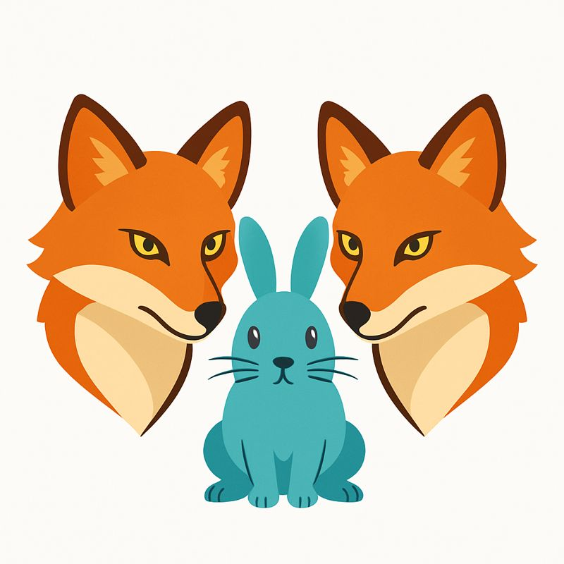

[](https://www.python.org/downloads/release/python-31111/)
[](https://docs.ray.io/en/latest/rllib/)


# Predator-Prey-Grass
## Emerging coevolution and cooperation through multi-agent deep reinforcement learning 

This repo explores the interplay between **nature** (inherited traits via reproduction and mutation) and **nurture** (behavior learned via reinforcement learning) in ecological systems. We combine **Multi-Agent Deep Reinforcement Learning** (MADRL) with **evolutionary dynamics** to explore emergent behaviors in a multi-agent dynamic ecosystem of Predators, Prey, and regenerating Grass. Agents differ by speed, vision, energy metabolism, and decision policies—offering ground for open-ended adaptation. At its core lies a gridworld simulation where agents are not just *trained*—they are *born*, *age*, *reproduce*, *die*, and even *mutate* in a continuously changing environment.

<p align="center">
    <b>Emerging cooperative hunting in Predator-Prey-Grass environment</b></p>
<p align="center">
    
</p>

### Environment:



* **Cooperative hunting** : Prey is eaten by a single Predator in its Moore neighborhood only if the Predator's energy is *strictly larger* than the Prey's energy. If there are multiple Predators in the Prey's Moore neighborhood, the Prey gets eaten if the cumulative energy of *all* Predators is strictly larger than the Prey's own energy. On failure (cumulative energy is too low), predators "struggle" and lose energy proportional to their share of the attacking group's energy (see `energy_percentage_loss_per_failed_attacked_prey`). On success, no extra energy loss is applied; prey energy is split among attackers (proportional by default, optional equal split via `team_capture_equal_split`). ([implementation](src/predpreygrass/rllib/shared_prey))

### Other environments:

* **Base environment**: The two-policy base environment. ([implementation](src/predpreygrass/rllib/base_environment), [results](https://humanbehaviorpatterns.org/pred-prey-grass/overview-ppg))

* **Mutating agents**: A four-policy extension of the base environment. ([implementation](src/predpreygrass/rllib/mutating_agents), [results](https://humanbehaviorpatterns.org/pred-prey-grass/marl-ppg/experiments/mutating-agents/))

* **Centralized training**: A single-policy variant of the base environment ([implementation](src/predpreygrass/rllib/centralized_training))

* **Walls occlusion**: An extension with walls and occluded vision ([implementation](src/predpreygrass/rllib/walls_occlusion))

* **Reproduction kick back rewards**: On top of direct reproduction rewards, agents receive indirect rewards when their children reproduce ([implementation](src/predpreygrass/rllib/kick_back_rewards))

* **Lineage rewards**: On top of direct reproduction rewards, agents receive rewards when their offspring survives over time ([implementation](src/predpreygrass/rllib/lineage_rewards))

### Experiments:

* Testing the **Red Queen Hypothesis** in the co-evolutionary setting of (non-mutating) predators and prey ([implementation](https://github.com/doesburg11/PredPreyGrass/blob/main/src/predpreygrass/rllib/red_queen/evaluate_red_queen_freeze_type_1_only.py), [results](https://humanbehaviorpatterns.org/pred-prey-grass/red-queen/))

* Testing the **Red Queen Hypothesis** in the co-evolutionary setting of mutating predators and prey ([implementation](src/predpreygrass/rllib/mutating_agents), [results](src/predpreygrass/rllib/mutating_agents#co-evolution-and-the-red-queen-effect))


### Hyperparameter tuning

* Hyperparameter tuning base environment - **Population-Based Training** ([Implementation](src/predpreygrass/rllib/hyper_parameter_tuning/tune_population_based_training.py))


## Installation of the repository

**Editor used:** Visual Studio Code 1.107.0 on Linux Mint 22.0 Cinnamon

1. Clone the repository:
   ```bash
   git clone https://github.com/doesburg11/PredPreyGrass.git
   ```
2. Open Visual Studio Code and execute:
   - Press `ctrl+shift+p`
   - Type and choose: "Python: Create Environment..."
   - Choose environment: Conda
   - Choose interpreter: Python 3.11.13 or higher
   - Open a new terminal
   - ```bash
     pip install -e .
     ```
3. Install the additional system dependency for Pygame visualization:
    -   ```bash
        conda install -y -c conda-forge gcc=14.2.0
        ```
## Quick start
Run the pre-trained policy in a Visual Studio Code terminal:

```bash
python ./src/predpreygrass/rllib/base_environment/evaluate_ppo_from_checkpoint_debug.py

```
Or a random policy:
```bash
python ./src/predpreygrass/rllib/base_environment/random_policy.py

```


## References

- [RLlib: Industry-Grade, Scalable Reinforcement Learning](https://docs.ray.io/en/master/rllib/index.html)
- [Paper Collection of Multi-Agent Reinforcement Learning (MARL)](https://github.com/LantaoYu/MARL-Papers)
- [Multi-Agent Reinforcement Learning: Foundations and Modern Approaches. Stefano V. Albrecht, Filippos Christianos, and Lukas Schäfer](https://www.marl-book.com/download/marl-book.pdf)
