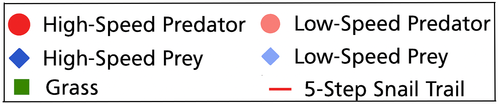
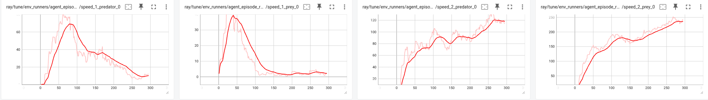
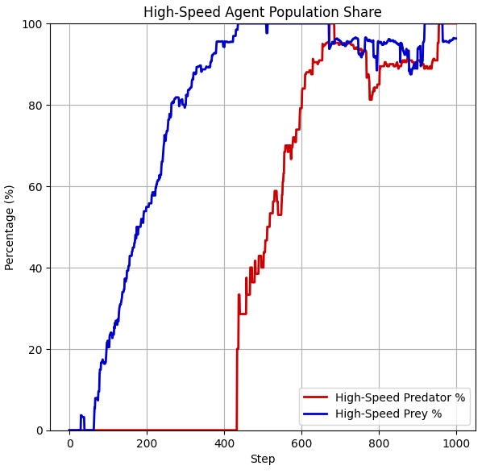

[](https://www.python.org/downloads/release/python-31111/)
[]()
[](https://github.com/DLR-RM/stable-baselines3/releases)
[](https://docs.ray.io/en/latest/rllib/)
[](https://colab.research.google.com/github/doesburg11/PredPreyGrass/blob/main/predpreygrass.ipynb)

# Artificial Life and Intelligence
### Multi-Agent Reinforcement Learning and Artificial Selection

<p align="center">
     
</p>

<p align="center">
    
</p>
<p align="center"><b>Evolution towards faster moving agents in a Predator-Prey-Grass gridworld</b>
</p>

## Overview
This project explores emergent behaviors in a multi-agent dynamic ecosystem of predators, prey, and regenerating grass. At its core lies a gridworld simulation where agents are not just *trained*—they are *born*, *age*, *reproduce*, and even *mutate*.

We combine **Multi-Agent Reinforcement Learning** (MARL) with **evolutionary dynamics** to investigate the interplay between **nature** (inherited traits via reproduction and mutation) and **nurture** (behavior learned via MARL algorithms). Agents differ by speed, vision, energy metabolism, and decision policies—offering ground for open-ended adaptation. Therefore,this environment doesn't just support pre-programmed behavior—it also gives rise to **emergent population dynamics** through learning, mutation, inheritance, and selection.

## Key Features

- **Modeling Nature vs. Nurture**: Agents inherit speed-based traits genetically, but refine behavior through learned policy optimization.
- **Energy-Based Life Cycle**: Movement, hunting, and grazing consume energy—agents must balance survival, reproduction, and exploration.
- **Multi-Policy Training**: Predators and prey are seperatly (decentralized) trained via their own policy module.
- **Gridworld Ecology**: Agents observe their local neighborhood with species-specific observation ranges; prey seek grass, predators hunt prey.
- **Procedural Regeneration**: Grass regrows over time; life and death shape a shifting ecological landscape.
- **Mutation and Selection**: When agents reproduce, they may randomly mutate (switching speed class). This introduces a natural (or more precise: *artificial*) selection pressure shaping the agent population over time.


## Starting point: MARL applied to a Predator-Prey-Grass environment

Displayed above is a Predator-Prey-Grass gridworld deploying a multi-agent environment with dynamic deletion and spawning of partially observant agents. Learning agents Predators (red) and Prey (blue) both sequentially expend energy moving around, and replenish it by eating. Prey eat Grass (green), and Predators eat Prey if they end up on the same grid cell. The agents obtain all the energy from the eaten resource. Predators die of starvation when their energy is run out, Prey die either of starvation or when being eaten by a Predator. Both learning agents asexually reproduce when energy levels exceed a certain threshold (through eating). In the base configuration, newly created agents are placed at random over the entire gridworld. Learning agents learn to move based on their partial observations of the environment.

## Centralized versus decentralized training
The described environment and training concept is implemented in **centralized training** as well as **decentralized training** utilizing two separate framework solutions: on the one hand PettingZoo in combination with StableBaseline3 for centralized training and on the other hand the RLlib framework for decentralized training.

<table align="center" width="100%">
  <tr>
    <th width="30%" align="left">Framework</th>
    <th width="70%" align="left">Solution</th>
  </tr>
  <tr>
    <td align="center">
      <a href="https://pettingzoo.farama.org/">
        
      </a><br>
      <a href="https://pettingzoo.farama.org/">PettingZoo Environment</a>
    </td>
    <td align="left">
      Single network for all agents (centralized learning) utilizing <a href="https://stable-baselines3.readthedocs.io/en/master/modules/ppo.html">
        <strong>Stable-Baselines3 PPO Algorithm</strong>
      </a> applied to a customized PettingZoo multi-agent environment (<a href="https://pettingzoo.farama.org/api/aec/"><strong>AECEnv</strong></a>).
  </tr>
  <tr>
    <td align="center">
      <a href="https://docs.ray.io/en/master/rllib/index.html">
        
      </a><br>
      <a href="https://docs.ray.io/en/master/rllib/index.html">RLlib (New API Stack) multi-agent environment </a>
    </td>
    <td align="left">
      Dual network for Predator and Prey seperately (decentralized learning) utilizing 
      <a href="https://docs.ray.io/en/master/rllib/rllib-algorithms.html#ppo">
        <strong>native RLlib PPO Solution</strong>
      </a>
      applied to the RLlib new API stack multi-agent environment (<a href="https://docs.ray.io/en/latest/rllib/package_ref/env/multi_agent_env.html"><strong>MultiAgentEnv</strong></a>).
    </td>
  </tr>
</table>

## Centralized training: Pred-Prey-Grass MARL with PettingZoo/SB3 PPO 

<p align="center">
    
</p>

### Configuration of centralized training
The MARL environment [`predpregrass_base.py`](https://github.com/doesburg11/PredPreyGrass/blob/main/src/predpreygrass/pettingzoo/envs/predpreygrass_base.py) is implemented using **PettingZoo**, and the agents are trained using **Stable-Baselines3 (SB3) PPO**. Essentially this solution demonstrates how SB3 can be adapted for MARL using parallel environments and centralized training. Rewards (stepping, eating, dying and reproducing) are aggregated and can be adjusted in the [environment configuration](https://github.com/doesburg11/PredPreyGrass/blob/main/src/predpreygrass/pettingzoo/config/config_predpreygrass.py) file. Basically, Stable Baseline3 is originally designed for single-agent training. This means in this solution, training utilizes only one unified network for Predators as well Prey. See [here in more detail](https://github.com/doesburg11/PredPreyGrass/tree/main/src/predpreygrass/pettingzoo#how-sb3-ppo-is-used-in-the-predator-prey-grass-multi-agent-setting) how SB3 PPO is used in the Predator-Prey-Grass multi-agent setting.

## Decentralized training: Pred-Prey-Grass MARL with RLlib new API stack 

<p align="center">
    
</p>

### Configuration of decentralized training
Obviously, using only one network has its limitations as Predators and Prey lack true specialization in their training. The RLlib new API stack framework is able to circumvent this limitation elegantly. The environment dynamics of the [RLlib environments](https://github.com/doesburg11/PredPreyGrass/blob/main/src/predpreygrass/rllib/) are largely the same as in the PettingZoo environment. However, newly spawned agents are placed in the vicinity of the parent, rather than randomly spawned in the entire gridworld. The implementation under-the-hood of the setup is somewhat different, utilizing array lists to store agent data rather than implementing a seperate agent class (largely a result of experimentation with compute time of the `step` function). Similarly as in the PettingZoo environment, rewards can be adjusted in a seperate environment configuration file (config_env.py). 

Training is applied in accordance with the RLlib new API stack protocol. The training configuration is more out-of-the-box than the PettingZoo/SB3 solution, but nevertheless is much more applicable to MARL in general and especially decentralized training.

<p align="center">
    
</p>

A key difference of the decentralized training solution with the centralized training solution is that the concurrent agents become part of the environment rather than being part of a combined "super" agent. Since, the environment of the centralized training solution consists only of static grass objects, the environment complexity of the decentralized training solution is dramatically increased. This is probably one of the reasons that training time of the RLlib solution is a multiple of the PettingZoo/SB3 solution. This is however a hypothesis and is subject to future investigation.  

## Emergent Behaviors
Training the single objective environment [`predpregrass_base.py`](https://github.com/doesburg11/PredPreyGrass/blob/main/src/predpreygrass/pettingzoo/envs/predpreygrass_base.py) with the SB3 PPO algorithm is an example of how elaborate behaviors can emerge from simple rules in agent-based models. In the above displayed MARL example, rewards for learning agents are solely obtained by reproduction. So all other reward options are set to zero in the [environment configuration](https://github.com/doesburg11/PredPreyGrass/blob/main/src/predpreygrass/pettingzoo/config/config_predpreygrass.py). Despite this relativily sparse reward structure, maximizing these rewards results in elaborate emerging behaviors such as: 
- Predators hunting Prey 
- Prey finding and eating grass 
- Predators hovering around grass to catch Prey 
- Prey trying to escape Predators

Moreover, these learning behaviors lead to more complex emergent dynamics at the ecosystem level. The trained agents are displaying a classic [Lotka–Volterra](https://en.wikipedia.org/wiki/Lotka%E2%80%93Volterra_equations) pattern over time:

<p align="center">
    
</p>

More emergent behavior and findings are described [on our website](https://www.behaviorpatterns.info/predator-prey-grass-project/).

## Introducing mutation with reproducing agents

The environment described above, wether centralized or decentralized trained, esentially optimizes policies for a fixed policy task for both predator an prey agent groups throughout the entire episode of the environment. To introduce variability in an agent policy (and therefore some element of open-endedness) we introduce for both predator and prey a low-speed and high-speed agent variant. A low-speed agent can move within its [Moore neighborhood](https://en.wikipedia.org/wiki/Moore_neighborhood), but a high-speed agent can move further within its *extended* Moore neighborhood with range *r*=2. Consequently, the high-speed agent can move faster across the gridworld, as depicted below.

<p align="center">
    
    <p align="center"><b>Action spaces of low-speed and high-speed agents</b></p>
</p>


The environment setup is changed to enable mutations with the reproduction of a agents. When reproduction occurs, there is a small change (5%) of mutating from a low-speed agent to a high-speed agent (or vice versa). When all 4 agents (low-speed-predator, high-speed-predator, low-speed-prey and high-speed-prey) are decentralized trained, it appears that average rewards of low-speed predator and prey agents **first increase rappidly** but **taper off after some time** as depicted below.The average rewards of the high-speed agents on the other hand still increase after this inflection point.

<p align="center">
    
    <p align="center"><b>Training results of low-speed and high-speed agents</b></p>
</p>

The training results suggests that the population of the low-speed agents diminishes relative to the population of high-speed agents, since (average) rewards are directly and solely linked to reproduction success for all agent groups. This crowding out of low-speed agents occurs **without any manual reward shaping** or explicit encouragement. High-speed agents—once introduced via mutation—apparently are more successful at acquiring energy and reproducing. As a result, they overtake the population at some point during the evaluation.

Moreoever, this hypothesis is supported further when evaluating the trained policies in a low-speed agent only environment at the start. It appears that when we initialize the evaluation with **only** low-speed predators and low-speed-prey, the population of low-speed agents is utlimately replaced by high-speed agents for predators as well as prey as displayed below. Note that after this shift the low-speed agents are not fully eradicated, but temporarily pop up due to back mutation.

<p align="center">
    
    <p align="center"><b>Low-speed agents replaced by high-Speed agents trough selection</b></p>
</p>


This is a clear example of **natural selection** within an artificial system:  
- **Variation**: Introduced by random mutation of inherited traits (speed class).  
- **Inheritance**: Agents retain behavior linked to their speed class via pre-trained policies.  
- **Differential Fitness**: Faster agents outperform slower ones under the same environmental constraints.  
- **Selection**: Traits that increase survival and reproduction become dominant.

### Co-Evolution and the Red Queen Effect

The mutual shift of both **prey and predator populations toward high-speed variants** reflects also a classic [**Red Queen dynamic**](https://en.wikipedia.org/wiki/Red_Queen_hypothesis): each species evolves not to get ahead absolutely, but also to keep up with the other. Faster prey escape better, which in turn favors faster predators. This escalating cycle is a hallmark of **co-evolutionary arms races**—where the relative advantage remains constant, but the baseline performance is continually ratcheted upward. It is noteworthy that in this setup prey start to mutuate first.

This ecosystem, therefore, is not only an instance of artificial selection—it’s also a model of **evolution in motion**, where fitness is relative, and adaptation is key.

Notably, agents in this system lack direct access to each other’s heritable traits such as speed class. Observations are limited to localized energy maps for predators, prey, and grass, with no explicit encoding of whether an observed agent is fast or slow. Despite this, we observe a clear evolutionary shift toward higher-speed phenotypes in both predator and prey populations. This shift occurs even when high-speed variants are initially absent and must arise through rare mutations, suggesting that selection is driven not by trait recognition but by differential survival and reproductive success. Faster agents outperform their slower counterparts in the competitive landscape created by evolving opponents, leading to a mutual escalation in speed. This dynamic constitutes an implicit form of co-evolution consistent with the Red Queen hypothesis: species must continuously adapt, not to gain an absolute advantage, but merely to maintain relative fitness in a co-adaptive system.

## Installation of the repository

**Editor used:** Visual Studio Code 1.99.0 on Linux Mint 22.0 Cinnamon

1. Clone the repository: 
   ```bash
   git clone https://github.com/doesburg11/PredPreyGrass.git
   ```
2. Open Visual Studio Code and execute:
   - Press `ctrl+shift+p`
   - Type and choose: "Python: Create Environment..."
   - Choose environment: Conda 
   - Choose interpreter: Python 3.11.11 or higher
   - Open a new terminal
   - ```bash
     pip install -e .
     ```
3. Install the additional system dependency:
    -   ```bash
        conda install -y -c conda-forge gcc=14.2.0
        ```    
## Running examples
- [PettingZoo in combination with SB3](https://github.com/doesburg11/PredPreyGrass/tree/main/src/predpreygrass/pettingzoo#getting-started-with-the-pettingzoosb3-framework)


## References

- [Terry, J and Black, Benjamin and Grammel, Nathaniel and Jayakumar, Mario and Hari, Ananth and Sullivan, Ryan and Santos, Luis S and Dieffendahl, Clemens and Horsch, Caroline and Perez-Vicente, Rodrigo and others. Pettingzoo: Gym for multi-agent reinforcement learning. 2021-2024](https://pettingzoo.farama.org/)    
- [Paper Collection of Multi-Agent Reinforcement Learning (MARL)](https://github.com/LantaoYu/MARL-Papers)
- [Multi-Agent Reinforcement Learning: Foundations and Modern Approaches. Stefano V. Albrecht, Filippos Christianos, and Lukas Schäfer](https://www.marl-book.com/download/marl-book.pdf)


