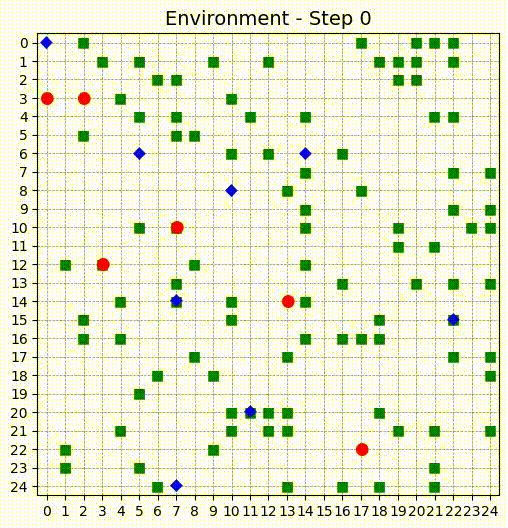

[](https://www.python.org/downloads/release/python-31111/)
[]()
[](https://github.com/DLR-RM/stable-baselines3/releases)
[](https://docs.ray.io/en/latest/rllib/)
[](https://colab.research.google.com/github/doesburg11/PredPreyGrass/blob/main/predpreygrass.ipynb)


</br>

<p align="center">
     
</p>

</br>


## Multi-Agent Reinforcement Learning (MARL)

Predator-Prey-Grass gridworld deploying a multi-agent environment with dynamic deletion and spawning of partially observant agents. The approach of the environment and algorithms is implemented in two separate solutions:


<table align="center" width="100%">
  <tr>
    <th width="30%" align="left">Framework</th>
    <th width="70%" align="left">Solution</th>
  </tr>
  <tr>
    <td align="center">
      <a href="https://pettingzoo.farama.org/">
        
      </a><br>
      <a href="https://pettingzoo.farama.org/">PettingZoo Environment</a>
    </td>
    <td align="left">
      Single network for all agents (centralized learning) utilizing <a href="https://stable-baselines3.readthedocs.io/en/master/modules/ppo.html">
        <strong>exteranal Stable-Baselines3 PPO Algorithm</strong>
      </a> applied to the PettingZoo multi-agent environment (<a href="https://pettingzoo.farama.org/api/aec/"><strong>AECEnv</stromg></a>).
  </tr>
  <tr>
    <td align="center">
      <a href="https://docs.ray.io/en/master/rllib/index.html">
        
      </a><br>
      <a href="https://docs.ray.io/en/master/rllib/index.html">RLlib (New API Stack) multi-agent environment </a>
    </td>
    <td align="left">
      Dual network for Predator and Prey seperately (decentralized learning) utilizing 
      <a href="https://docs.ray.io/en/master/rllib/rllib-algorithm/html#proximal-policy-optimization-ppo">
        <strong>native RLlib PPO Solution</strong>
      </a>
      applied to the RLlib new API stack multi-agent environment (<a href="https://docs.ray.io/en/latest/rllib/package_ref/env/multi_agent_env.html"><strong>MultiAgentEnv</stromg></a>).
    </td>
  </tr>
</table>

## Predator-Prey-Grass MARL with SB3 PPO
<br>
<p align="center">
    
</p>

### Overview
The MARL environment [predpregrass_base.py](https://github.com/doesburg11/PredPreyGrass/blob/main/predpreygrass/pettingzoo/envs/predpreygrass_base.py) is implemented using **PettingZoo**, and the agents are trained using **Stable Baselines3 (SB3) PPO**. Essentially this solution demonstrates how SB3 can be adapted for MARL using parallel environments and centralized training. 

### Environment dynamics
Learning agents Predators (red) and Prey (blue) both expend energy moving around, and replenish it by eating. Prey eat Grass (green), and Predators eat Prey if they end up on the same grid cell. The agents obtain all the energy from the eaten resource.
Predators die of starvation when their energy is zero, Prey die either of starvation or when being eaten by a Predator. The agents asexually reproduce when energy levels of learning agents rise above a certain treshold by eating. In the base configuration, newly created agents are placed at random over the entire gridworld. Learning agents learn to execute movement actions based on their partial observations (transparent red and blue squares respectively as depicted above) of the environment.

### Configuration
Rewards (stepping, eating, dying and reproducing) are aggregated and can be adjusted in the [environment configuration](https://github.com/doesburg11/PredPreyGrass/blob/main/predpreygrass/pettingzoo/config/config_predpreygrass.py) file. 

### Training
Basically, Stable Baseline3 is originally designed for single-agent. This means in this solution, training utilizes only one unified network for Predators as well Prey. 

### How SB3 PPO is used in the Predator-Prey-Grass a Multi-Agent Setting

#### 1. PettingZoo AEC to Parallel Conversion
- The environment is initially implemented as an **Agent-Environment-Cycle (AEC) environment** using **PettingZoo** (`predpreygrass_aec.py`).
- It is wrapped and converted into a **Parallel Environment** using `aec_to_parallel()` inside `trainer.py`.
- This conversion enables multiple agents to take actions simultaneously rather than sequentially.

#### 2. Treating Multi-Agent Learning as a Single-Agent Problem
- SB3 PPO expects a **single-agent Gymnasium-style environment**.
- The converted parallel environment **stacks observations and actions for all agents**, making it appear as a single large observation-action space.
- PPO then treats the multi-agent problem as a **centralized learning problem**, where all agents share one policy.

#### 3. Performance Optimization with Vectorized Environments
- The environment is further wrapped using **SuperSuit**:
  ```python
  env = ss.pettingzoo_env_to_vec_env_v1(env)
  env = ss.concat_vec_envs_v1(env, num_vec_envs, num_cpus=num_cores, base_class="stable_baselines3")
  ```
- This enables running multiple instances of the environment in parallel, significantly improving training efficiency.
- The training process treats the multi-agent setup as a **single centralized policy**, where PPO learns from the collective experiences of all agents.


## The RLlib solution with decentralized traing


<p align="center">
    
</p>

## Overview
Obviously, using only one network has its limitations as Predators and Prey lack true specialization in their training. The RLlib new API stack framework is able to circumvent this limitation, albeit at the cost of considerable more compute time.

### Environment dynamics
The environment dynamics are largely the same as in the PettingZoo environment. Newly spawned agents however are placed in the vicinity of the parent, rather than randomly spawned in the entire gridworld.

### Configuration
Similiraly as in the PettingZoo environment, rewards can be adjusted in the [environment configuration](https://github.com/doesburg11/PredPreyGrass/blob/main/predpreygrass/rllib/config_env.py) file. 

### Training
Training is applied in accordance with the RLlib new API stack protocol. The training configuration is more out-of-the-box then the PettingZoo/SB3 solution, but is much more applicable to MARL in general and especially decentralized training.


## Emergent Behaviors
Training the single objective environment [predpregrass_base.py](https://github.com/doesburg11/PredPreyGrass/blob/main/predpreygrass/single_objective/envs/base_env/predpreygrass_base.py) with the PPO algorithm is an example of how elaborate behaviors can emerge from simple rules in agent-based models. In the above displayed MARL example, rewards for learning agents are solely obtained by reproduction. So all other reward options are set to zero in the [environment configuration](https://github.com/doesburg11/PredPreyGrass/blob/main/predpreygrass/single_objective/config/config_predpreygrass.py). Despite these relative sparse reward structure, maximizing these rewards results in elaborate emerging behaviors such as: 
- Predators hunting Prey 
- Prey finding and eating grass 
- Predators hovering around grass to catch Prey 
- Prey trying to escape Predators

Moreover, these learning behaviors lead to more complex emergent dynamics at the ecosystem level. The trained agents are displaying a classic [Lotka–Volterra](https://en.wikipedia.org/wiki/Lotka%E2%80%93Volterra_equations) pattern over time:

<p align="center">
    
</p>

More emergent behavior and findings are described [on our website](https://www.behaviorpatterns.info/predator-prey-grass-project/).


## Installation

**Editor used:** Visual Studio Code 1.98.2 on Linux Mint 21.3 Cinnamon

1. Clone the repository: 
   ```bash
   git clone https://github.com/doesburg11/PredPreyGrass.git
   ```
2. Open Visual Studio Code and execute:
   - Press `ctrl+shift+p`
   - Type and choose: "Python: Create Environment..."
   - Choose environment: Conda 
   - Choose interpreter: Python 3.11.11 or higher
   - Open a new terminal
   - ```bash
     pip install -e .
     ```
 3. Install the following requirements:  
    -   ```bash 
        pip install pettingzoo==1.24.3
 
        ```
    -   ```bash 
        pip install stable-baselines3[extra]==2.5.0
 
        ```
    -   ```bash
        conda install -y -c conda-forge gcc=12.1.0
        ```    
    -   ```bash 
        pip install supersuit==3.9.3 
        ```
    -   ```bash 
        pip install ray[rllib]==2.43.0
        ```
    -   ```bash 
        pip install tensorboard==2.18.0 
        ```
    
## Getting started

### Visualize a random policy
In Visual Studio Code run:
```predpreygrass/single_objective/eval/evaluate_random_policy.py```
</br>
<p align="center">
    
</p>


### Training and visualize trained model using PPO from stable baselines3

Adjust parameters accordingly in:

[```predpreygrass/single_objective/config/config_predpreygrass.py```](https://github.com/doesburg11/PredPreyGrass/blob/main/predpreygrass/single_objective/config/config_predpreygrass.py)

In Visual Studio Code run:

[```predpreygrass/single_objective/train/train_sb3_ppo_parallel_wrapped_aec_env.py```](https://github.com/doesburg11/PredPreyGrass/blob/main/predpreygrass/single_objective/train/train_sb3_ppo_parallel_wrapped_aec_env.py)

To evaluate and visualize after training follow instructions in:

[```predpreygrass/single_objective/eval/evaluate_ppo_from_file_aec_env.py```](https://github.com/doesburg11/PredPreyGrass/blob/main/predpreygrass/single_objective/eval/evaluate_ppo_from_file_aec_env.py)

Batch training and evaluating in one go:

[```predpreygrass/single_objective/eval/parameter_variation_train_wrapped_to_parallel_and_evaluate_aec.py```](https://github.com/doesburg11/PredPreyGrass/blob/main/predpreygrass/single_objective/eval/parameter_variation_train_wrapped_to_parallel_and_evaluate_aec.py)

## References

- [Terry, J and Black, Benjamin and Grammel, Nathaniel and Jayakumar, Mario and Hari, Ananth and Sullivan, Ryan and Santos, Luis S and Dieffendahl, Clemens and Horsch, Caroline and Perez-Vicente, Rodrigo and others. Pettingzoo: Gym for multi-agent reinforcement learning. 2021-2024](https://pettingzoo.farama.org/)    
- [Paper Collection of Multi-Agent Reinforcement Learning (MARL)](https://github.com/LantaoYu/MARL-Papers)
- [Multi-Agent Reinforcement Learning: Foundations and Modern Approaches. Stefano V. Albrecht, Filippos Christianos, and Lukas Schäfer](https://www.marl-book.com/download/marl-book.pdf)


