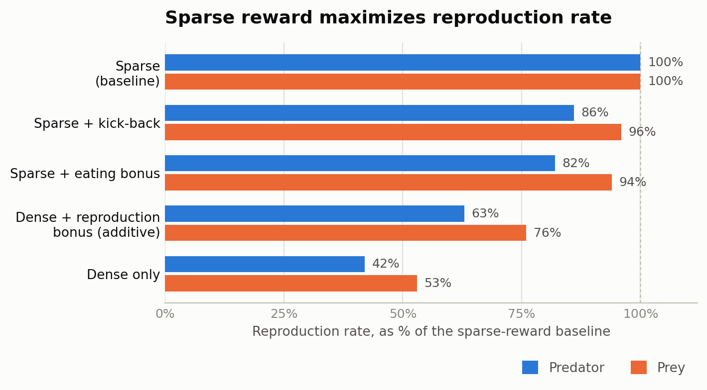

[](https://www.python.org/downloads/release/python-31113/)
[](https://docs.ray.io/en/latest/rllib/)
[](https://github.com/doesburg11/PredPreyGrass/actions/workflows/linux-test.yml)
[](LICENSE)

# Predator-Prey-Grass
## Multi-Agent Deep Reinforcement Learning meets Darwinian and Baldwinian evolution

**A multi-agent reinforcement-learning ecosystem for studying how cooperation emerges through learning within lifetimes and evolution across generations.**

<p align="center">
    
</p>
<p align="center"><sub>Fixed-trait game-theoretic hunting: coevolution, cooperation, defection and free-riding emerging under a fixed reward design.</sub></p>

- **Darwinian evolution** of inherited traits (speed, cooperation rate, metabolic rate, and more) via reproduction and mutation
- **Baldwinian interaction** between evolution and learning tested directly — do genetic selection and learned behavior actually shape each other, or just coexist?
- **Emergent cooperation, defection, reciprocity and coevolution**, studied under both evolving and fixed-trait agent populations
- Built with Python, Gymnasium and RLlib 2.58's new API stack (`RLModule` / `Learner` / `EnvRunner`), with dynamic, lifecycle-changing agent populations

**Start here:** [Quick start](#quick-start-run-a-demo-in-under-five-minutes) to run a demo in under five minutes, or the [headline result](#headline-result-sparse-rewards-beat-dense-rewards) below for the project's strongest empirical finding.

## How it works

This project explores whether cooperative behavior, coevolution, defection, and free-riding can emerge and stabilize in a spatial, resource-limited ecosystem, by combining within-lifetime multi-agent reinforcement learning with population-level ecological and evolutionary dynamics. It probes the interplay between **nature** (inherited traits via reproduction and mutation) and **nurture** (behavior learned via reinforcement learning) — including a direct test of the **Baldwin effect**: whether genetic selection and learned behavior actually shape each other, not just coexist. Agents differ by speed, vision, energy metabolism, and decision policies — offering ground for open-ended adaptation. At its core lies a gridworld simulation where agents are not just *trained* — they are *born*, *age*, *reproduce*, *die*, and even *mutate* in a continuously changing environment.

Legacy snapshot: the pre-cleanup research codebase is archived at [PredPreyGrassLegacy](https://github.com/doesburg11/PredPreyGrassLegacy).

## Headline result: sparse rewards beat dense rewards

> In controlled reward-shaping experiments, a sparse, reproduction-only reward outperformed four denser alternatives across every tested ecological outcome — reproduction rate, final population balance, and extinction risk.

<p align="center">
    
</p>

Started from a simple question: the base environment's only nonzero reward anywhere is a flat
`+10` bonus on successful reproduction — every other hook is `0.0`. Does that sparsity hurt
training, and would a dense, per-step energy-delta reward fix it? Five trained environment
variants and a full investigation later, the answer reversed the question: **sparse reward wins
on every axis tested, and adding density hurts** — not because of the sparsity itself, but
because a continuous signal layered into the same reward channel as reproduction adds noise that
outweighs the benefit it was meant to provide.

**Full writeup — motivation, methodology, every module's results, and open
questions — lives in
[`predpreygrass/non_evolutionary/project_reward_shaping/README.md`](predpreygrass/non_evolutionary/project_reward_shaping).**

## Start here

The repo splits into two structurally different families of experiment, matching the
`predpreygrass/evolutionary/` vs `predpreygrass/non_evolutionary/` directory split:

- **Evolutionary**: agents carry a heritable genome trait, passed parent → offspring
  with mutation. What gets selected is discovered, not designed.
- **Non-evolutionary**: every agent trait is fixed; only the RL policy adapts. What
  emerges is a behavioral equilibrium under a given incentive design, not a change in
  the population's genetics.

The full catalogue of environments and experiments — evolutionary trials, reward-shaping
variants, cooperation/game-theory environments, and the Red Queen evaluations — lives in
**[EXPERIMENTS.md](EXPERIMENTS.md)**.

## Quick start: run a demo in under five minutes

```bash
git clone https://github.com/doesburg11/PredPreyGrass.git
cd PredPreyGrass
python -m venv .venv && source .venv/bin/activate
pip install -e .
python ./predpreygrass/non_evolutionary/base_environment/random_policy.py
```

This installs the base dependencies and runs a random policy in the base environment —
no VS Code or Conda required. `pygame` (for the rendered window) ships as a regular pip
dependency; the Conda/GCC setup below is only needed if your platform lacks a
prebuilt `pygame` wheel.

Pretrained checkpoints and historical training outputs are preserved in the legacy archive rather than shipped in the active source tree.

## Full setup (Visual Studio Code + Conda)

**Editor used:** Visual Studio Code on Linux Mint 22.0 Cinnamon

1. Clone the repository:
   ```bash
   git clone https://github.com/doesburg11/PredPreyGrass.git
   ```
2. Open Visual Studio Code and execute:
   - Press `ctrl+shift+p`
   - Type and choose: "Python: Create Environment..."
   - Choose environment: Conda
   - Choose interpreter: Python 3.11.13 or higher
   - Open a new terminal
   - ```bash
     pip install -e .
     ```
3. Install the additional system dependency for Pygame visualization (only needed if
   `pip install` can't find a prebuilt `pygame` wheel for your platform):
    -   ```bash
        conda install -y -c conda-forge gcc=14.2.0
        ```

## Acknowledgments

Developed with AI coding assistance from [Claude](https://claude.com/claude-code) (Anthropic), which does the implementation, with [Codex](https://openai.com/codex) (OpenAI) acting as an independent second opinion, peer-reviewing Claude's nontrivial code changes.

## References

- [RLlib: Industry-Grade, Scalable Reinforcement Learning](https://docs.ray.io/en/master/rllib/index.html)
- [Paper Collection of Multi-Agent Reinforcement Learning (MARL)](https://github.com/LantaoYu/MARL-Papers)
- [Multi-Agent Reinforcement Learning: Foundations and Modern Approaches. Stefano V. Albrecht, Filippos Christianos, and Lukas Schäfer](https://www.marl-book.com/download/marl-book.pdf)

## Citation

If you use this software in your research, please cite it — see [CITATION.cff](CITATION.cff).
