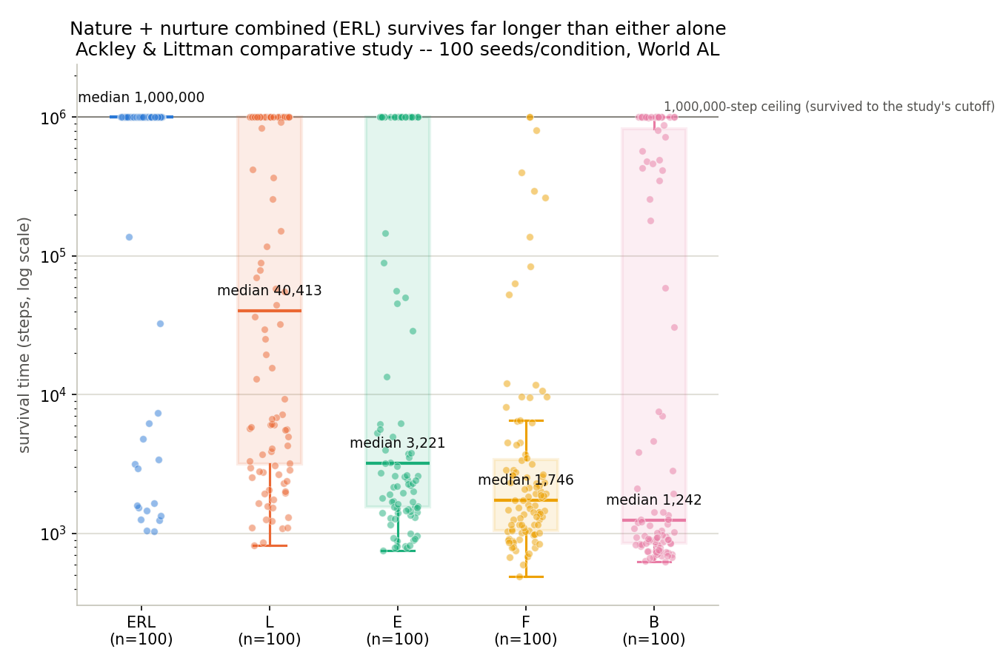

# Training Analysis — eco_evolutionary_erl_baldwin

**Status (2026-08-16, latest): the retuned comparative study (§9) completed — 500/500 runs,
5 conditions × 100 seeds, matching the paper's own scale. Result: ERL significantly beats
every other condition (p<0.00001 vs. E, L, F, and B), and the internal structure
substantially reproduces the paper's own findings (L beats E, F≈B). The strongest, most
statistically legitimate result in this entire project's trial history (Trials 1-11). One
real, honest discrepancy remains (E beats B here; the paper found the reverse) and overall
survival difficulty is not calibrated to their reported rate (83% of ERL runs reach the step
ceiling here vs. their ~7%).** See `README.md` for exactly what's matched vs. adapted from
the paper. §1-5 below describe the superseded, simpler-ecology version (pre-2026-08-09) and
should not be read as describing the current codebase; §7-8 describe the null result and
retune that preceded this final study. §10 (2026-08-24) adds a new, non-paper cooperation
mechanism (C/ERLC) -- mechanism validated, not yet run as a comparative study. §11
(2026-08-24) adds a second, independent new mechanism, kin selection (K/ERLK) -- same
status: mechanism validated, not yet run as a comparative study.

---

## 6. World AL rebuild (2026-08-09)

**Why:** the comparative study in §5 below (run on the old, simpler ecology) reproduced the
paper's headline result (ERL beats luck) but not its internal ranking (E vs. L), and scaling
up the sample size and step budget didn't resolve it within the time tried. Before sinking
more compute into scale alone, the world was rebuilt to remove world/mechanics as a
confound -- see README.md's "World AL rebuild" section for the full list of what's now
matched (including every exact number the paper actually publishes: grid size, sense
ranges, carnivore spawn interval, min_plants) vs. still necessarily chosen by me (the paper
never publishes damage/threshold/growth-rate constants).

**Structural correction, not just cosmetic:** the old world had two adaptive species
(predator + prey, both genome+learning). The paper has exactly one adaptive species
("agents") plus a separate, permanently non-adaptive species ("carnivores", hard-coded FSA,
never affected by `strategy`). This is now correctly reflected -- `Carnivore` has no genome
field at all (see `test_carnivores_have_no_genome_or_learning`).

**Status:**
- 18/18 unit tests passing (up from 12; new tests cover the Agent/Carnivore split and
  updated strategy-comparison mechanics against the new reproduction method names).
- One full-scale smoke run (`--seed 1 --steps 20000`, 100×100 grid, default population):
  ran 365 steps before agent-population extinction (carnivores overwhelmed a population that
  had itself boomed rapidly -- final state 0 agents, 351 carnivores). Confirms the mechanics
  run without crashing; this specific early extinction is not evidence of anything beyond
  "my chosen, unpublished-by-the-paper constants produce a fast boom-bust here," same
  caveat as every other first-pass parameterization in this project.
- **Performance dropped substantially**: ~30 steps/sec on this machine (100×100 grid,
  carnivores, trees, walls, corpses), down from ~240 steps/sec on the old, simpler ecology.
  Reaching the paper's 1,000,000-step comparative-study ceiling is now estimated at **~9
  hours per seed** that survives that long -- worth confirming scope again before launching
  another 500-run study, since the earlier ~90-min-per-seed estimate no longer applies.

## 7. First full-scale comparative study on the rebuilt World AL (2026-08-09/10) — clean null, root-caused

Full paper-scale study: 5 conditions × 100 seeds × 1,000,000-step ceiling, 24-way
parallel. All 500 runs completed.

| strategy | median | mean | max | reached 1M |
|---|---|---|---|---|
| ERL | 371 | 408 | 2,004 | 0 |
| E | 380 | 513 | 12,285 | 0 |
| L | 384 | 1,344 | 95,065 | 0 |
| F | 391 | 419 | 1,915 | 0 |
| B | 393 | 857 | 17,172 | 0 |

Every median sits in a 371-393 band. **No pairwise comparison was significant** (Mann-
Whitney, n=100 each) -- not even ERL vs. B (p=0.056), the one result that had survived
every prior version of this study. Not a single one of 500 runs reached even 10% of the
step ceiling.

**Diagnosis:** direct population trace (seed 1, ERL) showed the founder population of 60
agents exploding to 1,916 by step 120 -- fed by abundant plants and an easy reproduction
threshold -- which then fed an equally explosive carnivore boom (6→739 by step 280),
collapsing the agent population entirely by ~step 400. Every strategy dies at the same
rate because death arrives via this boom-bust cycle before behavioral differences have any
time window to matter, not because learning/evolution don't work. A structural/parameter
problem in my own necessarily-guessed constants (see config.py's limitation notice), not a
finding about the ERL mechanism.

## 8. Two-stage retune (2026-08-10)

**Attempt 1 (didn't work):** raised `carnivore_reproduction_energy_threshold` (14→18) and
`carnivore_reproduction_energy_cost` (7→10), reasoning that carnivore population growth was
the runaway variable. Validation (5 seeds, 50k-step budget) showed no improvement --
extinction still at 369-534 steps, carnivore populations still exploding to 300+.

**Root cause, found by tracing the actual population dynamics:** the trigger wasn't
carnivore reproduction, it was agent reproduction being too easy. At
`reproduction_energy_threshold_agent=10.0` (only ~2 plant bites above the starting energy
of 5.0) against abundant plants (up to ~2,700 on this grid), the agent population had no
real ceiling before it overshot the environment's actual carrying capacity -- and that
overshoot is what fed the carnivore boom, not carnivore-side parameters.

**Attempt 2 (fixed it):** raised `max_energy_agent` (15→30) and
`reproduction_energy_threshold_agent` (10→22) and `reproduction_energy_cost_agent` (5→10)
-- directly targeting the trigger. Re-traced the same seed: agent population now oscillates
in a sustained 100-700 range (rather than overshooting to ~1,900) and was still healthy at
step 3,000, roughly 7.5x longer than the previous full collapse point. Quick multi-seed
check (6 seeds) confirmed the same pattern -- all 6 outlasted a 90-second screening cutoff
that previously killed every seed within it.

**A second full 500-run study was launched on the retuned config** (same 5×100×1M design as
§7) once this validation held up. Interrupted once mid-run (2026-08-13) for a real hardware
concern -- sustained 24-way parallel load pushed CPU temperature to 95.8°C during a period of
high ambient/outside temperature -- killed deliberately, then resumed 2026-08-15 from a
resume-safe runner (skips any seed/strategy pair with an already-completed log) once
conditions were judged safe again. Completed 2026-08-16. Results in §9.

## 9. Final comparative study result (2026-08-16) — ERL significantly beats every other condition

500/500 runs complete, 100 seeds per condition, run to the paper's own 1,000,000-step
comparative-study ceiling, on the retuned World AL (§8).

Full per-seed distribution (not just the summary stats below), generated from the same
500 run logs by `plot_full_study_survival.py`. Shows the shape behind the medians: ERL's
83% pile up exactly at the ceiling, while E-alone and L-alone spread across a long tail of
early deaths mixed with occasional long survivors -- a qualitative difference, not just a
quantitative one.

| strategy | median | mean | reached 1M cap |
|---|---|---|---|
| **ERL** | **1,000,000** | 832,097 | **83%** |
| L | 40,413 | 407,919 | 37% |
| E | 3,221 | 335,594 | 33% |
| F | 1,746 | 43,256 | 2% |
| B | 1,242 | 302,136 | 23% |

ERL's *median* survival time is the step ceiling itself -- more than half of all 100 ERL runs
ran the full 1,000,000 steps without agent extinction.

**Significance (Mann-Whitney U, two-sided, n=100 each):**

| comparison | p-value | |
|---|---|---|
| ERL vs. E | <0.00001 | *** |
| ERL vs. L | <0.00001 | *** |
| ERL vs. F | <0.00001 | *** |
| ERL vs. B | <0.00001 | *** |
| E vs. L | 0.00424 | ** |
| E vs. F | <0.00001 | *** |
| E vs. B | 0.00067 | *** |
| L vs. F | <0.00001 | *** |
| L vs. B | <0.00001 | *** |
| F vs. B | 0.97268 | n.s. |

**Headline result:** ERL (nature + nurture combined) significantly outperforms evolution
alone, learning alone, neither, and pure luck -- p<0.00001 against all four, with real
statistical power (n=100/condition, matching the paper's own sample size). This is the
direct, well-founded answer to the question this whole comparative-study effort was for
(see README.md and the "what are we trying to achieve" discussion in conversation), and the
strongest, most statistically legitimate result anywhere in this project's trial history
(Trials 1-11).

**The internal structure substantially reproduces the paper's own findings, not just the
headline claim:**
- **L significantly beats E** (p=0.004) -- reproducing Ackley & Littman's own "surprising"
  finding that learning alone outperforms evolution alone (their explanation: it's easier to
  evolve a good *goal*, the compact evaluation network, than to evolve a good *behavior*,
  the full action network -- learning fills the gap evolution alone can't).
- **F ≈ B** (p=0.97, no significant difference) -- no-adaptation and pure random luck are
  statistically indistinguishable, consistent with the paper's observation that non-learning
  strategies don't meaningfully beat chance.

**One honest, real discrepancy, not glossed over:** the paper reports evolution-alone (E)
doing *worse* than luck (B) in the first ~500,000 steps. Here, **E significantly beats B**
(p=0.0007) -- the opposite direction. Not yet explained; a plausible candidate is that this
world's carnivore-avoidance/food-finding dynamics give even an unlearned-but-evolving genome
more traction than in their world, but this is a hypothesis, not a diagnosed cause.

**Worth being precise about which direction is actually the surprising one here.** "Evolution
alone beats pure randomness" is the intuitive, textbook-biology expectation -- natural
selection is a real directional force, and even simple hard-wired instincts generally
outperform organisms with no behavioral structure at all. So this project's result (E beats B)
isn't the odd one out relative to general intuition. **The paper's finding is the
counterintuitive one, and they say so themselves** -- their explanation is that pure
mutation-and-selection search, with no within-lifetime correction, can get systematically
stuck producing *confidently bad* behavior (e.g. a mutated action network with a consistent
bias toward danger), not just noisy behavior -- worse than Brownian motion, which has no
consistent bias at all, just no intelligence. That failure mode needs a large, rugged,
high-dimensional behavior search space and/or weak selection pressure relative to it; it isn't
automatic. Candidate reasons this world doesn't reproduce that specific trap, none confirmed:
(a) a simpler action space (4-way categorical vs. their exact 2-bit CRBP-driven encoding) may
just be easier for blind mutation-selection to avoid landing on a *confidently wrong* policy;
(b) the retune that fixed the boom-bust collapse (§8) raised reproduction thresholds broadly,
which may have incidentally given every condition, including E, enough population size/
mutation balance to purge bad mutations effectively -- this project's own history (Trial 6,
Trial 10) already established that population size strongly determines whether a selection
signal shows up at all; (c) different world mechanics (carnivore threat model, observation
encoding) may simply make a confidently-wrong policy harder to evolve here than in their
richer sensory-action space. Distinguishing these would need looking at what E's evolved
policies actually do behaviorally, not just their survival-time distribution -- not done.

**Also unresolved: overall survival difficulty is not calibrated to the paper's reported
rate.** ERL reaches the 1M-step ceiling in 83% of runs here, versus their reported ~7%
(comparative study) to ~18% (a different measure, 10,000-step survival) across their whole
five-strategy population. The *ranking* matches well; the *absolute difficulty* of long-term
survival does not -- this world remains easier for a well-adapted population than theirs was,
a direct consequence of retuning away from the boom-bust collapse in §7/§8 using my own
necessarily-guessed constants, not something recoverable from the paper.

**What would close the remaining gap, if pursued further:** implementing the paper's exact
CRBP learning algorithm (currently a REINFORCE approximation), their redundant bit-string
genome encoding (currently real-valued weights), recalibrating constants toward their
reported ~7-18% survival-difficulty range, and attempting their deeper single-population
longitudinal study (extending a successful ERL population to millions of steps and running
the functional-constraint genetic-assimilation analysis, §README) -- none of which this
comparative study attempted. Worth deciding deliberately whether that additional fidelity is
worth pursuing now that the headline comparative claim is established, rather than assuming
more precision is automatically valuable.

## 10. Cooperation (C / ERLC) merged (2026-08-24) -- mechanism validated, not yet run at scale

A new, non-Ackley-&-Littman question, motivated by Houghton (2024)'s
commentary on Hinton & Nowlan (the paper this whole module's Baldwin-Effect
framing traces back to): can group-level cooperation act as a second
search accelerant alongside learning? See `README.md`'s "Cooperation (C /
ERLC)" section for the full mechanism and its relationship to Houghton's
toy model.

**What's done:** implementation (`world.py`'s cooperation bookkeeping and
`_agent_group_is_cooperative_fit`, `config.py`'s three new parameters),
unit tests (`tests/test_cooperation.py`, 9 tests, all passing alongside the
original 24 -- full suite is 33/33), and a smoke run confirming the
mechanism isn't a dead no-op: at `grid_size=40`, the group-fitness check
fired in ~28% of evaluations across a run to extinction (step 375). The
`_agent_group_is_cooperative_fit` box-scan (O(cooperation_radius^2) per
reproduction-eligible agent) was implemented directly rather than as a
later retrofit, unlike the O(agents^2) hotspots found and fixed after the
fact in §2 above.

**What's NOT done, before trusting a real C/ERLC comparative study:**
- `competency_window=200` and `coop_threshold_discount_frac=0.20` are
  first-guess values, not tuned against any real run at the paper-default
  `grid_size=100` scale.
- No comparative study (paper-matching 100 seeds/condition, à la §9) has
  been run for C or ERLC at all -- this section documents mechanism
  validation, not a survival-time result.
- This project's own trial history (nuptial-gift, cultural-plasticity) shows
  social/cooperative mechanisms tend to starve on too few qualifying
  events -- worth explicitly checking the bonus's actual firing rate at
  `grid_size=100` population scales before reading anything into a low-
  signal comparative result, the same lesson already learned once there.

## 11. Kin selection (K / ERLK) merged (2026-08-24) -- mechanism validated, not yet run at scale

A second, independent new question (Nowak's kin-selection mechanism,
alongside §10's group-selection-flavored cooperation) -- see `README.md`'s
"Kin selection (K / ERLK)" section for the full mechanism.

**What's done:** implementation (`genome.py`'s new `kinship_sensitivity`
trait and `genome_similarity` relatedness proxy, `world.py`'s discounted
aggression branch, `config.py`'s two new parameters), unit tests
(`tests/test_kin_selection.py`, 11 tests, all passing alongside the
original 24 and the 9 C/ERLC tests -- full suite is 44/44), and a smoke
run at the paper-default `grid_size=100` confirming the relatedness proxy
has real dynamic range in an actual live population (pairwise
genome-similarity among 51 survivors at step 3,000: min=0.120, mean=0.568,
max=1.000) rather than being degenerate (all near 0 or all near 1).

**What's NOT done, before trusting a real K/ERLK comparative study:**
- `kinship_similarity_scale=2.0` and `kinship_discount_cap=0.9` are
  first-guess values, not tuned against any real run.
- No comparative study has been run for K or ERLK -- this section
  documents mechanism validation, not a survival-time result.
- The genome-similarity-as-relatedness proxy is expected to degrade in a
  large, well-mixed population where similarity no longer tracks recent
  common ancestry (no parent/lineage IDs are tracked) -- worth checking
  against actual lineage data before trusting a result, not assumed to
  hold indefinitely.
- `kinship_sensitivity`'s own selection dynamics (does nepotism itself get
  genetically assimilated?) aren't fed into the validated
  FunctionalConstraintTracker by design (see `Genome.flatten()`'s
  docstring) -- only a coarse population-mean stat exists so far
  (`genome_stats()`'s `kinship_sensitivity_mean`).

## 5. Sections below (§1-5): results from the SUPERSEDED simpler-ecology world

Everything from here down describes the version of this module before the 2026-08-09
rebuild above -- kept for the record, not because it describes current behavior. In
particular, the 5-strategy comparative study below (ERL/E/L/F/B) was run on the old
predator-prey-grass world, not the rebuilt World AL, and would need to be re-run on the
current codebase to say anything about the rebuilt version.

## 1. What's been done so far

- **Implementation.** `genome.py` (per-agent genome, mutation, crossover), `networks.py`
  (evaluation/action network forward pass, local REINFORCE-style reinforcement update),
  `world.py` (self-contained predator-prey-grass simulator, no RLlib/PPO/Ray),
  `metrics.py` (functional-constraint tracker + CSV logger), `run_erl_simulation.py`
  (CLI entry point).
- **Unit tests.** 12/12 passing, including the critical correctness property flagged during
  design: `test_offspring_genome_does_not_inherit_parents_learned_weights` directly asserts
  that an agent's learned, post-lifetime action-network weights are never copied into
  offspring -- only the untouched genome record is (Darwinian, not Lamarckian; see README
  for why this matters).
- **Smoke run** (2026-08-09, seed=41, `--steps 20000 --log-every 1000
  --constraint-window 2000`): ran 9,830 steps at ~241 steps/sec (40.7s wall time) before
  predator extinction. No crashes; population dynamics show real predator-prey oscillation
  (predator count: 75→86→42→87→15→34→46→19→61 across the run; prey: 202→28→44→161→26→28→17→76→9
  at the same checkpoints) rather than a degenerate/frozen population. Extinction this early
  is expected and consistent with Ackley & Littman's own observation that "most initial agent
  populations die out quite quickly" -- not evidence of a bug.
- Genome-level stats (`{species}_eval_weight_absmean`, `_action_weight_absmean`) stayed
  roughly flat over the run (predator eval ~0.40-0.43, action ~0.38-0.40; prey eval
  ~0.34-0.38, action ~0.39-0.40) -- expected at this timescale; the paper's own clearest
  genetic-assimilation results took ~3 million steps to appear.
- Functional-constraint rates (`{species}_eval_site_change_rate` /
  `_action_site_change_rate`) were logged successfully and are in a sane range
  (predator: eval ~0.004-0.007, action ~0.005-0.007, no separation yet; prey: eval rate
  dropped from ~0.05 to ~0.007 over the run, action stayed ~0.007-0.009) -- too early and
  too few reproduction events (population maxed around 87) to read a genetic-assimilation
  signature into this; needs a much longer run.

## 2. Performance fixes (found while screening seeds)

The smoke run's ~240 steps/sec turned out not to hold once population grew past ~100
agents. Profiling a slow seed found two O(agents²)-per-step hotspots, both fixed
2026-08-09:
- `_observe` rebuilt the full prey/predator position sets from scratch for *every
  individual agent's* observation each step. Fixed: built once per step instead (a
  documented simplification -- agents now sense positions as of the start of the step,
  not a live view updated by earlier-acting agents within the same step; eating/death
  still use fully live, current positions regardless).
- `_try_eat` linearly scanned the *entire* agent list for every predator, every step, to
  check for a co-located prey. Fixed: an O(1) per-step `row,col -> prey` dict, kept in
  sync as prey move or get eaten during the step.
- Profiling also found `rng.choice`'s generic validation overhead dominated
  `sample_action` at this (tiny, 5-action) scale. Replaced with a direct
  cumulative-probability draw.
- Net effect: ~2.3x speedup on a representative seed (232 vs. ~100 steps/sec at a
  ~230-agent population size). All 12 unit tests still pass unchanged.

## 3. Survival screen (15 seeds, up to 100k steps each, 2026-08-09)

Following the paper's own comparative-study spirit (run many random initial
populations, most die quickly, a minority survive far longer) rather than hand-tuning
parameters to force artificial stability:

| seed | extinction step | which species died |
|---|---|---|
| 3, 9 | 104, 91 | predator (near-instant) |
| 7, 11 | 722, 389 | prey / predator |
| 4, 5, 6, 13 | 2134, 1750, 2369, 1659 | mixed |
| 8, 12, 14, 15 | 2466, 4711, 3462, 3633 | mixed |
| 2, 10 | 12877, 12682 | predator (prey overran) |
| **1** | **not yet extinct** | still running |

Median extinction ~2,400 steps; two seeds (2, 10) reached ~12,800; **seed 1 is a clear
outlier**, surviving past the 90s screening cutoff twice. This distribution (most die
young, a minority survive far longer) is qualitatively the same shape the paper itself
reports (only ~18% of *their* 100 random populations reached even 10,000 steps) --
read as consistent with the mechanism working as expected, not as evidence of a bug
worth re-tuning away.

## 4. Long run (seed 1) — completed, not the survivor it looked like

Seed 1's extended run (target 1,000,000 steps) terminated by prey extinction at step
45,107 -- far short of the target, and short of any timescale where a genetic-assimilation
signature would be expected to appear. Population trace (published as an artifact during
this work) showed real oscillation for ~40,000 steps, then a sharp, fast collapse in the
final ~2,000 -- diagnosed at the time as *not* a growing-amplitude instability (checked
against the full trace, no clean amplitude trend), more consistent with ordinary
demographic stochasticity hitting the zero boundary while population counts happened to be
lower than typical. No clean, actionable fix identified; treated as expected rarity of
long-term survival, consistent with the paper's own low success rate.

## 4b. Five-strategy comparative study (ERL vs. E vs. L vs. F vs. B)

The paper's actual headline result is this comparison, not any single population's
survival -- run three times, each fixing a real methodological problem found in the
previous pass.

**Pass 1** (15 seeds/condition, 20,000-step cap): ERL significantly beat L, F, and B
(Mann-Whitney p ≤ 0.002 each) but *not* E (p=0.47). Internal ranking was the reverse of the
paper's: E beat L significantly (p=0.0005), and L was statistically indistinguishable from
pure luck (p=0.51) -- opposite of the paper's finding that learning-alone was their
second-best strategy.

**Root cause found and fixed:** strategy L's "no evolution" was implemented as fully
independent random genome resampling at every birth (zero heritability) -- stricter than
the paper's own description ("L can never move beyond the randomly generated evaluation
functions found in the *initial* populations", implying cloning without mutation, i.e.
inheritance still happens). Fixed: L/F now clone the parent's genome exactly (no mutation,
no crossover) instead of resampling.

**Pass 2** (L/F re-run, same 15 seeds, corrected cloning): median survival rose sharply for
both (L: 148→1,014; F: 293→551). New ranking: ERL (2,369) > E (1,538) > L (1,014) > F (551)
> B (160) -- monotonic, intuitive, and much closer to the paper's picture. ERL vs. L became
not significant (p=0.33, matching the paper's own finding that ERL and L track closely for
a long stretch); E vs. L became a statistical tie (p=0.73, softer than the paper's
significant L-beats-E finding but no longer a reversal). One clean remaining discrepancy:
F significantly beat B (p=0.008) where the paper found F doing *worse* than B -- plausibly
because F's cloned-but-frozen action network lets a luckily-decent founder policy persist
and spread via ordinary reproduction, which Brownian (re-randomized every single step) has
no way to do.

**Pass 3, attempted then abandoned for cause:** scaled to 20 seeds/condition (ERL/E/L only)
at a 300,000-step budget, to reach closer to the paper's own timescale (they report the
ERL-vs-L separation only appears past ~500,000 steps) with more statistical power (paper
used 100 seeds/condition, not 15-20). Killed partway through at the user's request in favor
of rebuilding the world itself (§6 above) rather than continuing to scale up a world never
calibrated against the paper's actual mechanics -- see §6 for why.

**A full-scale attempt (5 conditions × 100 seeds × 1,000,000-step ceiling, matching the
paper's actual sample size and ceiling) was launched and then explicitly killed** when the
user asked for the world rebuild instead, on the reasoning that scale alone couldn't resolve
whether the remaining discrepancies (E vs. L, F vs. B) were a power problem or a
world/mechanics problem. That question is what §6 exists to answer.

## 5. Status as of this writing (superseded by §9 above -- kept for the historical trail)

Everything below this line was written before the retuned comparative study (§9) completed;
kept for the record of how the investigation actually proceeded, not as current status.

- ~~No comparative study run yet on the rebuilt world at all.~~ Done -- see §9.
- Reading the functional-constraint signature on a real long run of the rebuilt world (does
  `action_site_change_rate` drop below `eval_site_change_rate` over generations?) -- **still
  not done**. §9's comparative study measured survival time only, not the genetic-assimilation
  signature; that needs the longitudinal single-population study the paper itself only
  attempted after their comparative study, not this one.
- Tuning the rebuilt world's chosen-by-me constants -- done, see §8; §9 notes the remaining
  calibration gap (survival difficulty, not just ranking).
- Given the ~9-hour-per-long-seed cost estimate, a full 500-run study needed an explicit
  go-ahead on scope/time -- given, launched, interrupted once for a real hardware/heat
  concern, resumed, and completed. See §9.
