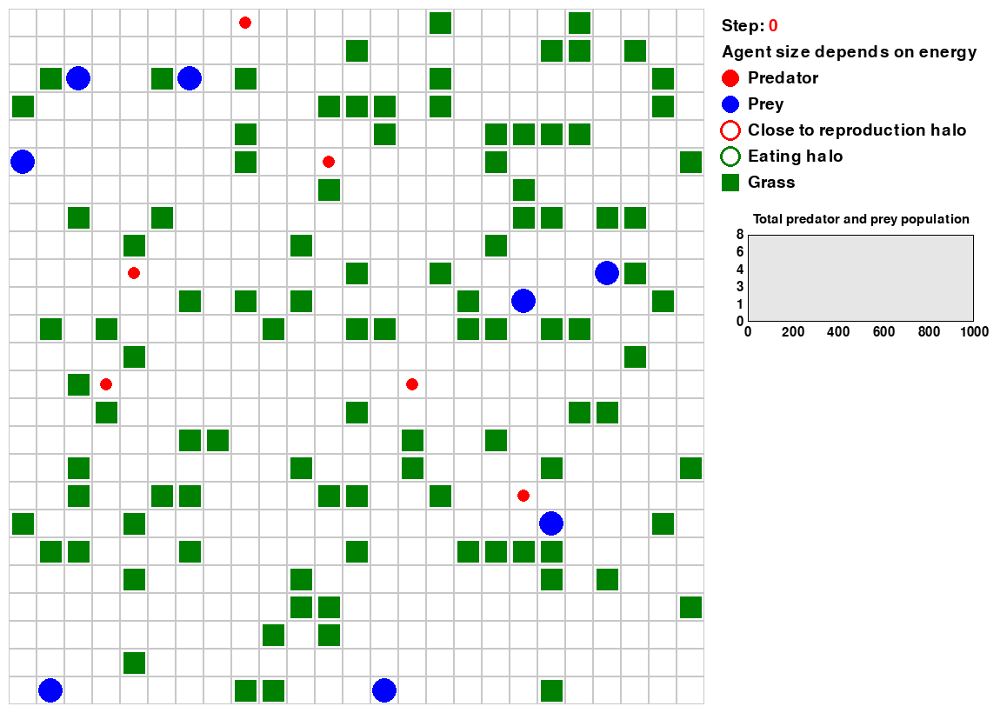
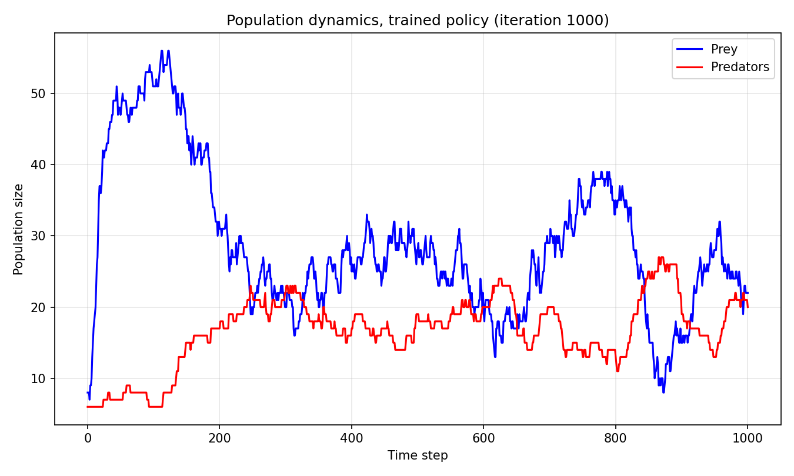
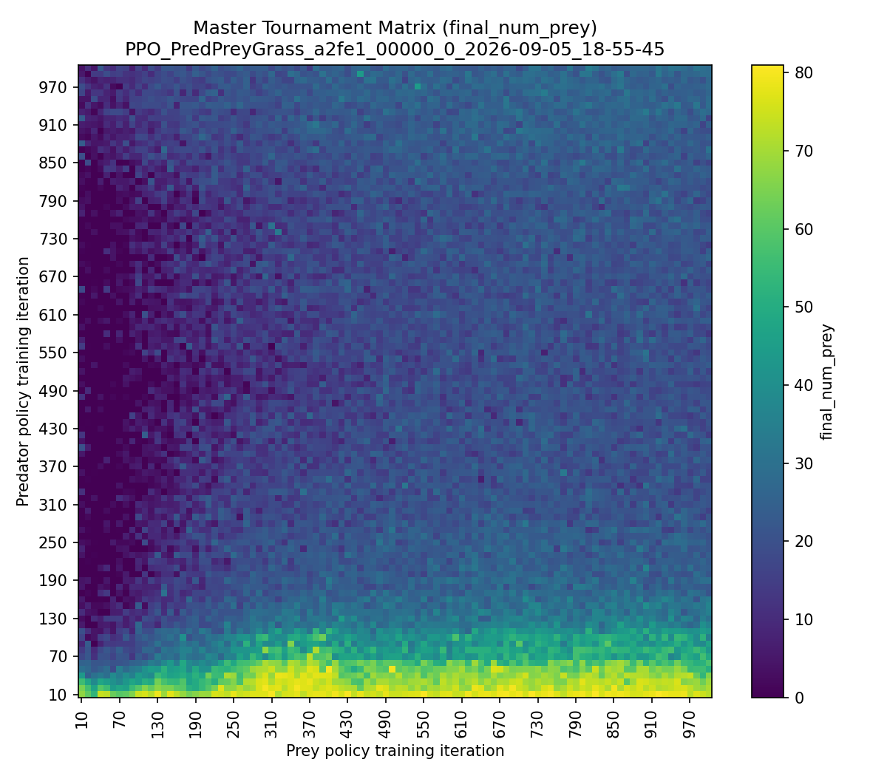

# Predator-Prey-Grass base environment

    <b>Evaluation of trained Predator-Prey-Grass base environment</b>

    

### Features base environment

- At startup Predators, Prey and Grass are randomly positioned on the gridworld.

- Predators and Prey are independently (decentralized) trained via their own RLlib policy module.:

  - **Predators** (red)
  - **Prey** (blue)

- **Energy-Based Life Cycle**: Movement, hunting, and grazing consume energy—agents must act to balance survival, reproduction, and exploration.

  - Predators and Prey **learn movement strategies** based on their **partial observations**.
  - Both expend **energy** as they move around the grid and **replenish energy by eating**:

    - **Prey** eat **Grass** (green) by moving onto a grass-occupied cell.
    - **Predators** eat **Prey** by moving onto the same grid cell.

  - **Survival conditions**:

    - Both Predators and Prey must act to prevent starvation (when energy runs out).
    - Prey must act to prevent being eaten by a Predator

  - **Reproduction conditions**:

      - Both Predators and Prey reproduce **asexually** when their energy exceeds a threshold.
      - New agents are spawned near their parent.
- **Sparse rewards**: agents only receive a reward when reproducing in the base configuration. However, this can be expanded with other rewards in the [environment configuration](./../base_environment/config_env.py). The sparse rewards configuration is to show that the ecological system is able to sustain with this minimalistic optimized incentive for both Predators and Prey.

- Grass gradually regenerates at the same spot after being eaten by Prey. Grass, as a non-learning agent, is being regarded by the model as part of the environment, not as an actor.

## Training and evaluation results

[Training](./tune_ppo_base_environment.py) the agents and [evaluating](./evaluate_ppo_from_checkpoint_debug.py) the environment is an example of how elaborate behaviors can emerge from simple rules in MARL models. As pointed out earlier, rewards for learning agents are solely obtained by reproduction. So all other reward options are set to zero in the environment configuration. Find more background on this [reward shaping and scaling on our website](https://humanbehaviorpatterns.org/pred-prey-grass/marl-ppg/challenges/rewards-ppg/scaling). Despite this relative sparse reward structure, maximizing these rewards results in elaborate emerging agents behaviors such as:
- Predators hunting Prey
- Multiple Predators collaborating/competing hunting Prey; increasing the probability of Prey being caught
- Prey finding and eating grass
- Predators hovering around grass to ambush Prey
- Prey trying to escape Predators

Moreover, these learning behaviors lead to more complex emergent dynamics at the ecosystem level:

- The trained policies make the ecosystem perpetuate much longer than a random policy.

- The trained agents are displaying some sort of the classic [Lotka–Volterra](https://en.wikipedia.org/wiki/Lotka%E2%80%93Volterra_equations) pattern over time. Below: a full 1000-step self-play episode from the SEED42 run's final (iteration 1000) checkpoint. Prey booms early, then predators catch up and the two settle into a lagged oscillation for the rest of the episode (grass, which sits flat near its carrying capacity throughout, is omitted so the predator/prey cycle is easier to read):

    

## Coevolutionary dynamics: is the predator-prey arms race still going?

Population and reward curves confirm the ecosystem sustains itself and produces
Lotka-Volterra-like cycles, but they don't answer a sharper question: over 1000
training iterations, is the predator-prey coevolution still an *ongoing arms
race*, or does it settle into a stable equilibrium at some point? Answering
this requires more than inspecting a single training run's reward curve — it
means cross-evaluating checkpoints from *different points in training*
against each other.

### The Master Tournament matrix

[`master_tournament_matrix.py`](./master_tournament_matrix.py) cross-evaluates
every saved predator-policy checkpoint against every saved prey-policy
checkpoint (mixing checkpoints from different training iterations into one
episode) and records outcome metrics into an NxN matrix. A clean diagonal
gradient in the resulting heatmap indicates genuine, ongoing directional
progress; a flat, noisy matrix indicates a [Red Queen](https://en.wikipedia.org/wiki/Red_Queen_hypothesis)-style
stalemate where both sides keep changing but neither gains lasting ground.

The script preloads all RLModule checkpoints once (avoiding N² redundant disk
reads), runs cells in parallel via `multiprocessing` (`--workers`, fork-based,
each worker pinned to a single torch thread to keep total CPU demand
predictable), and supports a `--dry-run`/pilot workflow (`--stride`,
`--checkpoints-limit`, `--episodes-per-cell`, `--max-steps`) to calibrate
timing before committing to a full sweep.

A full 100x100 sweep (all checkpoints saved every 10 iterations across the
1000-iteration SEED42 run, 3 episodes/cell, 30 parallel workers) produced:

    

**Finding: a two-phase pattern, not a single clean gradient.**

- **Early training (iterations <300): a real, asymmetric arms race.** Predator
  training iteration strongly predicts prey losses (`corr(predator_iteration,
  final_num_prey) = -0.72`); prey training iteration only partially compensates
  (`corr(prey_iteration, final_num_prey) = +0.38`). The predator escalates
  faster than the prey can keep up.
- **Mature training (iterations >=300, both axes): flattens out.** Both
  correlations drop to weak values (+0.24 / +0.23), and outcomes settle into a
  narrow, noisy band (mean 20.5, std 6.6) regardless of exactly which pair of
  mature checkpoints is used.

Cross-checking against each side's own average reward (which, in the
sparse-reward configuration, is essentially a per-capita reproduction-rate
proxy, since reproduction is the only nonzero reward term) sharpens this:
reward saturates *even earlier* (by iteration ~150-200, near its structural
ceiling) and then stays flat with near-zero variance for the rest of training.
That the ecological outcome (`final_num_prey`) took longer to settle than the
reward did, but *both* eventually flattened, is more consistent with the
system converging to a stable joint equilibrium than with an ongoing,
mutually-cancelling arms race.

### Distinguishing equilibrium from stagnation

A flat matrix in the mature region is consistent with two very different
explanations that look identical from the outside:

1. A genuine mutual equilibrium — neither side can improve further given the
   other's strategy.
2. Stagnation — self-play converged to *a* joint local optimum and stopped
   exploring (this run uses `entropy_coeff=0.0` and no Hall-of-Fame/opponent-diversity
   mechanism, both flagged in the coevolutionary-robotics literature as common
   causes of arms races failing to trigger or stalling early).

[`retrain_frozen_opponent.py`](./retrain_frozen_opponent.py) tells these apart
directly: it freezes one policy at a mature checkpoint (via RLlib's
`policies_to_train`, verified to leave the frozen policy's weights
byte-for-byte unchanged) and continues training the other side against that
now-stationary target — either warm-started from its own mature checkpoint
(the sharper test: can this specific already-converged policy still climb once
the opponent stops co-adapting?) or from scratch (can any policy learn to beat
this frozen opponent at all?). If reward/`final_num_prey` climb well past the
mature-region baseline, that's evidence of stagnation; if they stay flat even
against a fixed target, that's evidence of a real local equilibrium.

**Result: not a symmetric equilibrium.** Evaluating each run's checkpoint near
the start of retraining against the same checkpoint near the end (5 episodes
each, offline, against the fixed frozen opponent) gives:

| Run | `final_num_prey` (start &rarr; end) | frozen side's own reward |
|---|---|---|
| Freeze prey, warm-start predator | 19.6 &rarr; 19.6 (+0.0) | flat (9.591 &rarr; 9.612) |
| Freeze predator, warm-start prey | 14.6 &rarr; 26.2 (**+11.6**) | flat (9.866 &rarr; 9.873) |
| Freeze prey, predator from scratch | 37.6 &rarr; 6.4 | reaches ~ceiling by iteration ~10 |
| Freeze predator, prey from scratch | 13.0 &rarr; 22.0 (+9.0) | climbs toward ceiling |

- **The predator reached a genuine, robust equilibrium.** Warm-starting it
  against a truly stationary prey for 300 more iterations changed nothing —
  reward and ecological outcome both stayed flat. Starting from scratch
  converges to essentially the same strong result within ~10 iterations. This
  optimization problem appears to have one strong, easily-reachable attractor.
- **The prey's co-trained convergence was premature.** Its own reward barely
  moves either way (it's already pinned near the reward ceiling), but its
  *ecological* outcome (`final_num_prey`) improves by roughly 80% once the
  predator target stops moving — real headroom existed that ordinary
  co-training, against a constantly-shifting predator, never let it reach.

This refines rather than overturns the equilibrium reading: the flat mature
region of the tournament matrix reflects the predator having converged for
real, while the prey's side of that same flatness was closer to stagnation —
plausibly explaining the matrix's original early-training asymmetry
(predator escalates faster, prey only partially compensates) as more than a
transient effect. Caveat: 5 episodes/condition, one seed — suggestive, not a
rigorous statistical test.

## Centralized versus decentralized training
The described environment and training concept is implemented with separated (decentralized) training for both learning agent types utilizing the RLlib framework. To elaborate on the difference, we compare this approach with the [(legacy) centralized trained environment utilizing PettingZoo and Stable Baselines3 (SB3)](https://github.com/doesburg11/PredPreyGrass-pettingzoo-legacy/tree/main/predpreygrass/pettingzoo).

### (Legacy) Configuration of centralized training
The MARL environment [`predpreygrass_base.py`](https://github.com/doesburg11/PredPreyGrass-pettingzoo-legacy/blob/main/predpreygrass/pettingzoo/envs/predpreygrass_base.py) is implemented using **PettingZoo**, and the agents are trained using **Stable-Baselines3 (SB3) PPO**. Essentially this solution demonstrates how SB3 can be adapted for MARL using parallel environments and centralized training. Rewards (stepping, eating, dying and reproducing) are aggregated and can be adjusted in the [environment configuration](https://github.com/doesburg11/PredPreyGrass-pettingzoo-legacy/blob/main/predpreygrass/pettingzoo/config/config_predpreygrass.py) file. Basically, Stable Baseline3 is originally designed for single-agent training. This means in this solution, training utilizes only one unified network for Predators as well Prey. See [here in more detail](https://github.com/doesburg11/PredPreyGrass-pettingzoo-legacy/tree/main/predpreygrass/pettingzoo#how-sb3-ppo-is-used-in-the-predator-prey-grass-multi-agent-setting) how SB3 PPO is used in the Predator-Prey-Grass multi-agent setting.

### Decentralized training: Pred-Prey-Grass MARL with RLlib new API stack

Obviously, using only one network has its limitations as Predators and Prey lack true specialization in their training. The RLlib new API stack framework is able to circumvent this limitation elegantly. The environment dynamics of the RLlib environments are largely the same as in the PettingZoo environment. However, newly spawned agents are placed in the vicinity of the parent, rather than randomly spawned in the entire gridworld. The implementation under-the-hood of the setup is somewhat different, utilizing array lists to store agent data rather than implementing a separate agent class (largely a result of attempting to optimize compute time of the `step` function). Similarly as in the PettingZoo environment, rewards can be adjusted in a separate environment [configuration file](./../base_environment/config_env.py)

Training is applied in accordance with the RLlib new API stack protocol. The training configuration is more out-of-the-box than the PettingZoo/SB3 solution, but nevertheless is much more applicable to MARL in general and especially decentralized training.

    

A key difference of the decentralized training solution with the centralized training solution is that the concurrent agents become part of the environment rather than being part of a combined single "super" agent. Since, the environment of the centralized training solution consists only of static grass objects, the environment complexity of the decentralized training solution is dramatically increased. This is probably one of the reasons that training time of the RLlib solution is a multiple of the PettingZoo/SB3 solution.
