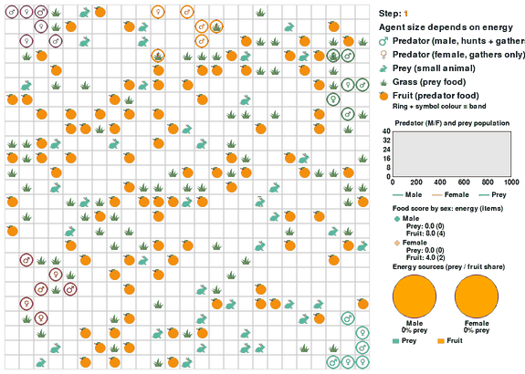

# predator_bands

A clone of [`predator_complementary_diet`](../predator_complementary_diet/) (sexed predators, two-parent reproduction,
fruit/meat stores with a complementary-diet requirement, scripted prey) with **band living** added. Earlier modules are
unchanged. Non-evolutionary: PPO learning only. The design and its open questions are in
[`../predator_complementary_diet/BANDS_DESIGN.md`](../predator_complementary_diet/BANDS_DESIGN.md).

**Consolidated results: [`RESULTS.md`](RESULTS.md).**



*Trained policies, first 400 steps (every 5th step shown): 5 bands (symbol and ring colour = band, shape = sex), the viable meat-sharing run
(`F008_MEAT060`, seed 42, checkpoint 19: meat sharing 0.6, fruit sharing 0.3, meat cost share 0.10, fruit regrowth 0.08), deterministic
actions. Right panel: population, per-sex food score (energy and items eaten) and energy-source pies. Re-create with
`python -m predpreygrass.non_evolutionary.predator_bands.record_gif <checkpoint dir> --out results_figures/trained_policies.gif`.*

## STATUS (2026-09-25): built, under calibration

Built and tested (113 tests; Codex review found 4 issues, all fixed). First calibration runs (seed 42, 100 iterations,
5 s per iteration, 30 learning predators):

| Run (seed 42) | Meat share | Fruit regrowth | Band sharing | Result |
|---|---|---|---|---|
| Pilot (stopped at 82 iterations) | 0.25 | 0.04 | 0.3 | Females extinct in every episode from iteration 25; hunters supplied only ~120 energy of meat per episode against ~250 needed |
| CALIB M010_SHARE030 (100 it.) | 0.10 | 0.04 | 0.3 | Female extinction 92% early, 67% late; episode length 362 to 737; ~7 female births and ~7 marriages per episode |
| CALIB M010_NOSHARE (100 it., control) | 0.10 | 0.04 | 0 | Females extinct in ~100% of episodes; episode length ~390; ~3 births per episode |
| CALIB M005_SHARE030 (100 it.) | 0.05 | 0.04 | 0.3 | Female extinction 80% early, 13% late; episodes near the 1000-step cap; ~5 females and ~11 males alive; deaths now mostly fruit deficiency |
| CALIB F008_SHARE030 (200 it.) | 0.10 | 0.08 | 0.3 | Female extinction 100% at iterations 25-75, then 77-85% (flat); episode length ~750; ~23 female meat-deficiency deaths per episode, ~1-3 from fruit; ~14 marriages per episode |
| CALIB F008_NOSHARE (200 it., control) | 0.10 | 0.08 | 0 | Female extinction 96-100% throughout; episode length ~410; ~15 female meat-deficiency deaths per episode |
| CALIB F008_MEAT060 (200 it., seed 42) | 0.10 | 0.08 | meat 0.6 / fruit 0.3 | **Viable.** Female extinction 61% (iterations 25-50), then 2-12% and stable; episodes ~970-990 steps (cap 1000); 6-9 females and ~28 males alive; ~35-40 births and ~35 marriages per episode; ~470 energy of meat shared per episode. High turnover: ~20 female meat- and ~14 fruit-deficiency deaths per episode. One seed |
| CALIB F008_MEAT060 seed 43 (200 it.) | 0.10 | 0.08 | meat 0.6 / fruit 0.3 | **Replicates seed 42.** Female extinction 85% (iterations 0-25), 36%, 11%, then 2-7% and stable; episodes ~1000 steps; 6-9 females and ~26-29 males alive; ~36 births and ~37-40 marriages per episode; ~520-550 energy of meat shared per episode; ~14 female fruit- and ~19-21 meat-deficiency deaths per episode |
| CALIB F008_MEAT060_MJF (200 it., seed 42, `male_joins_female`) | 0.10 | 0.08 | meat 0.6 / fruit 0.3 | **Viable, more so for females than the default rule.** Female extinction 68% (iterations 0-25), 5%, 2%, then 0%; episodes ~1000 steps; 12-14 females and ~30 males alive (default rule: 6-9 and ~28); ~44-46 female births and ~32 marriages per episode; ~55 within-band pairings (default: ~35); ~700 energy of meat shared per episode (default: ~470); **only ~2.4 of 5 bands survive (default: ~4.5)**, i.e. the population merges into a few large bands; ~20 female fruit- and ~17 meat-deficiency deaths per episode. One seed |

Band sharing clearly helps (the controls lose all their females), but at meat share 0.10 a 30% share does not sustain them. More fruit
regrowth removed the fruit-deficiency deaths but not the meat ones, so the limit is how meat is distributed, not the fruit supply:
males catch ~135 prey (~400 energy) per episode but keep ~70% of it in an uncapped store while females starve. Hence the last run
splits the sharing rate by food type (meat shared more widely, as real bands do): `--band-meat-share-rate 0.6 --band-fruit-share-rate 0.3`.
**This worked:** with meat sharing 0.6, females are sustained at meat share 0.10 (see the last row). Seed 43 replicates it (female extinction 2-7% late). The `male_joins_female`
marriage rule is also viable, with more surviving females but far fewer bands (one seed; see the last row).

## Behaviour analysis (2026-09-25, descriptive)

`analyze_band_behavior.py` rolls out the final checkpoint (19) of the three viable runs (meat share 0.10, fruit regrowth 0.08, meat sharing 0.6 / fruit
0.3): seed 42, seed 43 and the `male_joins_female` variant (seed 42), 20 episodes each. Rollout-based and descriptive: one checkpoint per run, two
seeds plus one variant, no causal claims. A Codex review of the script led to fixes before these numbers: parental care and gifts are now counted
next to band sharing, moves onto occupied cells are treated as blocked, and the random baseline is used for the first 100 steps only.
Full logs: `~/simulation_results/band_behavior/behavior_{s42,s43,mjf}.log`.

| Per life (pooled over lives) | seed 42 | seed 43 | `male_joins_female` |
|---|---|---|---|
| Life length, male / female (steps, all lives) | 508 / 230 | 469 / 245 | 472 / 258 |
| Prey share of own foraging, male / female | 16% / 2.7% | 18% / 2.7% | 20% / 2.4% |
| Own meat per life, male / female | 23.3 / 1.2 | 23.8 / 1.3 | 24.5 / 1.2 |
| Meat that came from others, male / female | 22% / 76% | 21% / 78% | 26% / 80% |
| Single females: life, meat from others | 294 steps, 79% | 282 steps, 73% | 234 steps, 75% |
| Founding-couple females: life, meat from others | 246 steps, 75% | 295 steps, 74% | 252 steps, 74% |
| Approach bias toward prey, male / female | +0.17 / +0.04 | +0.19 / +0.03 | +0.22 / +0.02 |
| Approach bias toward fruit, male / female | +0.21 / +0.21 | +0.22 / +0.21 | +0.19 / +0.22 |
| Approach bias toward same-band / other-band members (males; females) | -0.09 / -0.08; -0.08 / -0.08 | -0.08 / -0.06; -0.06 / -0.05 | -0.07 / -0.07; -0.09 / -0.09 |

(Approach bias: positive means the policy's intended move ends closer to the target than a uniform random mover's would; every interval above excludes
zero; the 95% episode-cluster intervals are in the logs.)

What the runs show:
- **A sex differentiation in foraging emerges.** Males approach and take prey; females approach fruit like males do but barely approach prey, so
  females live almost entirely on fruit they gather themselves and on meat that reaches them through the band (75-80% of their meat, against ~22% for males).
  Band sharing moves meat from the hunters to everyone in range, and females pass on a similar amount of fruit (~12-14 energy given per life).
- **Single females are not worse off than paired ones** in these runs: the same reliance on band meat (73-79%) and similar life lengths (234-295 against
  246-295 steps for founding-couple females). Females of every kind live about half as long as males (~230-260 against ~470-510 steps), which
  matches the high female turnover seen in training.
- **No sign of active cohesion beyond the starting layout.** In the first 100 steps the share of decisions with a same-band member in range is
  0.78 (male) and 0.85 (female) for the trained policies against 0.77 for random movers (a small edge for females only). Both sexes move *away* from any
  nearby predator, same band or other (-0.05 to -0.09), i.e. they avoid crowding while staying within sharing range (about 3.5-4.6 cells from the nearest
  band-mate). There is no valid random comparison after step 100, because random-policy populations die out.
- **`male_joins_female` merges the population into fewer bands:** later in episodes the nearest same-band member is ~2.4-2.9 cells away (against ~3.5-4.6)
  and 90-96% of decisions have a band-mate in range (against 71-86%), consistent with the ~2.4 surviving bands reported above.

- **Minimum meat a female needs** (`analyze_female_meat_intake.py`, same runs): the rules put the meat drain at 0.010 (always idle) to 0.018 (always
  moving) energy per step at meat share 0.10, from a 2.5 starting store. Females that lived at least 800 steps had a net meat intake (own hunting +
  received - given) of at least 0.016-0.017 per step (median about 0.021), i.e. at the upper end of that floor, with the starting store covering the
  rest; among females that lived at least 300 steps the lowest was about 0.009 (5th percentile about 0.010). Intake is not consumption, and the
  samples of 800-step lives are small (11, 26 and 24 females).

- **Who is scattered** (`analyze_band_scatter.py`, same runs, sampled every 10 steps): the share of observations in which a predator has
  no band-mate within sharing range is about 31-37% for founders (never changed band), 5-19% for members born into a band, and
  8-12% for members that changed band less than 25 steps ago, rising to 12-25% more than 100 steps after the move. So marriage is not the
  main source of scatter (a marriage needs a mate within 3 cells, so the mover arrives next to its new band); scatter grows with time in a
  band, and the policies themselves do not hold bands together. Distance to the band centroid (about 8 cells for every group) is
  uninformative because bands are spread over several clusters. Descriptive, one checkpoint per run; age and sex effects not separated.

Limits: a state-dependent policy comparison would need the shared-state method used in `predator_sexual_reproduction`; the counts of founder roles are
small (100 lives each); lives cut off at the episode end are included (many males, few females). See the Codex-reviewed docstring of
`analyze_band_behavior.py` for the exact definitions.

## Mammoth pilot (2026-09-26, one seed): joint hunts were not learned

3 bands, 2 mammoths (energy 20, respawn 80, single-band parties, success 0.02 / 0.25 / 0.6 / 0.9 and death on failure 0.30 / 0.15 / 0.05 /
0.02 for parties of 1 / 2 / 3 / 4+), no threats, sharing 0.6 / 0.3, meat cost share 0.10, fruit regrowth 0.05, 150 iterations. The
population is viable (episodes ~970 steps late, female extinction 16%, ~5 females and ~16 males alive). But predators almost never hunt
together: per episode ~8 attempts are solo (party of 1) and cost ~2.8 predator deaths, ~0.8 attempts have a party of 2, and parties of 3 or
more are essentially absent. Mammoth kills are ~0.3 per episode (~6 energy distributed, negligible). So the group hunt was not discovered
at this training scale, and the solo attempts are a net cost. Untested next steps: a smoother success curve (0.1 at party size 1), lower
solo death chance, the band compass, more or richer mammoths, longer training.

## No-solo mammoth test (2026-09-26, one seed, 300 iterations each): pair hunts are learned with the compass, cohesion does not change

Solo attempts made harmless and useless (party of 1: success 0, death 0; pairs 0.3 / 0.1, triples 0.6 / 0.05, 4+ 0.9 / 0.02), 2 mammoths,
3 bands, no threats, sharing 0.6 / 0.3, meat cost share 0.10, fruit regrowth 0.05.

| Per episode | Compass off (iterations 175-217) | Compass on (iterations 200-211) | First pilot (2% solo odds) |
|---|---|---|---|
| Attempts by a pair / by a triple | 3.1 / 0.2 | 8.9 / 0.8 | 0.8 / 0 |
| Kills by a pair / by a triple | 0.9 / 0.2 | 3.6 / 0.5 | 0.2 / 0 |
| Mammoth energy distributed | 18-27 | 80 | 6 |

With the compass, pair attempts and kills grow through training (energy from mammoths 4.6 to 80 per episode, still rising); without it they
stay flat from iteration 50 on. Populations are viable in both (episodes ~850-900 steps, female extinction 20-40%). But cohesion is unchanged
against the no-mammoth control (checkpoint 29 against a 150-iteration run at checkpoint 14, so not perfectly matched): share of observations
out of sharing range 38% / 21% / 28% (founders / born / moved over 100 steps) with the compass against 36% / 21% / 28% in the control; late nearest
same-band distance 4.6 (males) and 4.0 (females) against 4.5 and 4.0; the approach bias toward band-mates is still negative (-0.09 to -0.10).
Reading (not tested): a pair hunt needs only one band-mate next to the attacker, and mammoth meat (~80 energy per episode) is small next to
band sharing (~250 meat), so it is a payoff too small and too occasional to change where predators stand. Also 211 of 300 iterations were
logged for the compass-on run's training curves.

## Bigger-mammoth test (2026-09-26, one seed, 300 iterations): mammoth meat as large as band sharing, cohesion still unchanged

4 mammoths of energy 40 (the no-solo curve, band compass on, otherwise as above). Pair hunts keep growing through training (last block: ~20 pair
attempts and ~6.4 pair kills per episode, ~1.3 triple attempts and ~0.6 triple kills, still rising), and mammoth meat is now a major energy source:
~290 energy per episode distributed, about as much as band sharing moves (~260-300 meat per episode). Populations are viable (episodes ~865-925
steps, female extinction 21-50% in the last blocks, ~2.6 of 3 bands alive). Cohesion at checkpoint 29 (20 episodes) is not better than the
no-mammoth control: share of observations out of sharing range 42% / 20% / 30% (founders / born / moved over 100 steps) against 36% / 21% / 28%;
late nearest same-band distance 4.8 (males) and 3.9 (females) against 4.5 and 4.0; within-range share 0.69 / 0.81 against 0.72 / 0.81; approach bias
toward band-mates still negative (-0.11 males, -0.08 females). One seed and one checkpoint; the control is a shorter no-mammoth run.

**Summary of the cohesion attempts so far (all one seed, 150-300 iterations):** band compass, roaming threats with group defense (tested at several
strengths), wider defense, distance-scaled and shorter-range sharing, and mammoth hunts (normal, no-solo, no-solo with compass, and bigger) did not
produce a learned pull toward band-mates. The mammoth hunts show that pairs can learn a coordinated hunt when solo attempts are useless and the
compass is on, but that does not keep bands together. Untested: memory or communication in the policy, longer training, several seeds, requiring
parties of three or more, and defining band membership by proximity (see `BANDS_DESIGN.md`, section 9).

## Proximity-defined bands (2026-09-26, one seed, 150 iterations): membership rules did not reduce scatter

Band membership that follows co-residence (options `band_fission`, `band_fusion`, `band_drift_steps`, `band_drift_join`; designed rules, not learned
behaviour; 3 bands to start, sharing 0.6 / 0.3, meat cost share 0.10, fruit regrowth 0.05). **Version 1** (fission above 8, fusion, drift-out after 50 steps
leaving for a one-member band) fragmented the population: ~10 bands of mean size 1.3 with ~40 drift-outs per episode, female extinction 74%, movers out of
sharing range 59-74%, late within-range share 0.29 (males). A Codex review found bugs: drift counters that carried over when a member changed band (so
members drifted out again at once), drift decisions that depended on iteration order, dead or doomed predators counted as members, a band split only once per
check, and freshly split bands fusing in the same call. **Version 2** (bugs fixed; drift-*join* after 100 steps: join the nearest other band within 5 cells,
else leave alone; fission above 8; fusion) is viable (episodes ~860-940 steps late, female extinction 22-36%, ~5 bands alive, mean band size ~3.6, ~42-54 fissions,
~16-20 drift-outs and ~2 fusions per episode) but its cohesion is **worse** than the flat-band control: share of observations out of sharing range 40% / 33% / 30-51%
(founders / born / moved) against 36% / 21% / 28%; late nearest same-band distance 6.0 (males) and 4.9 (females) against 4.5 and 4.0; within-range share 0.54 / 0.67
against 0.72 / 0.81. Reading (not tested): splitting a band of nine into two spatial clusters does not make either cluster tight (they can span more than the
5-cell sharing range), bands keep splitting as births refill them, and smaller bands leave fewer members within reach of a hunter's share. One seed, one
checkpoint; the control is a shorter no-membership-rule run.

## Prey-dependent calibration (2026-09-27, one seed, 150 iterations each): no viable regime with more prey dependence yet

Motivation: predator and prey numbers were roughly stable with no Lotka-Volterra pattern; predators appear fruit-limited (prey is about 15% of their foraging energy). Three runs lowered fruit income and raised the meat share of the cost (3 bands, sharing 0.6/0.3, no threats/mammoths):

| run | fruit gain | meat cost share | female extinction (from the training log) | episode length (rollouts) | prey share of foraging energy |
|---|---|---|---|---|---|
| A | 0.03 | 0.30 | 100% | about 209 | 24% |
| B | 0.03 | 0.50 | 97% | about 81 | 19.5% |
| C | 0.05 | 0.40 | not read out | 73-156 (mean about 124) | 16.1% |

None is viable, so `analyze_population_dynamics.py` (needs episodes of at least about 300 steps) could not be applied to A-C.

Then a richer catch instead: new option `prey_energy_yield` (default 1.0 = unchanged) multiplies the energy a predator gains from a catch, leaving the prey's own ecology alone. Both runs use fruit 0.03, meat cost share 0.15, sharing 0.6/0.3, one seed, 150 iterations, and the analysis on checkpoint 14 (6 rollout episodes, max 1001 steps):

| run | prey energy yield | episode lengths (steps) | prey share of foraging energy | predators / prey (mean per episode) | best-lag corr(prey, predators) |
|---|---|---|---|---|---|
| D | 3 | 568, 1001, 1001, 670, 1001, 1001 | 52.1% | 12.7-17.7 / 38.5-45.3 | -0.81 to +0.69 (mostly negative) |
| E | 5 | 1001 in all six | 62.4% | 15.4-17.7 / 39.7-44.2 | -0.71 to -0.40 (all negative) |

Both are sustained in rollouts and prey is now the main food source. In training, female extinction was still common in D (about 0.7 of episodes) and lower in E (0.18-0.40 after the first 25 iterations); counts are from the TensorBoard scalars over the logged iterations.

What this does and does not show: predator and prey counts are negatively correlated (best lag), which is the expected sign when predators eat the prey, so predator-prey coupling is present. There is no clean Lotka-Volterra cycle: the dominant period varies from 134 to 470 steps between episodes and explains 21-57% of the variance in episodes of about 1000 steps, i.e. only 2-5 cycles, and predator and prey counts stay near 16 and 42 with coefficients of variation of 0.12-0.26 and 0.07-0.14. One seed and one checkpoint; the regime differs from the earlier runs (less fruit, richer prey), so it is not a like-for-like comparison, and whether cohesion or hunting behaviour changed was not analysed here.

## Threats on the richer-prey regime, and a free-rider problem in the defense rule (2026-09-27, one seed each, 150 iterations)

Two more runs added 6 roaming threats to run E's setup (prey yield 5, fruit 0.03, meat cost share 0.15), with `threat_kill_prob=0.3`, satiation 100, cooldown 10, and a wider `threat_defense_radius=5`, differing only in `threat_defenders_to_repel`:

| run | defenders to repel | episode lengths (steps) | prey share of foraging energy | encounters/iter (end of training) | repelled/iter | killed/iter | killed-alone share |
|---|---|---|---|---|---|---|---|
| THREATS6 | 2 | 568-1001 (4 of 6 at cap) | 57.1% | 158.2 | 64.6 (41%) | 23.6 (15%) | 69% |
| THREATS6_REPEL5 | 5 | 225-1001 (mixed) | 58.8% | 102.5 | 5.7 (6%) | 20.4 (20%) | 47% |

Both stay viable and keep prey as the majority food source; population dynamics still show no clean cycle (negative best-lag correlation in most episodes, dominant period 134-470 steps across both runs). Raising the repel bar to 5 (needing most of a 3-band, ~16-predator population's band together at once) cut repels from 41% to 6% of encounters, as expected, but did not produce visibly tighter clustering in the rendered rollout.

**A free-rider problem in the design, not (only) a credit-assignment one.** `threat_defense_radius` (2-5 across these runs) is larger than `threat_attack_range` (a threat only ever attacks a predator within distance 1 of itself). A predator counts as a defender for anyone within `threat_defense_radius` of it, so a band-mate can sit at distance 2-5 from an attacked target -- safely outside the threat's reach -- and get full credit toward repelling it, at zero personal risk. There is no reward for defending (`config_env.py`'s threat comment: "No reward terms; ... only the outcome depends on company"), so the individually optimal policy is to stay just inside the defense radius but outside the attack radius: full benefit, no exposure. This is a public-goods/volunteer's-dilemma structure, not a two-player prisoner's dilemma, but the same free-rider logic applies, and it does not obviously improve with more threats or a higher repel bar -- both just make the safe defender ring more valuable without making it any riskier to stand in.

Added `threat_attack_all_adjacent` (default off) as a first step: when on, a threat attacks every predator within distance 1 of itself at once, not just the nearest, so predators who *are* mutually adjacent to the threat share real risk and can defend each other in the same step. This narrows the free-rider gap only for the already-adjacent; it does not close it for the radius-2-to-5 "safe ring" band-mates.

Added `band_reputation` (default off) as a second, more direct attempt at the "safe ring" itself: every predator gets a continuous reputation score in [0, 1] (starts at 1.0), nudged by `reputation_ema_alpha` each time it is counted as a defender -- toward 1.0 if it was itself within distance 1 of the threat (genuinely exposed), toward 0.0 if not (free-riding on the wider defense radius). The score scales, rather than switches, two things: how much a defender's presence counts toward repelling a threat or lowering the kill probability, and how much of a band-mate's shared forage it actually receives -- a habitual free-rider gradually becomes less useful to defend with and less worth sharing with, and recovers gradually with genuine exposure, rather than a hard cutoff. Modeled loosely on image-scoring indirect reciprocity (Nowak & Sigmund) and the reputation-based sanctioning (ridicule, exclusion) anthropologists (Boehm, *Hierarchy in the Forest*) describe enforcing real hunter-gatherer sharing norms, and mechanically executed like the module's other designed payoffs, not a learned action, for the same credit-assignment reasons as the male/female gifts. (An earlier binary "ostracism" version of this idea, built and reviewed in the same session but never used in a run, was fully replaced by this continuous design rather than kept alongside it.) Not yet calibrated or run: whether a shrinking share/defense benefit actually changes free-riding behaviour, or just leaves a low-reputation predator to die off faster, is an open question. Untried besides this: shrinking `threat_defense_radius` down near the attack range (removes the safe ring entirely, at the cost of making group defense much harder to trigger), a direct reward for a successful defense (moves the module away from its "no reward terms, outcome depends only on company" design), or exposing reputation as an observation channel so avoidance/approach of specific band-mates would be learned rather than mechanical.

## What is new (on top of the diet module)

- **Initial bands:** `num_bands` (**3 by default since 2026-09-25; all calibration and behaviour results above used 5**) bands of a founding couple (recorded mates), `band_children_per_couple` (2) dependent
  children (alternating male, female), and one unpaired male and female each; members start on the free cells nearest a band
  centre (`band_spawn_radius`, enforced), centres spread by farthest-point sampling. 18 predators by default (30 with 5 bands). The food settings (fruit regrowth 0.04 by default; the viable 5-band runs used 0.08) have not been re-calibrated for 3 bands.
- **Band sharing:** `band_share_rate` (0.3) of any forage, prey or fruit, is split equally among the forager's living band
  members within `band_share_range` (5); meat stays meat and fruit stays fruit; doomed members are not rescued. Mechanical, no
  reward for grouping. The old mate gifts are set to 0 here; parental care stays at 0.2.
- **Kin exclusion** (`kin_exclusion`): no parent-child or sibling mating.
- **Marriage** (`marriage_rule`): a cross-band pairing moves one partner (default the female) and their dependent children
  into the other's band; newborns join the father's band.
- **Observation:** channels 6 and 7 mark same-band and other-band predators (8 channels in total). Sex is still not visible.
- `num_bands = 0` turns all band features off (the diet-module behaviour).
- New metrics: `band_share_events`, `band_share_meat_total`, `band_share_fruit_total`, `marriages`, `within_band_pairings`,
  `kin_blocked_checks`, `bands_alive`.

## Running

```
python -m predpreygrass.non_evolutionary.predator_bands.tune_ppo_predator_bands \
    --seed 42 --max-iters 100 --reward-per-energy 0.5 --penalty-combat-death 0.2 --minibatch-size 1024 \
    --diet-meat-cost-share 0.10 --band-share-rate 0.3
python -m predpreygrass.non_evolutionary.predator_bands.random_policy
pytest predpreygrass/non_evolutionary/predator_bands/tests/ -v
```
Flags: `--num-bands`, `--band-share-rate`, `--band-share-range`, `--kin-exclusion 0/1`, `--marriage-rule`,
`--band-meat-share-rate`, `--band-fruit-share-rate` (each defaults to the single rate), `--diet-meat-cost-share`, `--scripted-prey 0/1`,
`--initial-num-fruit`, `--energy-gain-per-step-fruit`.

## Not built

Big game ("mammoths" needing several hunters, kill split by band strength): see the design draft.
