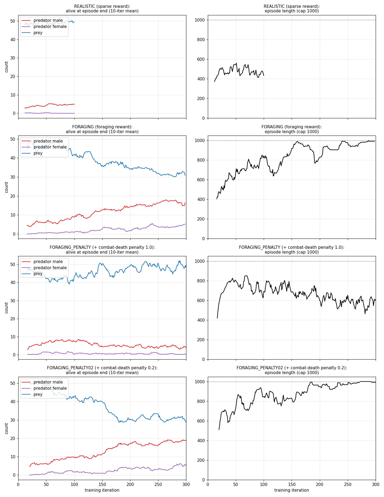
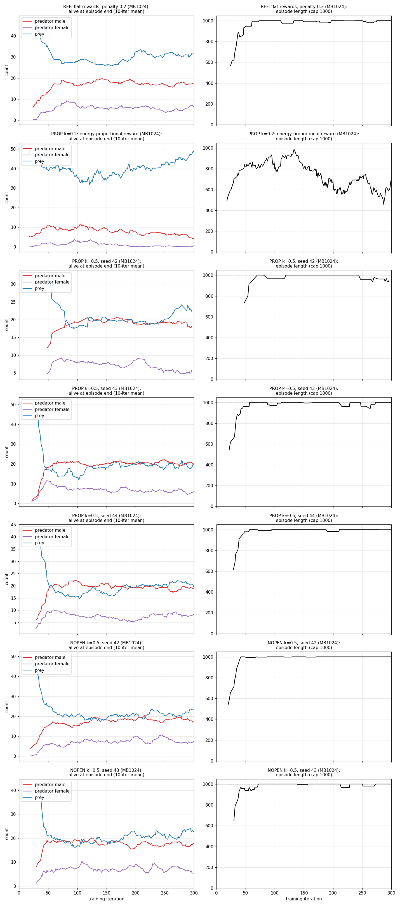
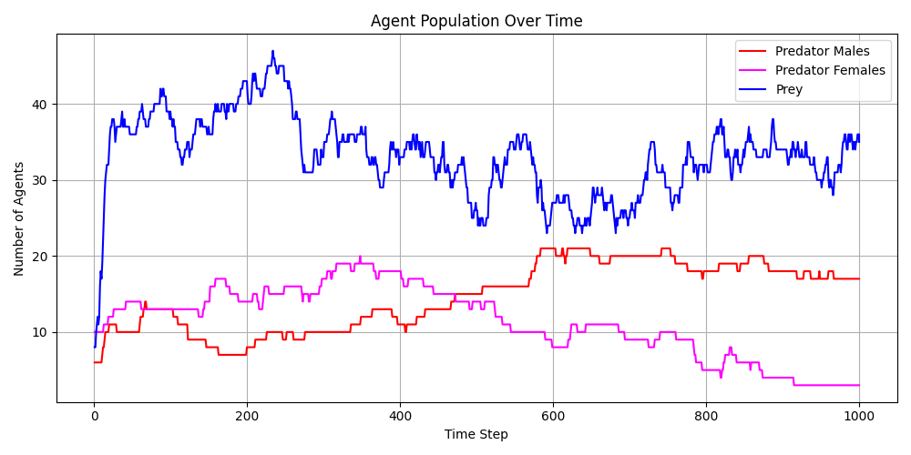

# predator_sexual_reproduction

A copy of [`base_environment_step_energy`](../base_environment_step_energy/) that
replaces asexual predator reproduction with **sexual (two-parent) reproduction**,
and splits predators into two sexed policies with different foraging roles.

## Research motivation

Predators, not prey, are the human analog in this module. The project's
broader interest is human cooperation and behavior; predators are cast as
"humans" here because humans hunt *and* gather fruit, whereas herbivore prey
don't map onto that. Two features are specifically included as human-like
traits under study, not just mechanics:

- **Sexual reproduction** (a mate requirement, not solo energy-threshold
  reproduction), with asymmetric parental investment (see below), as a
  substrate for pair-bonding-like dynamics.
- **Sex differentiation in foraging (a "division of labor")** -- both sexes can hunt, but face
  very different odds (the ablations suggest the difference in success rate matters more than the tested difference in death risk; see Status) (see "Why hunting is risky, and riskier for females"
  below), so any resulting specialization is meant to emerge from training,
  not be hardcoded by fiat -- a precondition many theories of human
  cooperation lean on.

This is why predators were chosen over prey for this feature despite prey
being the easier population to test it on (denser, more frequent mating
opportunities, no interaction with the hunting/engagement code path) --
prey have no analogous role in a human-cooperation framing.

## The mechanism

- **predator_male**: low-risk/high-success hunter (90% success / 5% death per
  attempt by default), also gathers fruit.
- **predator_female**: high-risk/low-success hunter (20% success / 10% death
  per attempt by default), also gathers fruit.
- **prey**: unchanged from `base_environment_step_energy` -- only eats grass,
  reproduces asexually (solo, energy-threshold triggered).

Grass is prey-exclusive food; fruit is predator-exclusive food (both sexes can
gather it). This keeps predator and prey foraging from ever competing over
the same patches, unlike `eco_evolutionary_nuptial_gift`'s predator_female
(which deliberately competes with prey for grass).

### Sexual reproduction

A `predator_male` and a `predator_female` reproduce together when:

1. Both **independently** clear `predator_creation_energy_threshold`.
2. They are within `mate_search_radius` (Chebyshev distance) of each other.

This can never be an exact-cell match, unlike predator-catches-prey or
prey-eats-grass: `predator_male`/`predator_female` share one grid layer
(channel 1, "predator"), and movement collision already forbids two
predators -- of either sex -- from ever occupying the same cell. A radius
check is therefore structurally required, not just a design preference.
This is the same constraint `eco_evolutionary_nuptial_gift`'s
`cooperation_range` (male → female nuptial gift) faces, and is modeled on it.

Unlike the nuptial-gift module, reproduction itself is genuinely two-parent
here: both parents pay energy, both get the reproduction reward, and a single
offspring (sex assigned by an unbiased coin flip) is spawned adjacent to the
**female** (the mate). There is no genome in this module (it's a
`non_evolutionary/` module, mirroring `base_environment_step_energy`) --
"sexual" here means the two-parent *mechanic* (mate-finding, joint energy
cost, joint reward), not genetic recombination.

**Birth cost is split asymmetrically**: the female pays 90% and the male
pays 10% of the offspring's starting energy by default
(`predator_birth_cost_share_female`/`_male`), modeled on parental investment
theory (Trivers, 1972) -- the female bears the larger share of the shared
reproductive cost, consistent with her also being the structurally riskier
forager (see below).

### Male provisioning (offsetting the female's post-birth energy deficit)

A `predator_female` pays the larger share of birth cost (90% by default) but
her only reliable income is fruit-gathering -- a shared, depletable resource,
and a much weaker income stream than hunting is for the male (90% success vs.
her 20%). Left alone, this makes her a recovery bottleneck after even one
successful birth. To offset this, a `predator_male`'s successful hunt donates
`male_gift_donation_rate` (default `0.3`) of the energy gained to **his
recorded mate only** (`self.agent_mate`), provided she's currently within
`predator_gift_range` (Chebyshev distance, default `3`) -- not to any nearby
female. This is exclusive/pair-bonded (more biologically apt for the human
pair-bonding this module studies than broadcasting to whoever happens to be
nearby, which is what `eco_evolutionary_nuptial_gift` does for its
non-pair-bonded species), unidirectional (male → female only), and
mechanically executed -- not a learned action -- for the same
credit-assignment rationale as `eco_evolutionary_nuptial_gift`'s
`male_donation_rate` (a donor's own reward stream never reflects a
recipient's downstream fitness, so a learned "donate" action would face a
real credit-assignment gap).

The mate bond (`self.agent_mate[male] = female` and vice versa) is recorded
the first time a pair successfully reproduces together, and updated (not
accumulated) on any later reproduction -- serial monogamy, i.e. his most
recent partner, not lifetime exclusivity. Remating severs both former
partners' reverse pointers first, so an ex never keeps receiving gifts
indefinitely. A male who has never reproduced has no recorded mate and
gives no gifts at all. See `_apply_male_gift`.

### Parental care (both parents feed their own nearby offspring)

Alongside mate provisioning, **both** parents (not just the mother) share
`parent_offspring_share_rate` (default `0.2`) of any successful forage --
hunt *or* fruit -- with their own nearby living offspring, recorded at birth
in `self.agent_parents[child] = (father, mother)`. Direct paternal
provisioning of offspring (not just of the mother) is a documented
human-specific trait in the cooperative-breeding literature -- most mammals
rely on the mother alone, which is part of why this module casts predators
as humans in the first place. Unlike the exclusive, single-recipient mate
gift, this splits evenly across however many of a parent's own children are
currently nearby, since (unlike mates) a parent can have several living
offspring at once. Reuses `predator_gift_range` for proximity rather than
adding a separate knob. See `_share_energy_with_offspring`.

Care stops once the offspring has reproduced itself (`self.has_reproduced`)
-- a **reproduction-based**, not age-based, independence cutoff: this
module tracks no per-agent age at all, so "started its own family" is a
much cheaper proxy for "grown up" than adding age/weaning-duration
bookkeeping would be. Distance still tapers care off for free too -- a
grown offspring that simply wanders away (without yet reproducing) falls
out of range on its own.

### Why hunting is risky, and riskier for females

Hunting is a 3-outcome stochastic contest for **both** sexes, resolved
whenever a predator shares a cell with a prey (`_resolve_hunting_attempt`):

1. **success** -- the predator eats the prey (same bookkeeping as a
   deterministic catch would have).
2. **predator dies** -- the prey is left completely unharmed; the predator
   itself is removed, using the same bookkeeping as starvation.
3. **failure** -- nothing happens; the predator can still separately gather
   fruit that step.

`predator_male` gets favorable odds (90% success / 5% death by default);
`predator_female` gets unfavorable odds (20% success / 10% death by default).
This reverses the module's original design, where `predator_female` was
*structurally incapable* of touching prey at all -- now both sexes have the
same capability, and any tendency for females to lean on fruit-gathering
instead of hunting is meant to be an **emergent consequence of RL training**
under this risk asymmetry, not a hardcoded rule. Whether training produces
that specialization depends on the reward design: it does not with flat per-event
rewards, and it does, on three seeds, with an energy-proportional reward (see
"Is there a division of labor?" below).

## Grid channels

`num_obs_channels = 5`: Border, Predator (both sexes share this layer),
Prey, Grass, Fruit.

## Config (see `config_env.py`)

Energy costs (`homeostatic_energy_cost_per_step_*`, `move_energy_cost_per_step_*`)
are inherited unchanged from `base_environment_step_energy`'s validated
defaults. New keys: `mate_search_radius` (default `3`), `n_possible_predator_male`/
`n_possible_predator_female` (replacing the single `n_possible_predators` pool),
`n_initial_active_predator_male`/`n_initial_active_predator_female`,
`initial_energy_predator_male`/`initial_energy_predator_female`, the
`initial_num_fruit`/`initial_energy_fruit`/`energy_gain_per_step_fruit` fruit
settings (same shape as the grass settings),
`predator_birth_cost_share_female`/`_male` (default `0.9`/`0.1`),
`penalty_predator_death_in_combat` (default `0.0`), the hunting-odds keys
`prey_vs_predator_male_success_prob`/`_death_prob` (default `0.90`/`0.05`)
and `prey_vs_predator_female_success_prob`/`_death_prob` (default
`0.20`/`0.10`), `male_gift_donation_rate`/`predator_gift_range` (default `0.3`/`3`) for male
provisioning, and `parent_offspring_share_rate` (default `0.2`, reuses
`predator_gift_range`) for parental care. `__init__` raises `ValueError` if
a sex's success+death probabilities exceed 1.0, if the birth-cost shares
don't sum to exactly 1.0, or if `male_gift_donation_rate`/
`parent_offspring_share_rate` is outside `[0, 1]`, or if their sum exceeds
`1.0` (a male's successful hunt applies both donations to the same gross
gain, not sequentially off a shrinking remainder, so an unchecked sum above
1.0 could deduct more energy than the hunt actually gained).

`reward_predator_per_energy` (default `0.0` = off) pays a forage reward proportional to the energy gained
(k x energy, for fruit and prey alike), added to the flat per-event rewards
`reward_predator_catch_prey` / `reward_predator_gather_fruit`; set those two to 0 for a purely energy-proportional
reward. Command-line flags for the tune script: `--reward-per-energy`, `--reward-catch-prey`, `--reward-gather-fruit`,
`--penalty-combat-death` (a magnitude, stored negative), `--minibatch-size`, `--num-epochs`, `--male-*`/`--female-*` hunting odds.

## Running

Train:
```
python -m predpreygrass.non_evolutionary.predator_sexual_reproduction.tune_ppo_predator_sexual_reproduction --seed 42 --max-iters 500
```

Watch a random policy (sanity check, no training needed):
```
python -m predpreygrass.non_evolutionary.predator_sexual_reproduction.random_policy
```

Evaluate a checkpoint interactively:
```
python -m predpreygrass.non_evolutionary.predator_sexual_reproduction.evaluate_ppo_from_checkpoint_debug
```
(update the hardcoded `checkpoint_path` first).

Run the validation test suite (not auto-discovered by the repo's pytest
`testpaths` -- must be invoked explicitly, same as every other module's tests):
```
pytest predpreygrass/non_evolutionary/predator_sexual_reproduction/tests/ -v
```

## Status and key results

Built 2026-09-17 to 09-18 (sexual reproduction, stochastic hunting, exclusive mate
provisioning, parental care, observability metrics). Trained 2026-09-19 to 09-21; full log,
tables and the reasoning behind each step in [`RESULTS.md`](RESULTS.md).

**Key message: with a flat reward per fruit and per catch, predators learn to steer toward fruit but
not toward prey, and men eat no more prey than a random walker does. Under an energy-proportional reward
(`reward_predator_per_energy` = 0.5), three training seeds consistently produced a partial sex
differentiation in foraging: men take about 48% of their energy from prey (a random walker: 41%) and step
onto adjacent prey about 1.4 times as often as chance; women take about 12% (random: 15%) and approach
fruit the most; the ecosystem stays healthy. This survives a same-observation (shared-state) policy
comparison and dropping the explicit combat-death penalty entirely. Ablations show women's hunting
success is the more influential factor (three seeds each for both single-factor ablations now), responding
as a fairly sharp threshold around 40-60% success rather than a smooth gradient; a lower death chance alone
gives a smaller, also-replicated shift. The higher-success ablations collapse the prey population, so
necessity is not yet shown under matched ecological conditions. Only k = 0.5 is replicated.**

**The runs compared** (all seed 42 unless noted, all at the shipped-default hunting odds):

| Name | Reward | Iterations | Minibatch |
|---|---|---|---|
| **REALISTIC** | Sparse: only reproduction pays (10.0) | 100 | 128 |
| **FORAGING** | REALISTIC plus catch prey +1.0 and gather fruit +0.5 (flat, per event) | 300 | 128 |
| **FORAGING_PENALTY** | FORAGING plus -1.0 when a predator dies in a failed hunt | 300 | 128 |
| **FORAGING_PENALTY02** | FORAGING plus -0.2 when a predator dies in a failed hunt | 300 | 128 |
| **REF** | FORAGING_PENALTY02 rewards, re-run at the faster minibatch | 300 | 1024 |
| **PROP k=0.2** | Energy-proportional: reward = 0.2 x energy gained (fruit and prey alike), flat rewards 0, penalty 0.2 | 300 | 1024 |
| **PROP k=0.5** | As PROP k=0.2 with k = 0.5 (three seeds: 42, 43, 44) | 300 | 1024 |
| **NOPEN** | As PROP k=0.5 with the combat-death penalty at 0 (two seeds: 42, 43) | 300 | 1024 |
| **Response surface** | As PROP k=0.5 with women's success at 40% or 60% (death kept at 10%) | 300 | 1024 |
| **ABL_SUCCESS_ONLY / ABL_DEATH_ONLY** | As PROP k=0.5 with only women's success (90%) or only their death chance (5%) changed (three seeds each: 42, 43, 44) | 300 | 1024 |

Run directories are `PPO_PREDATOR_SEXUAL_REPRODUCTION_<...>_SEED42` under `~/simulation_results/ray_results/` (see `RESULTS.md`
for the exact names). The penalty and proportional runs are diagnostics on the reward design, not proposed final rewards.



*Minibatch-128 runs. Rows: REALISTIC (100 iterations), FORAGING, FORAGING_PENALTY (-1.0), FORAGING_PENALTY02 (-0.2).
Left: individuals alive at episode end. Right: episode length (cap 1000). Seed 42.*



*Minibatch-1024 runs. Rows: REF (flat rewards), PROP k=0.2 (declines: women almost extinct), PROP k=0.5 with seeds 42, 43, 44 (healthy).*



*One evaluation episode of the FORAGING run's final checkpoint (iteration 300, seed 42, deterministic
argmax actions, `evaluate_ppo_from_checkpoint_debug.py`). All three populations coexist for the full
1000 steps; the female population is the fragile one. A single episode, so illustrative rather than statistical.*

- **REALISTIC (sparse):** predator policies stayed near random, and females are almost extinct by the end of each episode.
- **FORAGING (flat foraging rewards):** episodes reach the 1000-step cap and both sexes learn to approach fruit (x1.54 male,
  x1.65 female against a random mover), but prey approach stays near random.
- **Penalties (-1.0, -0.2):** -1.0 collapses the predator population. The -0.2 run looked like a first hint of male-hunts /
  female-gathers, but that did not reproduce when the same rewards were re-run at minibatch 1024 (REF), so it is unconfirmed.
- **Where a predator's energy comes from** (`analyze_energy_sources.py`): men eat 120-160 fruits per life at only 0.4-0.5
  energy each (full is 2.0) and about 9 prey at 4.7 each; their prey share (about 37-40%) equals a random walker's. Gifts are
  negligible (about 3% of a woman's intake). The flat rewards pay per event regardless of energy, so per unit of energy fruit pays about
  4.6 times more than prey and repeatedly eating nearly empty fruit is strongly rewarded (a plausible reason the flat-reward runs show no
  male prey preference; not isolated experimentally, see below).
- **PROP k=0.2:** men eat fruit at 0.99 energy per fruit (0.40 in REF) and net intake rises 60%, but the female population collapses
  (0.6 alive, births 8 against 32 in REF). k = 0.2 and 0.5 pay the same per unit of energy for fruit and prey and differ only in scale, so
  the collapse at 0.2 points to reward scale (fruit worth about 0.1 reward to a woman) rather than to the fruit/prey ratio.
- **PROP k=0.5 (three seeds):** men step onto adjacent prey x1.32-1.49 as often as a random mover (flat-reward runs
  x0.85-1.08; approach bias +0.26 to +0.29 cells against -0.010 to +0.040 in the flat-reward runs, which differ in minibatch so that range
  is not a seed-variance estimate) and draw 46.9-49.6% of their energy
  from prey; women draw 11.1-12.1% from prey (less than a random walker's 14.8%) and approach fruit x1.83-1.91. The ecosystem
  is healthy in all three (births about 37-43, 19-20 men and 5-8 women alive at the end), though prey are depleted to about 18-21.
- **Caveat:** only k = 0.5 has been replicated (REF and k = 0.2 have one seed each); k = 0.5 was chosen after k = 0.2 failed; the
  absolute effect is modest.

Reproduce the charts with `python -m predpreygrass.non_evolutionary.predator_sexual_reproduction.analyze_training_curves`,
the approach/avoid measurement with `analyze_prey_approach_from_checkpoint`, and the energy split with `analyze_energy_sources`.

### Is there a sex differentiation in foraging ("division of labor")? What is and is not established

*This section was tightened after an independent second opinion (Codex); see `RESULTS.md`, "Second opinion".*

**Working definition.** Here "division of labor" only means a difference between the sexes, emerging from training rather than
hard-coded, in (a) what they do (approach toward prey and fruit) and (b) where their energy comes from (prey share of gross
own-forage energy), while the population stays viable. It does not imply coordination or task allocation. Nothing forces the
difference: both sexes can hunt and gather, and the male/female difference in hunting odds (90% / 5% against 20% / 10% success /
death) is the only built-in asymmetry that bears on hunting.

**Established (descriptive; three training seeds, energy-proportional reward `reward_predator_per_energy` = 0.5, iteration 300):**
- Men step onto an adjacent prey x1.32-1.49 as often as a random mover; women x1.02-1.07. In REF (flat rewards, same minibatch, one seed) men were x0.85.
- Men take 46.9-49.6% of their gross own-forage energy from prey (a random walker: 41%; flat-reward runs 37-40%); women 11.1-12.1% (random 15%; flat-reward runs 13-15%).
- Women approach fruit the most (x1.83-1.91), and the ecosystem stays healthy (births about 37-43, 19-20 men and 5-8 women alive).

**Confirmed by a same-observation comparison, and without the explicit death penalty.** `analyze_shared_states.py` queries the male and
female policy of a checkpoint on exactly the same stored observations (a fixed random-policy state bank, environment not stepped), removing
the confound that rollouts measure a policy partly on states it creates for itself. Every k = 0.5 run, with or without the -0.2 combat-death
penalty, shows a male-minus-female prey approach-bias difference of +0.15 to +0.22 (interval well above 0); REF (flat rewards) shows about
+0.02. Dropping the penalty entirely (`penalty_predator_death_in_combat = 0`, two seeds) leaves the split unchanged or slightly stronger and
does not change deaths-in-combat per episode, so **the explicit penalty appears unnecessary for the split at this setting** (it does not show
death risk itself is irrelevant, since dying still ends a predator's future reward either way).

**Supported by the runs but not fully isolated (working hypotheses):**
- **Women's lower hunting success is what matters most, and it responds as a threshold, not a gradient.** Giving women the men's odds (90% /
  5%; seeds 42, 43) removes the split. Both single-factor ablations now have three-seed support:

  | Women's odds (success / death) | Men: prey share | Women: prey share | Prey alive | Split? |
  |---|---|---|---|---|
  | 20% / 10% (baseline, three seeds) | 47-50% | 11-12% | 18-21 | yes |
  | 20% / 5% (death chance only, three seeds) | 44.9-52.7% | 14.7-15.4% | 19-23 | yes, slightly narrower on all three |
  | 40% success / 10% death (one seed) | 41.7-41.8% | 26.4-27.2% | 21.4 | yes, ecosystem still healthy |
  | 60% success / 10% death (one seed) | 40.9-41.4% | 37.7-38.5% | **5.1** | breaking down, ecosystem collapsing |
  | 90% / 10% (success only, three seeds) | 29-34% | 40-48% | 0.4-2.9 | no, reversed on all three |
  | 90% / 5% (equal odds, two seeds) | 34-38% | 37-38% | 0-1.6 | no |

  Success is the more influential factor and replicates on three seeds each way; a lower death chance alone gives a smaller, also-replicated
  shift toward more hunting. The response to success looks like a fairly sharp threshold in the 40-60% band, not a smooth gradient: the split
  and the ecosystem are essentially unchanged at 40% and both break down between 40% and 60%. The interventions are not perfectly single-factor
  (success, death and failure share one random draw), and every run at 60% success or above collapses the prey population, so necessity of the
  unequal odds is not demonstrated under matched ecological conditions.
- **The reward design matters.** The same unequal odds gave no split under flat per-event rewards and under k = 0.2 (women's population
  collapsed), and a split at k = 0.5. Flat rewards strongly reward repeatedly eating nearly empty fruit (a man collected about 60-80
  reward per life from fruit against about 9 from prey), a plausible reason for the absence of the male prey preference; this has not been
  isolated, because k = 0.2 and k = 0.5 pay the same per unit of energy for fruit and prey and differ only in reward scale (relative to
  the reproduction reward of 10 and the death penalty), which may also matter.

**Not established, or limits:**
- **It is partial, not exclusive specialization, and no coordination is shown.** Men still get about half their energy from fruit; a
  woman catches about one prey per life (0.8-1.0) against about 10 for a man.
- **Few independent training runs at most settings.** Three seeds for k = 0.5 and for both single-factor ablations; one or two each for REF,
  k = 0.2, no-penalty and each response-surface point. The bootstrap intervals in the rollout analysis cover episodes of one trained
  checkpoint, not training-seed variation (the shared-state comparison is a partial exception: it is a policy-only comparison, but its
  interval still covers states of one checkpoint). k = 0.5 was chosen after k = 0.2 failed, and mostly only iteration 300 is analysed.
- **Settings are mixed across older runs.** The minibatch-128 runs (FORAGING, penalty runs) are not like-for-like controls for the
  minibatch-1024 runs; REF is the matched flat control. On the shared-state comparison, the minibatch-128 penalty-0.2 run shows about half the
  effect size of the matched minibatch-1024 runs, consistent with treating it as real but not robust.
- **Measurement caveats.** Rollouts sample actions from each policy, so approach and step-onto ratios (outside the shared-state check) mix
  action preference with the states each policy creates; "step onto" is the probability of an action whose nominal destination is the
  target's cell. Energy figures are gross own-forage energy, means over lives that include lives cut off at the end of the episode, and
  prey share is a ratio of means.
- **The higher-success and equal-odds ablations collapse the prey population**, so their numbers describe short, prey-poor lives, not a
  matched comparison with the healthy baseline. The birth-cost asymmetry remained throughout and produced no split on its own.

**Current best statement of the result:** under energy-proportional forage reward with k = 0.5, the male-prey / female-fruit differentiation
replicates across three training seeds, with or without the explicit combat-death penalty, and survives a same-observation comparison that
removes the self-created-states confound. Men obtain roughly 47-50% of their gross own-forage energy from prey against roughly 11-13% for
women. Flat-reward runs do not show the same pattern and strongly reward repeated consumption of depleted fruit. The split responds to
women's hunting success as a threshold around 40-60%, not a smooth gradient; both single-factor ablations (success, death chance) have
three-seed support, with success the more influential factor. The results still suggest, rather than fully isolate, a productivity-based
mechanism modulated by reward design, since the higher-success and equal-odds interventions collapse the prey population rather than holding
the ecology fixed.

### Training speed and the minibatch size

About 97% of each iteration is the PPO learner update, which is limited by one CPU core doing about
29,000 tiny gradient steps (minibatch 128, 30 epochs, three policies); the GPU sits at about 31% and
the environment runners are nearly idle. In a 50-iteration test (FORAGING configuration, seed 42)
`--minibatch-size 1024` was **5.8x faster** (14.7 against 84.7 minutes) and reached a healthier
ecosystem and stronger fruit approach at the same iteration; `--num-epochs 10` was 2.8x faster.
One seed, and any change of these settings makes runs not directly comparable, so the defaults stay
at 128 and 30 for now (the runs up to FORAGING_PENALTY02 used them; the later REF and PROP runs pass `--minibatch-size 1024`). Two practical limits: only one GPU run fits at a
time (the learner grows to about 10 of 16 GB), and a CPU-only learner (`--gpu-fraction 0`) is about 5x
slower. The diagnosis, search and full numbers are in `RESULTS.md`, Iteration 5.

## TODO next

1. **Death-chance response surface** (5/10/20/30% at fixed 20% success, several seeds) to complement the success-rate surface (done,
   Iteration 9) and settle how much of a role risk plays.
2. **Matched-ecology ablation** (Codex's suggestion, open): more prey replenishment or starting prey, or fixed finite cohorts, so a
   high-success/equal-odds run does not collapse the prey population, for a cleaner necessity test.
3. Try other k (0.3, 0.7) and re-tune the combat-death penalty on top of the energy-proportional reward (now looks droppable, see
   Iteration 9); watch whether prey depletion (about 18-21 alive) limits predators over longer runs.
4. More seeds where only one or two exist: REF, PROP k=0.2, the response-surface points (40%, 60%), and the no-penalty runs.
5. Decide whether `--minibatch-size 1024` becomes the default (5.8x faster; recommended). The defaults stay 128 / 30 so
   earlier runs remain reproducible; the newer runs pass the flag explicitly.
6. Fruit-only shaping (no catch reward) to separate learning to gather from learning to hunt.
7. Longer training and multiple late checkpoints, not only iteration 300, to check the effect is stable rather than a snapshot.
