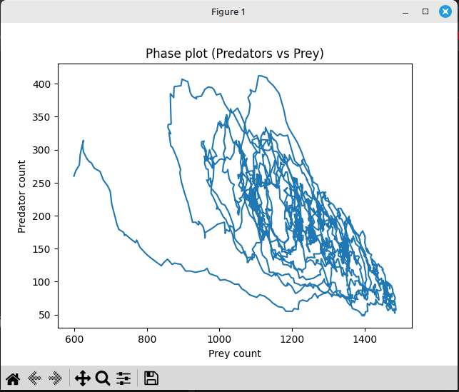
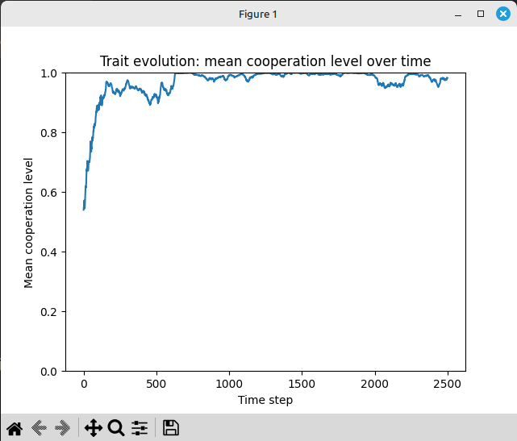
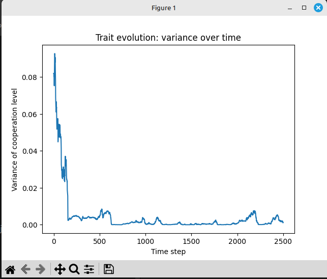
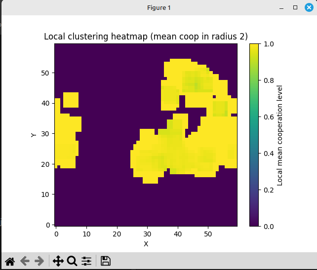
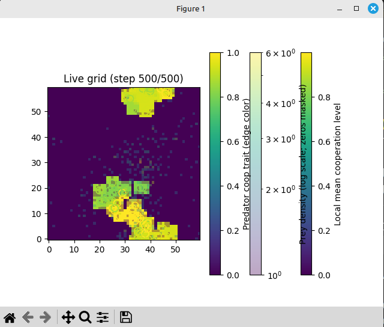

# Predator--Prey Cooperation Model Results

## With Formal Evolutionary Interpretation

This document summarizes the results of the spatial predator--prey model
with evolving continuous cooperation traits, and provides a formal
evolutionary interpretation using:

-   Hamilton's Rule (Kin Selection)
-   Multilevel Selection
-   Price Equation
-   Public Goods Game Structure
-   Spatial Assortment Theory

------------------------------------------------------------------------

# 1. Ecological Dynamics

## Population Oscillations


Classic predator--prey oscillations are observed:

-   Prey peaks precede predator peaks
-   Predator crashes allow prey recovery
-   System remains dynamically stable

This confirms ecological coupling resembling Lotka--Volterra dynamics:

dPrey/dt = rP - a P C

dPred/dt = b a P C - m C

Where: - P = prey density - C = predator density - a = encounter rate -
b = conversion efficiency - m = predator mortality

Spatial structure modifies these equations locally but preserves
cyclical structure.

## Phase Plot (Predators vs Prey)



The phase trajectory forms a stable loop rather than spiraling to
extinction or exploding without bound. This supports the interpretation
that the system settles into a resilient oscillatory regime rather than
chaotic collapse.

------------------------------------------------------------------------

# 2. Evolutionary Dynamics

## Trait Evolution: Mean Cooperation



Mean cooperation rapidly increases toward fixation (≈1.0).

This indicates strong directional selection:

∂W/∂c \> 0 for all c ∈ \[0,1\]

where W is fitness and c is cooperation level.

------------------------------------------------------------------------

## Trait Variance Collapse



Variance approaches zero → near monomorphic cooperative population.

No balancing selection or polymorphism is maintained under current
parameters.

------------------------------------------------------------------------

# 3. Hamilton's Rule Interpretation

Cooperation increases kill probability:

p_kill = 1 − (1 − p0)\^(Σ c_i)

Energy is shared among contributors only.

The fitness benefit of cooperation depends on:

-   b = marginal increase in survival/reproduction due to improved
    hunting success
-   c = energetic cost of cooperation
-   r = spatial assortment (probability that neighbors share similar
    trait)

Hamilton's Rule:

r b \> c

In this simulation:

-   Local reproduction creates high spatial assortment r
-   Benefits b are strong due to nonlinear kill function
-   Costs c are moderate

Thus:

r b − c \> 0

for most of trait space → cooperation is strictly advantageous.

This explains rapid fixation.

------------------------------------------------------------------------

# 4. Multilevel Selection Perspective

We can decompose selection into:

Δz = Cov_group(W_g, z_g)/W̄ + E_g\[Cov_ind(W_i, z_i)\]/W̄

Where:

-   z = cooperation trait
-   W_g = group fitness (local predator cluster success)
-   W_i = individual fitness

In this model:

-   Groups with higher mean cooperation have higher hunting success.
-   Within-group selection is weak because defectors do not receive
    shared rewards.

Therefore, between-group selection dominates.

This is a multilevel cooperation regime.

------------------------------------------------------------------------

# 5. Price Equation Formulation

The evolutionary change in cooperation can be written as:

Δz = Cov(W, z) / W̄

Since high-cooperation individuals consistently receive more energy and
reproduce more, the covariance term remains positive across time.

Thus cooperation monotonically increases.

Variance collapses because directional selection pushes toward boundary
condition c = 1.

------------------------------------------------------------------------

# 6. Spatial Assortment

Local clustering heatmap:



Spatial reproduction ensures that offspring remain near parents.

Assortment coefficient α \> 0 emerges endogenously.

Effective relatedness:

r ≈ Corr(z_i, z_neighbors)

High r enables Hamilton's condition.

## Live Grid Snapshot (Final Frame)



The final-frame visualization layers multiple signals for interpretation:

-   Background encodes local cooperation field.
-   Overlay shows prey density (log-scaled to prevent dense patches from washing out the map).
-   Predators are open circles with edge color mapped to cooperation level.

This makes it easier to see how spatial structure and trait values co-vary.

------------------------------------------------------------------------

# 7. Public Goods Game Structure

This system resembles a spatial public goods game with exclusion:

-   Contributions increase group success
-   Only contributors receive reward
-   Defectors receive no benefit

This is not a Prisoner's Dilemma.

It is closer to a coordination game where cooperation strictly
dominates.

Thus fixation is expected.

------------------------------------------------------------------------

# 8. Why No Social Dilemma Emerges

For a dilemma, we require:

Temptation T \> Reward R

But here:

Reward(cooperate) \> Reward(defect)

for nearly all ecological states.

Therefore, no stable polymorphism arises.

------------------------------------------------------------------------

# 9. Interpretation of Full System

The model demonstrates:

-   Stable ecological oscillations
-   Strong directional selection for cooperation
-   Variance collapse → fixation
-   Spatial clustering reinforcing kin-like dynamics

This is a textbook case of cooperation evolving under spatial assortment
and shared rewards.

------------------------------------------------------------------------

# 10. Visualization Notes

All plots and the live grid snapshot are generated by
`src/predpreygrass/ecology/emerging_cooperation.py`.

The animation layers are:

-   Base layer: local cooperation heatmap (clustering metric).
-   Overlay: prey density heatmap with log scaling (zeros masked).
-   Predators: open circles with edge color mapped to cooperation level.

The animation is capped at `ANIM_STEPS` for clarity, while summary plots
use the full simulation horizon.

------------------------------------------------------------------------

# 11. Reproduction of Results

To regenerate the figures and outputs used in this report, run:

```bash
python src/predpreygrass/ecology/emerging_cooperation.py
```

If you want deterministic plots, set `SEED` in the script to a fixed
integer before running.

------------------------------------------------------------------------

# 12. Key Parameter Settings (Simulation Run)

These settings define the ecological and evolutionary pressures used to
generate the figures. Full definitions live in
`src/predpreygrass/ecology/emerging_cooperation.py`.

-   Grid: `W=60`, `H=60`
-   Initial populations: `PRED_INIT=250`, `PREY_INIT=600`
-   Steps: `STEPS=2500`
-   Predator energetics: `METAB_PRED=0.06`, `MOVE_COST=0.008`, `COOP_COST=0.18`
-   Predator reproduction: `BIRTH_THRESH_PRED=3.0`, `LOCAL_BIRTH_R=1`
-   Mutation: `MUT_RATE=0.03`, `MUT_SIGMA=0.08`
-   Hunt mechanics: `HUNT_R=1`, `P0=0.08`, `KILL_ENERGY=4.0`, `SHARE_MIN_COOP=0.02`
-   Prey dynamics: `PREY_MOVE_PROB=0.25`, `PREY_REPRO_PROB=0.04`, `PREY_MAX=1600`
-   Clustering radius: `CLUST_R=2`

------------------------------------------------------------------------

# 13. Next Directions (If Desired)

To generate richer evolutionary dynamics:

-   Allow defectors partial benefit (introduce temptation)
-   Add diminishing returns to cooperation
-   Add risk cost to high cooperation
-   Introduce competing predator morphs
-   Measure evolving assortment coefficient explicitly


# Mathematical Derivation of the Selection Gradient


Let \(c_i \in [0,1]\) be individual cooperation, and for the local hunting group \(g\):

$$
S_g = \sum_{j \in g} c_j = c_i + S_{-i}
$$

Kill probability:

$$
p_{\text{kill}}(S_g) = 1 - (1 - p_0)^{S_g}
$$

Expected energy gain (contributors-only proportional sharing):

$$
G_i = p_{\text{kill}}(S_g)\,E\,\frac{c_i}{S_g}
$$

Cost per tick:

$$
C_i = \kappa c_i
$$

Fitness proxy:

$$
W_i = E\frac{c_i}{S_g}\Bigl[1 - (1 - p_0)^{S_g}\Bigr] - \kappa c_i
$$

Define:

$$
f(S) = 1 - (1 - p_0)^S
$$

Then \(W_i = E\frac{c_i}{S_g}f(S_g) - \kappa c_i\).

Selection gradient:

$$
\frac{\partial W_i}{\partial c_i}
=
E\left[
\frac{\partial}{\partial c_i}\left(\frac{c_i}{S_g}\right)f(S_g)
+
\frac{c_i}{S_g}f'(S_g)\frac{\partial S_g}{\partial c_i}
\right]
-\kappa
$$

Use:

$$
\frac{\partial S_g}{\partial c_i}=1,\qquad
\frac{\partial}{\partial c_i}\left(\frac{c_i}{S_g}\right)=\frac{S_g-c_i}{S_g^2}=\frac{S_{-i}}{S_g^2}
$$

and:

$$
f'(S_g) = (1-p_0)^{S_g}\ln\left(\frac{1}{1-p_0}\right)
$$

Final result:

$$
\frac{\partial W_i}{\partial c_i}
=
E\left[
\frac{S_{-i}}{S_g^2}\Bigl(1-(1-p_0)^{S_g}\Bigr)
+
\frac{c_i}{S_g}(1-p_0)^{S_g}\ln\left(\frac{1}{1-p_0}\right)
\right]
-\kappa
$$

Cooperation is selected for when:

$$
\frac{\partial W_i}{\partial c_i} > 0
$$
