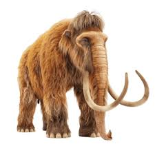

# Mammoths Defection: cooperative hunting with defection

## Environment and logic (full description)

### Entities and roles
- **Predators (humans / hunters)**: `type_1_predator` agents that move, lose energy, hunt, and reproduce.
- **Prey (mammoths)**: `type_1_prey` agents that move, lose energy, eat grass, and reproduce.
- **Grass**: static resource patches that regrow energy over time.
- **Walls** (optional): impassable cells that can be manually placed.

### Grid, observations, and visibility
- The world is a 2D grid (`grid_size` x `grid_size`).
- Each agent observes a local square window around itself (Moore neighborhood), with separate ranges for predators and prey (`predator_obs_range`, `prey_obs_range`).
- Observations include channels for predators, prey, and grass energy; optional line-of-sight masking can hide entities behind walls.

### Startup
- At startup, humans, mammoths, and grass are randomly positioned on the gridworld. Walls surround the gridworld and can optionally be placed within it.

### Actions and movement
- Each agent selects a movement action mapped to a displacement in its Moore neighborhood (including stay).
- Predators cannot share a cell with other predators, and prey cannot share a cell with other prey.
- Movement into wall cells is blocked.

### Energy, decay, and death
- All agents have an energy state. Each step, energy decays by a fixed per-step amount (`energy_loss_per_step_predator`, `energy_loss_per_step_prey`).
- If an agent's energy reaches 0 or below, it dies and is removed from the gridworld.

### Foraging and hunting dynamics
- **Prey grazing**: when a mammoth lands on grass, it consumes grass energy and gains that energy (grass energy decreases and can regrow later).
- **Predator hunting**: humans can hunt for mammoths via a two-step "freeze then resolve" process (see below).

### Team capture with defection (step-by-step)

This variant models cooperation vs free-riding without a separate "join/defect" action. Defection is inferred from the movement decision.

#### Step t: identify participants and freeze prey
1. For each predator, find all adjacent mammoths (Moore neighborhood) at step t.
2. Each predator is assigned to **at most one** mammoth: the adjacent mammoth with the **highest energy** (ties broken by prey id).
3. For each mammoth, the **participant set** is all predators assigned to it at step t.
4. If the participant set is non-empty, that mammoth is **frozen at step t+1** (it cannot move).
5. The participant set is fixed at step t (predators cannot join or leave the participant set in t+1).

#### Step t+1: classify actions and resolve capture
4. Each participant chooses a movement action.
5. **Cooperators** are participants whose **intended move** keeps them within the mammoth's Moore neighborhood at t+1.
   - This includes staying put, moving onto the mammoth, or moving to any adjacent Moore cell.
6. **Defectors** are participants whose **intended move** leaves the Moore neighborhood at t+1.
   - A predator is still a defector even if the move is blocked and it ends up staying in place.

#### Success condition
7. Capture succeeds if:
   - `sum(E_cooperators) > E_mammoth + team_capture_margin`
   - This uses cooperator energy at the start of step t+1 (before paying any cooperator cost).

#### Costs and rewards
8. Each cooperator pays a fixed cost `team_capture_coop_cost` **every time**, even if the capture fails.
9. On success:
   - The mammoth is removed.
   - Its energy is split **equally among all participants** (cooperators + defectors).
   - Each participant receives: `E_mammoth / N_participants`.
10. On failure:
   - The mammoth survives and can move again at step t+2.
   - No energy is transferred to predators (but cooperators already paid their cost).

#### Social dilemma
- Defectors reduce the cooperator energy sum, lowering the chance of success.
- If capture succeeds, defectors still share the reward without paying the cost.
- This creates a free-riding dilemma: defecting is immediately attractive but can undermine long-term group success.

### Reproduction
- Humans reproduce asexually when their energy exceeds `predator_creation_energy_threshold`.
- Mammoths reproduce asexually when their energy exceeds `prey_creation_energy_threshold`.
- A child is spawned in a nearby free cell and its starting energy is deducted from the parent.

### Rewards and termination
- Rewards are sparse: agents receive reward only on successful reproduction.
- There is **no explicit cooperation reward**; cooperative hunting emerges from the capture rules and energy accounting.
- An episode ends when either humans or mammoths go extinct, or when `max_steps` is reached.

---

### Metrics (logged via EpisodeReturn callback)

Per-episode capture totals:
- `team_capture_episode_attempts`: number of capture resolutions in the episode.
- `team_capture_episode_participants`: total participant slots across attempts.
- `team_capture_episode_cooperators`: total cooperator slots across attempts.
- `team_capture_episode_defectors`: total defector slots across attempts.
- `team_capture_episode_successes`: successful captures in the episode.
- `team_capture_episode_failures`: failed captures in the episode.

Cumulative (since training start):
- `team_capture_total_participants`: total participant slots across all episodes.
- `team_capture_total_defectors`: total defector slots across all episodes.
- `team_capture_total_defection_rate`: `total_defectors / total_participants * 100`.

# MADRL training

- Predators and Prey are independently (decentralized) trained via their own RLlib policy module.
  - **Predator**
  - **Prey**
- Predators and Prey learn movement strategies based on their partial observations.

# Results

    <b>Emerging cooperative hunting in Predator-Prey-Grass environment</b>

    

- Cooperative hunting can emerge even without explicit rewards for cooperation.
- Human hunters tend to cluster together when cooperation is beneficial.
