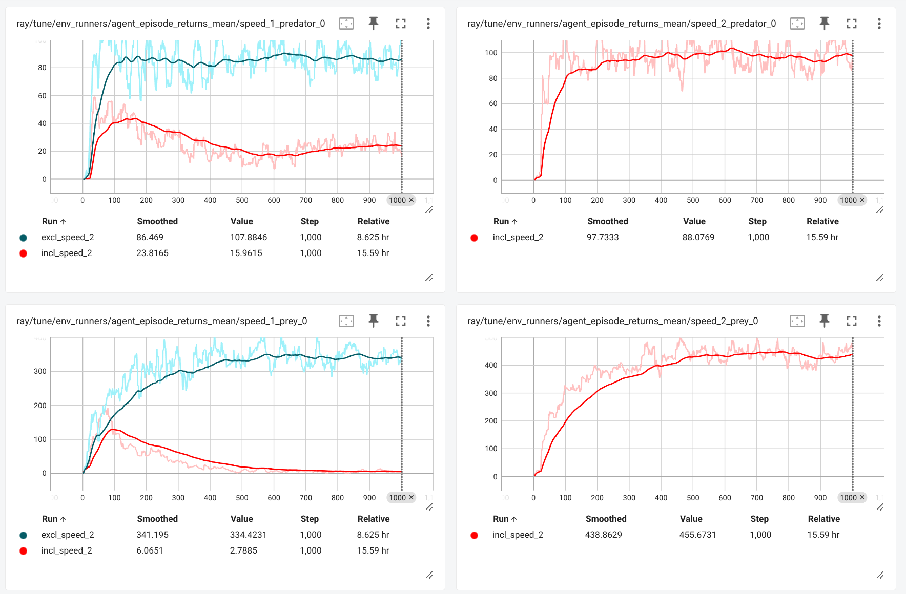
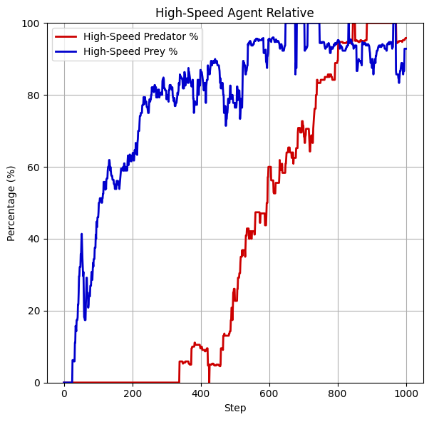

# [mutating_agents]: Predator-Prey-Grass mutating agents environment

    <b>Evaluation of trained nutating agents envrionment</b>

    

## Additional features with respect to the [base-environment](https://github.com/doesburg11/PredPreyGrass/tree/main/src/predpreygrass/rllib/v1_0)

* At the start of the evaluation, the Predator and Prey populations only consists of "slow" agents.
  * "Slow" agents (Speed 1): can move in a (9-position) [Moore neighborhood](https://en.wikipedia.org/wiki/Moore_neighborhood) range.

* At reproduction, the offspring of both "slow" Predators and Prey, can mutate with a probability of 5% towards "fast" agents (and vice versa).
  * "Fast" agents (Speed 2): can move in a (25-position) extended Moore neigborhood range. Consequently, the high-speed agent can move faster across the gridworld per simulation step.

    
    
<b>Action spaces of low-speed (Speed 1) and high-speed (Speed 2) agents</b>

## Training and evaluation results

**Mutation and Selection**: When agents reproduce, they may randomly mutate (switching speed class). This introduces a natural (or more precise: *artificial*) selection pressure shaping the agent population over time.

The base-environment setup is changed to enable mutations with the reproduction of a agents. When all 4 agents (low-speed-predator, high-speed-predator, low-speed-prey and high-speed-prey) are decentralized trained, it appears that average rewards of low-speed predator and prey agents **first increase rappidly** but **taper off after some time** as depicted below.The average rewards of the high-speed agents on the other hand still increase after this inflection point.

    
    
<b>Training results of low- & high-speed agents combined and low-speed agents only</b>

The training results suggests that the population of the low-speed agents diminishes relative to the population of high-speed agents, since (average) rewards are directly and solely linked to reproduction success for all agent groups. This crowding out of low-speed agents occurs **without any manual reward shaping** or explicit encouragement. High-speed agents—once introduced via mutation—apparently are more successful at acquiring energy and reproducing. As a result, they overtake the population at some point during the evaluation.

Moreoever, this hypothesis is supported further when evaluating the trained policies in a low-speed agent only environment at the start. It appears that when we initialize the evaluation with **only** low-speed predators and low-speed-prey, the population of low-speed agents is utlimately replaced by high-speed agents for predators as well as prey as displayed below. Note that after this shift the low-speed agents are not fully eradicated, but temporarily pop up due to back mutation.

    
    
<b>Low-speed agents replaced by high-Speed agents trough selection</b>

This is an example of **"natural" selection** within an artificial system:
- **Variation**: Introduced by random mutation of inherited traits (speed class).
- **Inheritance**: Agents retain behavior linked to their speed class via pre-trained policies.
- **Differential Fitness**: Faster agents outperform slower ones under the same environmental constraints.
- **Selection**: Traits that increase survival and reproduction become dominant.

### Co-Evolution and the Red Queen Effect

The mutual shift of both **prey and predator populations toward high-speed variants** reflects also a classic [**Red Queen dynamic**](https://en.wikipedia.org/wiki/Red_Queen_hypothesis): each species evolves not to get ahead absolutely, but also to keep up with the other. Faster prey escape better, which in turn favors faster predators. This escalating cycle is a hallmark of **co-evolutionary arms races**—where the relative advantage remains constant, but the baseline performance is continually ratcheted upward. It is noteworthy that in this setup prey start to mutuate first.

This ecosystem, therefore, is not only an instance of artificial selection—it’s also a model of **evolution in motion**, where fitness is relative, and adaptation is key.

Notably, agents in this system lack direct access to each other’s heritable traits such as speed class. Observations are limited to localized energy maps for predators, prey, and grass, with no explicit encoding of whether an observed agent is fast or slow. Despite this, we observe a clear evolutionary shift toward higher-speed phenotypes in both predator and prey populations. This shift occurs even when high-speed variants are initially absent and must arise through rare mutations, suggesting that selection is driven not by trait recognition but by differential survival and reproductive success. Faster agents outperform their slower counterparts in the competitive landscape created by evolving opponents, leading to a mutual escalation in speed. This dynamic constitutes an implicit form of co-evolution consistent with the Red Queen hypothesis: species must continuously adapt, not to gain an absolute advantage, but merely to maintain relative fitness in a co-adaptive system.
