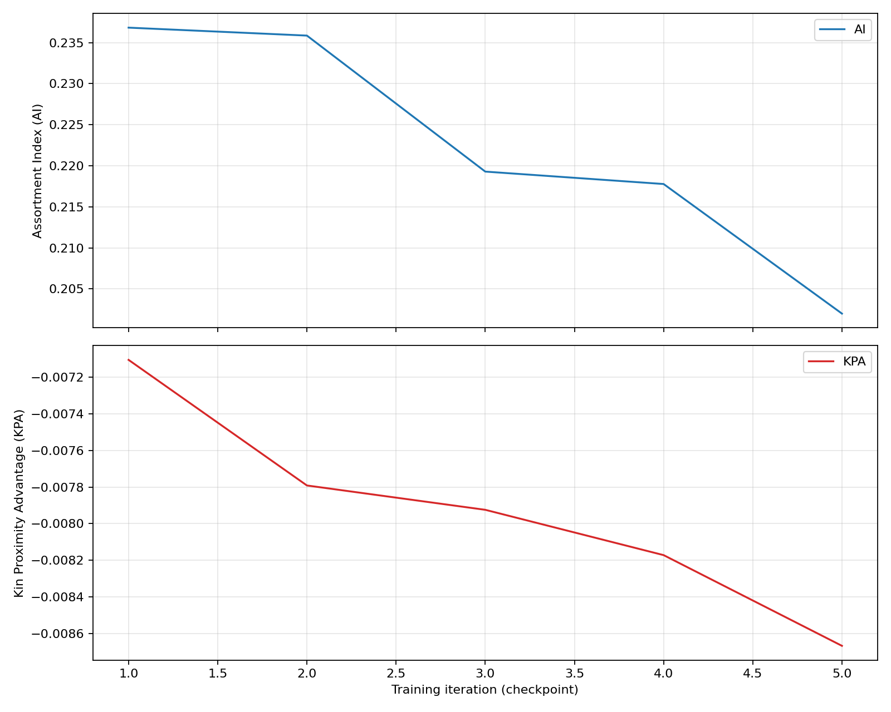

# PredPreyGrass — Selfish Gene: The Search for Emergent Cooperation

## Table of Contents
- [1) Motivation and Principles](#motivation-principles)
- [2) Environment lineage and code organization](#environment-organization)
- [3) Tier‑1 Selfish Gene Reward (Design Goal)](#tier1-reward)
- [4) Minimalist augmentation path](#minimalist-augmentation)
- [5) What and how we measure (Metrics)](#metrics)
- [6) Experiment plan (A/B comparison)](#experiment-plan)
- [7) Results to date (example run)](#results)
- [8) Reproducing the analysis](#reproduce)
- [9) Conclusions so far](#conclusions)
- [10) Next steps (incremental and testable)](#next-steps)
- [11) Pointers and assets](#pointers-assets)
 - [12) Practical configuration and running](#practical-config)
 - [13) Cooperation logging (env‑level) and one‑shot harness](#coop-logging)
 - [14) Troubleshooting](#troubleshooting)
 - [15) Implementation details (keys and internals)](#impl-details)
 - [16) Artifact paths](#artifact-paths)


## 1) Motivation and Principles
<a id="motivation-principles"></a>
We want to detect whether cooperation can emerge from minimal ecological settings without scripting “helping” into the reward. To guard against pre‑determined outcomes:
- Minimal augmentation first: avoid hand‑crafted incentives that force cooperative behaviors.
- Seek fundamentals: if cooperation exists here, it should surface from selection pressures alone.
- Measure learning, not imposition: any cooperative signal should be the result of learning, not directly rewarded social verbs.


## 2) Environment lineage and code organization
<a id="environment-organization"></a>
- Baseline environment: `walls_occlusion` (gridworld with walls and line‑of‑sight occlusion). Only movement actions are available to agents.
- Selfish Gene variant: `src/predpreygrass/rllib/selfish_gene/predpreygrass_rllib_env.py` adds lineage tracking and optional observation channels (kin density) while keeping the action space minimal (movement only).
- RL stack: Ray RLlib PPO (new API), multi‑agent with per‑policy RLModules. Evaluation loads modules from checkpoints.
- Version isolation and reproducibility: checkpoints are evaluated with training‑aligned observation keys, and `run_config.json` is used when available.

### Environment config keys and channel ordering (summary)
- Lineage reward windows
  - `lineage_reward_window` (int, default 50): Base window for counting living offspring to compute lineage reward.
  - `lineage_reward_window_predator` / `lineage_reward_window_prey` (optional): Species‑specific overrides; otherwise fallback to `lineage_reward_window`.
- Observation features
  - `include_visibility_channel` (bool): Appends LOS visibility mask as a channel; complements `mask_observation_with_visibility`.
  - `mask_observation_with_visibility` (bool): Multiplies dynamic channels by LOS mask (same channel count).
  - `include_kin_density_channel` (bool): Appends a normalized same‑policy neighbor count as the last channel.
  - `kin_density_los_aware` (bool): If true, only counts LOS‑visible kin (blocked by walls otherwise).
  - `kin_density_radius` (int): Chebyshev radius R for kin counting.
  - `kin_density_norm_cap` (int/float): Divisor used to normalize kin counts, then clipped to [0, 1].
- Episode length
  - `max_steps` (int): Cap on steps per episode.

Notes on channel ordering
- Base channels: walls + dynamic layers (predators, prey, grass) → `num_obs_channels`.
- Optional visibility (if `include_visibility_channel=True`) is appended next.
- Optional kin‑density (if `include_kin_density_channel=True`) is appended last.

Compatibility
- Enabling extra channels changes the observation shape. Checkpoints trained without kin‑density or visibility must be evaluated with the same flags. The evaluator merges observation‑critical keys from `run_config.json` to avoid mismatches, but explicit overrides still need to be consistent.


## 3) Tier‑1 Selfish Gene Reward (Design Goal)
<a id="tier1-reward"></a>
Principle (from GOAL_SELFISH_GENE.md): reward reflects lineage replication only.
- Each agent carries lineage metadata: lineage_tag (root_ancestor), parent_id, birth_step.
- Window W: per‑agent direct fitness = count of viable offspring within W (optionally weighted by offspring survival at window end).
- Reward: Rᵢ(W) = α · direct_fitnessᵢ / mean_births_per_capita(W); trickled evenly across the last W steps to reduce variance.
- Guards: cap births per short horizon; discount closely spaced births; keep base ecology (eat, starve, die) but reduce shaping so Tier‑1 dominates.

In practice we implemented a windowed, lineage‑aware return that substitutes for direct reproduction reward. This ties returns to both reproduction and the survival of offspring—an operational proxy for the “selfish gene” perspective and a minimalist path toward kin selection signals.


## 4) Minimalist augmentation path
<a id="minimalist-augmentation"></a>
- Step 1 (Reward): Replace direct reproduction reward with lineage reward. Action space stays as movement only. If kin selection offers an advantage, it should manifest as clustering or coordinated movement.
- Step 2 (Observation): Add optional kin‑density observation channels (with LOS‑aware variant) so agents can perceive local density of same‑lineage conspecifics. Still no new actions or explicit helping.

Design guardrails:
- Do not impose social verbs (no forced sharing, no explicit communications in the reward).
- Keep observation‑critical flags aligned between training and evaluation: LOS, visibility masking, kin_density_radius, normalization cap.


## 5) What and how we measure (Metrics)
<a id="metrics"></a>
We never hardcode helping; we detect lineage‑level outcomes and spatial signals.

Primary metrics (from METRICS_CLUSTERING.md):
- Assortment Index (AI): baseline‑corrected same‑lineage neighbor fraction within radius R; LOS‑aware variant available. AI ≈ 0 implies random assortment; higher implies kin clustering.
- Kin Proximity Advantage (KPA): difference in reproduction success when kin are present vs absent within R at the prior step; LOS‑aware variant available. Positive values mean kin proximity helps; negative values indicate a disadvantage (e.g., crowding/predation risk).

Diagnostics and controls:
- Per‑policy breakdowns (predator vs prey) for AI/KPA.
- Shuffle baseline: for AI, roots are shuffled per step to estimate expected assortment by chance.
- Bootstrap CIs: optional confidence intervals (evaluator supports `--bootstrap`); plotter shades CI bands when present.
- Additional ideas (sketch): nearest‑kin distance, lineage survival curves, clustering→fitness scatter, lineage share shifts vs null.

Implementation pointers:
- Metric functions: `analysis/coop_metrics.py` (LOS aware; bootstrap support).
- Evaluator: `analysis/eval_checkpoints_coop.py` (sweeps checkpoints, logs minimal per‑episode data, computes metrics, writes CSV and per‑checkpoint JSON). Flags include `--bootstrap` (CIs), `--stochastic` (sample actions), and `--progress-interval` (heartbeats).
- Plotter: `analysis/plot_coop_time_series.py` (AI/KPA vs iteration; optional EMA smoothing; CI band shading if CSV has `ai_lo/ai_hi` and `kpa_lo/kpa_hi`).


## 6) Experiment plan (A/B comparison)
<a id="experiment-plan"></a>
From EXPERIMENT_PLAN.md:
- Compare A (current rewards) vs B (adds Tier‑1 lineage reward).
- Hold environment seeds/config equal; run n ≥ 5 eval seeds per condition.
- Primary outcomes:
  - ↑ kin clustering (A → B)?
  - ↑ correlation between kin density and survival/offspring (A → B)?
  - Lineage frequency shifts > null (shuffle control)?
- Suggested knobs: mutation rate μ=0.005, lineage window W=2000, α=0.1, kin radius R=2, equalized starting shares.


## 7) Results to date (example run)
<a id="results"></a>
Evaluating 5 checkpoints from `PPO_SELFISH_GENE_2025-10-02_21-31-07` produced:
- AI: clearly positive (≈ 0.24 → ≈ 0.20). There is non‑trivial kin clustering above random.
- Trend: AI declines across checkpoints—clustering weakens with training.
- KPA: slightly negative throughout (≈ −0.007 → ≈ −0.009) and trending more negative—kin proximity correlates with a small reproduction disadvantage, consistent with resource crowding and/or predator pressure on clusters.

Embedded plot (from assets):



Interpretation:
- Under movement‑only actions and lineage reward, policies show meaningful assortment but learn to disperse over training.
- Slightly negative KPA suggests proximity costs (scramble for grass, visibility to predators) outweigh benefits of kin proximity in the current setup.

Training‑time visibility:
- A callback logs online proxies (coop/ai_raw, coop/ai_los, coop/kpa) to TensorBoard and under `custom_metrics/coop/*` for discoverability.
- The evaluator prints flushed heartbeats and episode markers to assure liveness during long runs.


## 8) Reproducing the analysis
<a id="reproduce"></a>
Evaluate checkpoints with CIs and deterministic actions:
```
python src/predpreygrass/rllib/selfish_gene/analysis/eval_checkpoints_coop.py \
  --run ~/Dropbox/02_marl_results/predpreygrass_results/ray_results/PPO_SELFISH_GENE_2025-10-02_21-31-07 \
  --episodes 20 \
  --max-steps 800 \
  --seed 0 \
  --limit 5 \
  --out output/coop_eval_summary.csv \
  --log-root output/coop_eval_logs \
  --progress-interval 50 \
  --bootstrap 500
```

Stochastic evaluation (sample actions) writes a separate CSV:
```
python src/predpreygrass/rllib/selfish_gene/analysis/eval_checkpoints_coop.py \
  --run ~/Dropbox/02_marl_results/predpreygrass_results/ray_results/PPO_SELFISH_GENE_2025-10-02_21-31-07 \
  --episodes 20 \
  --max-steps 800 \
  --seed 0 \
  --limit 5 \
  --out output/coop_eval_summary_stochastic.csv \
  --log-root output/coop_eval_logs_stochastic \
  --progress-interval 50 \
  --bootstrap 500 \
  --stochastic
```

Plot the time series (auto‑shades CI if present):
```
python src/predpreygrass/rllib/selfish_gene/analysis/plot_coop_time_series.py \
  --csv output/coop_eval_summary.csv \
  --out output/coop_eval_plots/PPO_SELFISH_GENE_2025-10-02_21-31-07.png \
  --ema 0.3
```

Optional: bootstrap a single checkpoint for CIs with detailed JSON inspection:
```
python src/predpreygrass/rllib/selfish_gene/analysis/coop_metrics.py \
  --log-dir output/coop_eval_logs/checkpoint_000005 \
  --los-aware \
  --bootstrap 2000
```


## 9) Conclusions so far
<a id="conclusions"></a>
- With lineage reward and minimal observation extensions, we do not see increasing learned kin clustering. Cooperation via spatial assortment exists (positive AI), but policies trend toward dispersion, and kin proximity shows a small reproduction disadvantage.


## 10) Next steps (incremental and testable)
<a id="next-steps"></a>
1) Expand the action space (minimally):
- Energy sharing or partial harvest (leave a fraction of grass/prey; or explicit small energy transfer to nearby kin). This introduces potential reciprocity/kin support without baking it into rewards.
- Light signaling: a low‑cost “ping” that influences kin movement.

2) Gentle environmental nudges:
- Reduce proximity penalties (increase grass regrowth, cap predator efficiency on clusters) so grouping is not strictly worse.
- Slightly increase vision radius so kin signals persist and are useful.

3) Measurement upgrades:
- Always produce CIs in the evaluator (toggle already available) and add CI bands to plots (done when CSV has columns).
- Keep per‑policy breakdowns in the JSONs and compare predator vs prey drivers.
- Consider stochastic evaluation as part of the default sweep to reveal latent cooperative modes.

4) Experimental rigor:
- Follow the A/B plan: compare “current rewards” vs “Tier‑1 lineage reward” with matched seeds/config; analyze kin clustering and kin‑→fitness correlations; include shuffle controls and multiple eval seeds.


## 11) Pointers and assets
<a id="pointers-assets"></a>
- Env (selfish gene): `src/predpreygrass/rllib/selfish_gene/predpreygrass_rllib_env.py`
- Evaluator & metrics: `src/predpreygrass/rllib/selfish_gene/analysis/`
- Baseline occlusion env: `src/predpreygrass/rllib/walls_occlusion/`
- Plot image: `assets/images/readme/PPO_SELFISH_GENE_2025-10-02_21-31-07.png`


## 12) Practical configuration and running
<a id="practical-config"></a>

Key files
- Environment: `src/predpreygrass/rllib/selfish_gene/predpreygrass_rllib_env.py`
- Default env config: `src/predpreygrass/rllib/selfish_gene/config/config_env_selfish_gene.py`
- Training launcher: `src/predpreygrass/rllib/selfish_gene/tune_ppo_selfish_gene.py`
- Checkpoint evaluation (RLModule loader): `src/predpreygrass/rllib/selfish_gene/evaluate_ppo_from_checkpoint_debug.py`

Recommended settings (starting points)
- Lineage window: start with `lineage_reward_window = 100–150` (baseline 150). If rewards feel sparse, try 80–100. To emphasize survival, 200–250. You can override per species with `lineage_reward_window_predator` and `lineage_reward_window_prey`.
- Episode length: with window ≈150, set `max_steps = 700–900` (baseline 800). Debug: 200–400. Long‑horizon: 1200–2000. Rule of thumb: `max_steps ≈ 4–6 × lineage_reward_window`.
- Kin‑density channel: safe to enable (observation‑only). Defaults `kin_density_radius = 2`, `kin_density_norm_cap = 8` work well. With corridors/occlusion, set `kin_density_los_aware = True`.
- Choosing kin‑density radius R: start with R=2. If very sparse or heavy occlusion, R=3; very dense, R=1–2. Expected same‑policy neighbors ≈ ρ_g × A_R, where A_R = (2R+1)^2 − 1. Set `kin_density_norm_cap` ≈ 1.5–2× that expectation to avoid early saturation.

Train (PPO, new RLlib API)
```
python src/predpreygrass/rllib/selfish_gene/tune_ppo_selfish_gene.py
```
Before launching, adjust `config/config_env_selfish_gene.py` for lineage windows and observation flags (e.g., enable kin channel, LOS awareness).

Evaluate a checkpoint (RLModule loader + visualization)
```
python src/predpreygrass/rllib/selfish_gene/evaluate_ppo_from_checkpoint_debug.py
```
The evaluator auto‑merges observation‑critical keys from `run_config.json` to reduce shape mismatches.


## 13) Cooperation logging (env‑level) and one‑shot harness
<a id="coop-logging"></a>

Enable lightweight per‑episode logs for post‑hoc analysis without changing rewards or training. In `config/config_env_selfish_gene.py` set:

- `"enable_coop_logging": true`
- `"coop_log_dir": "output/coop_logs"`

Each episode writes one JSON with:
- Static metadata: `episode_index`, `seed`, `max_steps`, subset of config (including `kin_density_radius`), and `walls` if present (used by LOS‑aware analysis).
- Steps: per‑agent fields: `unique_id`, `policy_group`, `root_ancestor`, `position`, `age`, `energy`, `offspring_count`.

The environment flushes logs on reset, at max‑steps truncation, and on `close()`.

Run analysis directly on logs
```
python src/predpreygrass/rllib/selfish_gene/analysis/coop_metrics.py --log-dir output/coop_logs --los-aware --bootstrap 1000
```

One‑shot harness (generate + analyze)
```
python src/predpreygrass/rllib/selfish_gene/analysis/quick_run_and_analyze.py \
  --episodes 20 \
  --max-steps 800 \
  --los-aware \
  --bootstrap 1000 \
  --by-policy
```
Override env config at runtime using repeated `--config-override key=value`, e.g.:
```
--config-override kin_density_radius=3 \
--config-override include_kin_density_channel=true \
--config-override wall_placement_mode=manual
```

Notes
- LOS‑aware analysis uses the `walls` stored in each episode log.
- Prefer multiple episodes (≥20) and align `max_steps` with lineage windows for stable signals.


## 14) Troubleshooting
<a id="troubleshooting"></a>
- Observation shape mismatch when loading a checkpoint: ensure `include_visibility_channel` and `include_kin_density_channel` match training. The evaluator merges keys from `run_config.json`, but explicit overrides still need to be consistent.
- Sparse lineage reward signal: reduce `lineage_reward_window` to 80–100, or increase prey/grass abundance.
- Early population collapse: shorten `max_steps` to 400–600 for more resets, or lower movement/step energy losses.


## 15) Implementation details (keys and internals)
<a id="impl-details"></a>
- Tier‑1 Selfish Gene reward is computed by a windowed lineage function (see `_windowed_lineage_reward(agent_id, window)`) and applied during predator/prey reproduction handlers for the parent. Species‑specific keys `lineage_reward_window_predator` and `lineage_reward_window_prey` override the base `lineage_reward_window` when provided.
- Unique lineage tracking maintains maps of `unique_agents` and per‑unique stats (birth/death steps, parent UID, offspring list/count, fitness aggregates) to support downstream analysis.
- Kin‑density channel: groups by same‑policy prefix (e.g., `type_1_predator`) and uses Chebyshev radius. When `kin_density_los_aware=True`, kin counts are restricted to LOS‑visible neighbors by combining the kin mask with the visibility mask before counting; observation shape remains unchanged.
- Callback metrics: training emits `coop/ai_raw`, `coop/ai_los`, `coop/kpa` and mirrors them under `custom_metrics/coop/*` for TensorBoard.


## 16) Artifact paths
<a id="artifact-paths"></a>
- Ray results (training): `~/Dropbox/02_marl_results/predpreygrass_results/ray_results/` (one subfolder per run).
- One‑shot event log: `reproduction_events.log` (step, parent UID, child UID, lineage reward, living‑offspring list).

---
Questions, corrections, or requests for additional experiments (e.g., implementing partial harvest or energy sharing) are very welcome. We can stage them as a new `vX_Y` experiment directory to preserve lineage and comparability.
