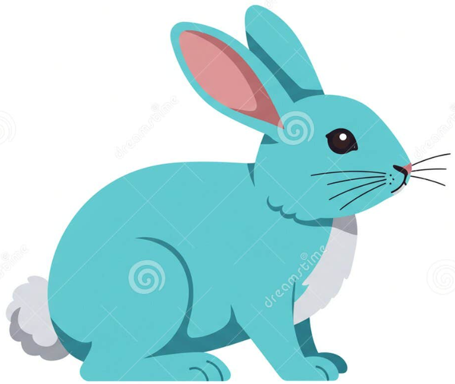

# Cooperative Hunting: Features "Shared Prey" environment

- At startup Predators , Prey  and Grass are randomly positioned on the gridworld. Walls are surrounding the gridworld and are possibly manually placed within the gridworld. 

- Predators and Prey can move in a Moore neighborhood. Predators cannot share a cell with other Predators. Prey cannot share a cell with other Prey. Neither Predator nor Prey can move to a Wall cell.

- Predators and Prey possess energy which depletes every time step.

- If the energy of an agent is zero, the agent dies and is removed from the gridworld.

- Predator can eat Prey and Prey can eat grass to replenish their energy.

- **Cooperative capture and energy accounting**: A Prey is eaten by (a) Predator(s) if the cumulative energy of all Predators in its Moore neighborhood is *strictly larger* than the Prey's own energy (optionally with a safety margin via `team_capture_margin`). This holds for a single Predator as well as a group.
  - **Failed attempt (struggle cost)**: If the cumulative energy is too low, the attack fails and the Prey survives. The attacking Predators lose energy to reflect the struggle. The total penalty is `prey_energy * energy_percentage_loss_per_failed_attacked_prey` and is **subtracted proportionally** from each attacker based on their energy share. This applies to solo and team attempts. If the penalty drops a Predator to zero or below, it dies that step.
  - **Successful capture (no struggle cost)**: When the attackers have higher cumulative energy, the Prey is removed and **no extra energy loss** is applied to Predators. The Prey's energy is then split among attackers (proportional by default, or **equal split** when `team_capture_equal_split = True`).

- A Grass patch is eaten if a Prey lands on its cell.

- If a Grass patch is eaten, its energy is set to zero and the corresponding Prey receives its energy.

- Grass gradually regenerates at the same spot after being eaten by Prey. Grass, as a non-learning agent, is being regarded by the model as part of the environment, not as an actor.

- When a Predator or Prey reaches a certain energy threshold by eating, it asexually reproduces. Its child is placed in the Moore neighborhood of its parent. The initial energy of a child is deducted from the parent.

- Agents only receive a reward when they reproduce. All other behavior is emergent. The sparse rewards configuration shows that the ecological system is able to sustain with this minimalistic optimized incentive for both Predators and Prey.

- The game ends when either the number of Predators or the number of Prey is zero.

## Energy Division After Cooperative Prey Capture

### Proportional Split vs Equal Split

In the **Shared Prey** environment, all predators in a prey's Moore neighborhood participate in the attempt. Once the cumulative predator energy in that neighborhood exceeds the prey's energy (optionally with `team_capture_margin`), the prey is removed and its energy is redistributed among the participating predators. If the attempt fails, a struggle penalty is applied to the attackers proportional to their energy share (see `energy_percentage_loss_per_failed_attacked_prey`). Two alternative energy-division rules are supported on successful capture:

---

### 1. Proportional Split (default)

By default, the prey’s energy is divided **proportionally to the current energy of each participating predator**:

```
ΔE_i = E_prey * (E_i / sum_j E_j)
```

**Implications:**

* Predators with higher energy receive a larger share of the prey.
* Contribution is implicit: bringing more energy to the coalition yields a higher payoff.
* Cooperation is encouraged **only when necessary** (i.e. when no single predator can meet the capture threshold alone).
* This rule tends to produce **hierarchical cooperation**:

  * strong predators dominate kills,
  * weaker predators may trail or be excluded,
  * “rich-get-richer” dynamics can emerge.

**Interpretation:**
This split is purely local and does not require counterfactual reasoning or centralized credit assignment. Cooperation emerges as a *means* to enable capture, not as a rewarded objective.

---

### 2. Equal Split (optional)

When `team_capture_equal_split = True`, the prey’s energy is divided **equally among all participating predators**:

```
ΔE_i = E_prey / |helpers|
```

**Implications:**

* All helpers receive the same payoff regardless of their individual energy.
* Low-energy predators are incentivized to stay close to others, as participation alone guarantees reward.
* This often leads to **increased spatial clustering and pack-like movement**.
* However, it also introduces **free-rider incentives**:

  * predators may join late or contribute little energy while still receiving an equal share.

**Interpretation:**
Equal splitting removes implicit hierarchy and favors inclusive cooperation, but at the cost of increased exploitation pressure. Whether stable cooperation emerges becomes a learning problem rather than a structural guarantee.

---

### Comparison Summary

| Aspect            | Proportional Split       | Equal Split               |
| ----------------- | ------------------------ | ------------------------- |
| Reward basis      | Current energy           | Presence                  |
| Cooperation style | Hierarchical / selective | Inclusive / pack-oriented |
| Free-riding       | Discouraged              | Encouraged                |
| Spatial behavior  | Looser coordination      | Stronger clustering       |
| Assumptions       | Minimal, local           | Minimal, local            |
| Credit assignment | Implicit                 | Uniform                   |

---

### Research relevance

Both division rules preserve the **minimal-assumption philosophy** of the environment:

* No explicit cooperation reward
* No kin selection or shared team reward
* No centralized or counterfactual credit assignment

The difference lies in **what kind of cooperation agents are able to learn**:

* proportional split emphasizes *power-based coalition formation*,
* equal split emphasizes *presence-based cooperation and coordination*.

Comparing these regimes allows us to study how reward division alone shapes emergent cooperative behavior in multi-agent reinforcement learning.


# MADRL training

- Predators and Prey are independently (decentralized) trained via their own RLlib policy module.:

  - **Predator** 
  - **Prey**

  - Predators and Prey **learn movement strategies** based on their **partial observations**.

# Results
<p align="center">
    <b>Emerging cooperative hunting in Predator-Prey-Grass environment</b></p>
<p align="center">
    
</p>

- Cooperative hunting occurs, though it is **not strictly imposed nor rewarded**.

