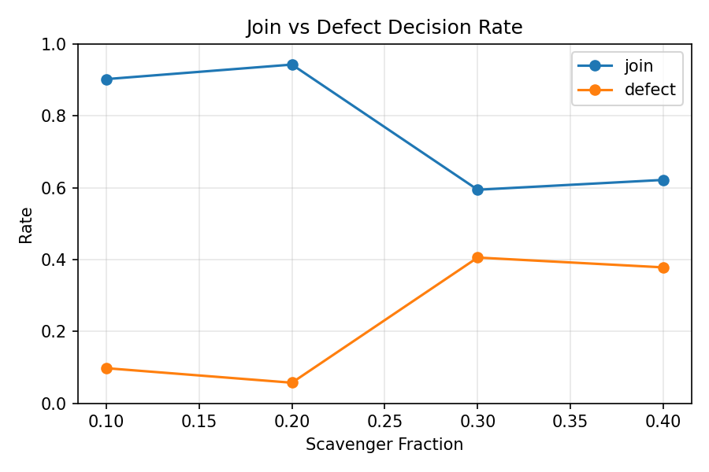
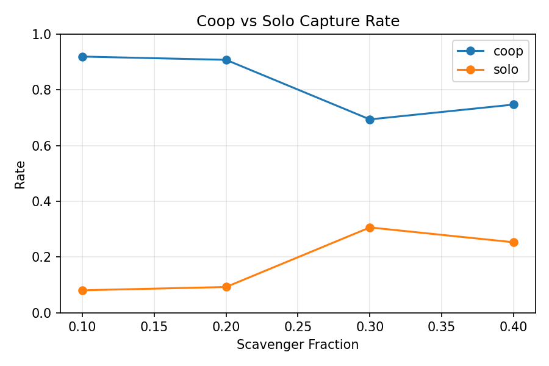
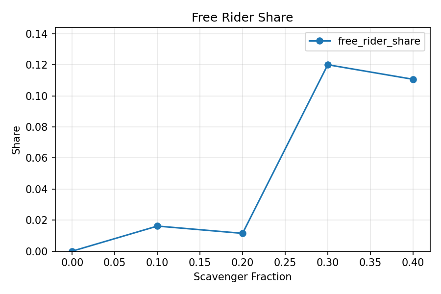
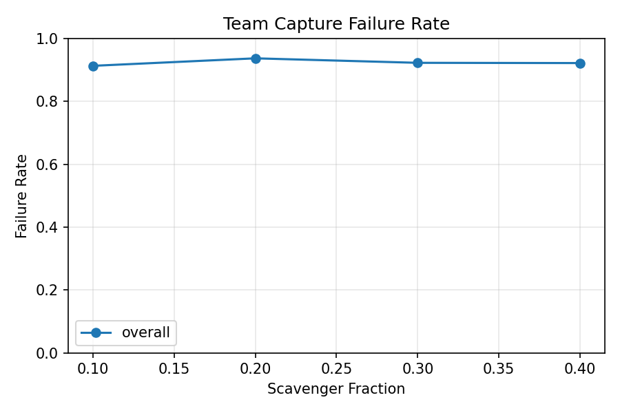
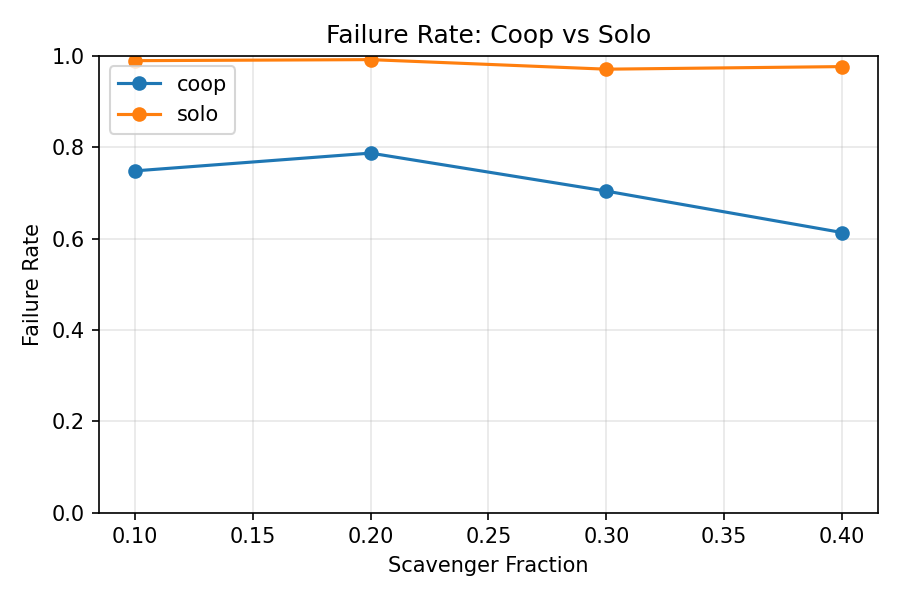
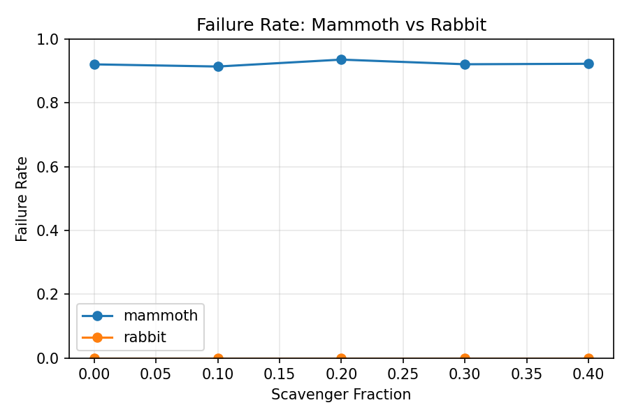
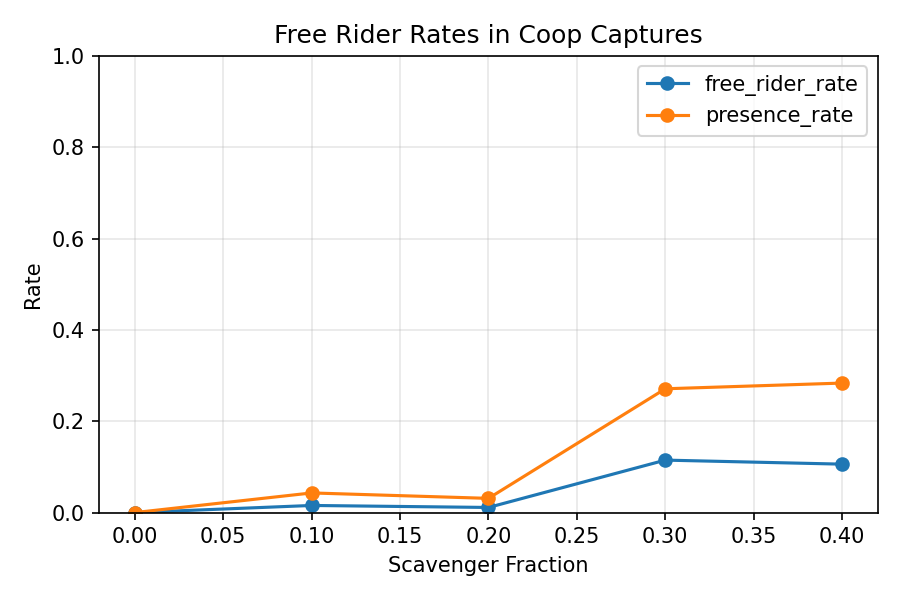
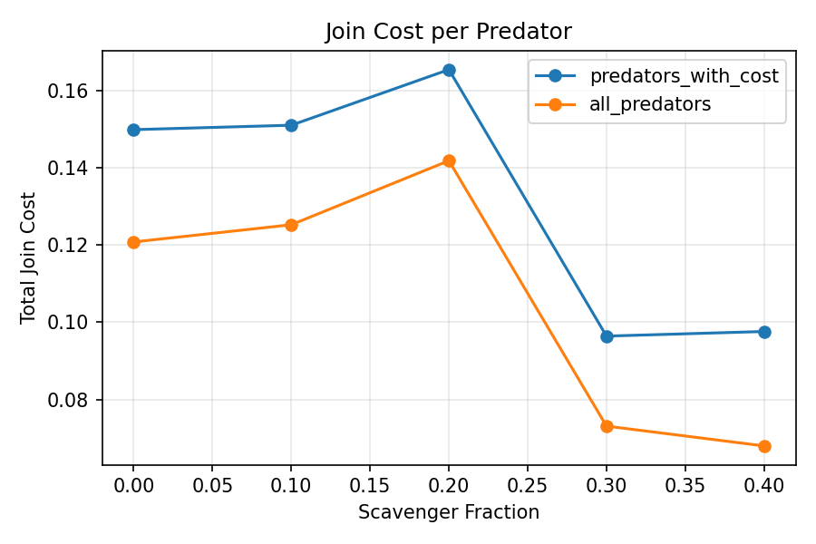
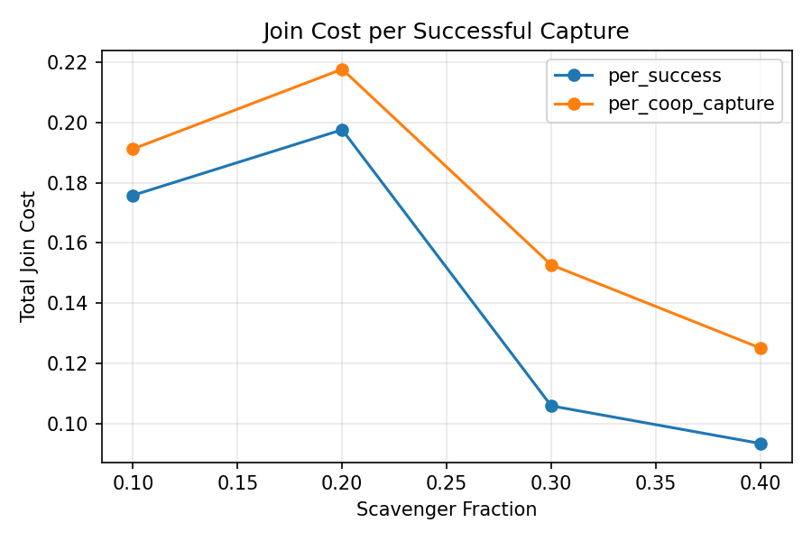

# Eval Comparison Report

Generated: 2026-02-05 16:16:22

Source files:
- `/home/doesburg/Projects/PredPreyGrass/src/predpreygrass/rllib/stag_hunt_forward_view/ray_results/join_cost_0.02/eval_comparison.csv`
- `/home/doesburg/Projects/PredPreyGrass/src/predpreygrass/rllib/stag_hunt_forward_view/ray_results/join_cost_0.02/eval_comparison_summary.csv`

**Summary Takeaway (Short)**
- Cooperative (group) hunters achieve the **highest reproductive success** (raw reproduction reward).
- Solo hunters outperform free‑riders in **all** scavenger settings.
- This holds even when cooperation is costlier, indicating cooperation remains reproductively advantageous.

**Scope and Assumptions**
- This report aggregates the five trainings at `team_capture_join_cost = 0.02` with `team_capture_scavenger_fraction` in {0.0, 0.1, 0.2, 0.3, 0.4}. Each row is 30 (1000 step) eval runs from a single training directory (`n_eval_dirs = 1`).
- `join_rate` and `defect_rate` are **per predator-step** decision rates. A predator “defects” by choosing `join_hunt = 0`.
- `coop_capture_rate` and `solo_capture_rate` are **within successful captures only** (not all attempts).
- `failure_rate` metrics are based on **attempts**, so high values mean most attempts fail.
- `rabbit_fail_rate = 0.0000` almost certainly indicates **no rabbit attempts** in these evals (denominator zero), not perfect success.
- Join cost per event is fixed at `0.02` by design; changes in total cost or cost per predator reflect **behavioral changes** (how often joining occurs), not parameter changes.

**How to Read the Tables**
- `join_rate` vs `defect_rate`: how often predators choose to join vs refuse across all decision steps.
- `free_rider_share`: among participants near captures, what fraction free‑rode rather than joined.
- `coop_fail_rate` vs `solo_fail_rate`: how often cooperative vs solo attempts fail. Lower is better.
- `join_cost_per_successful_capture`: how much join cost was paid per successful capture (a proxy for “coordination expense” per success).

**Key Patterns**
- **Joining drops sharply** once scavenger share is high. Join rate is ~0.90–0.94 at scavenger 0.0–0.2, but falls to ~0.60–0.62 at 0.3–0.4. Defection rises correspondingly.
- **Free‑riding increases** with scavenger share. It is near zero at 0.0–0.2 but jumps to ~0.11–0.12 at 0.3–0.4.
- **Cooperation is more effective than solo hunting**, but both fail often. Coop failure rates are ~0.62–0.79 vs solo ~0.97–0.99, showing a large advantage for cooperation even though total failure rates are high overall.
- **Join cost burden per predator drops** at higher scavenger fractions, consistent with fewer join events rather than lower cost per event (which stays at 0.02).

**Interpretation**
- Increasing the scavenger fraction makes defection more attractive, so agents choose to join less often. This is consistent with a stronger free‑riding incentive.
- Even when joining drops, cooperative attempts remain **substantially more successful** than solo attempts, suggesting that cooperation is still the efficient strategy for actually catching prey.
- The system shows a tension: **cooperation is more effective** but **defection becomes more common** as the free‑rider payoff increases.

**Conclusions (from these evals)**
- **Cooperation remains the most effective way to capture**, but **free‑riding pressure increases** with higher scavenger share.
- **Behavioral change is driven by incentives, not mechanics**: join cost per event is fixed; reduced total join cost at higher scavenger share is a result of fewer join decisions.
- **If the goal is to show cooperation emerges despite higher cost**, the current regime already shows cooperation outperforming solo attempts even while defection grows at higher scavenger fractions. Pair this with payoff‑based analysis (from `eval_payoff_*`) to show whether joiners still do better net of costs.

Summary (aggregated across eval dirs)

| scavenger | n_eval_dirs | n_runs_total | join_rate | defect_rate | coop_capture_rate | free_rider_share | failure_rate | coop_fail_rate | solo_fail_rate |
| --- | --- | --- | --- | --- | --- | --- | --- | --- | --- |
| 0.0000 | 1 | 30.0000 | 0.9399 | 0.0601 | 0.9406 | 0.0000 | 0.9208 | 0.7482 | 0.9933 |
| 0.1000 | 1 | 30.0000 | 0.9030 | 0.0970 | 0.9186 | 0.0162 | 0.9140 | 0.7460 | 0.9898 |
| 0.2000 | 1 | 30.0000 | 0.9421 | 0.0579 | 0.9168 | 0.0115 | 0.9357 | 0.7863 | 0.9926 |
| 0.3000 | 1 | 30.0000 | 0.5961 | 0.4039 | 0.6926 | 0.1201 | 0.9211 | 0.7037 | 0.9703 |
| 0.4000 | 1 | 30.0000 | 0.6193 | 0.3807 | 0.7320 | 0.1107 | 0.9227 | 0.6229 | 0.9756 |

Failure rate by prey type

| scavenger | mammoth_fail_rate | rabbit_fail_rate |
| --- | --- | --- |
| 0.0000 | 0.9208 | 0.0000 |
| 0.1000 | 0.9140 | 0.0000 |
| 0.2000 | 0.9357 | 0.0000 |
| 0.3000 | 0.9211 | 0.0000 |
| 0.4000 | 0.9227 | 0.0000 |

Failure rate by attempt type

| scavenger | coop_fail_rate | solo_fail_rate |
| --- | --- | --- |
| 0.0000 | 0.7482 | 0.9933 |
| 0.1000 | 0.7460 | 0.9898 |
| 0.2000 | 0.7863 | 0.9926 |
| 0.3000 | 0.7037 | 0.9703 |
| 0.4000 | 0.6229 | 0.9756 |

Payoff vs Behavior (Net of Costs)

| scavenger | join_rate | defect_rate | coop_fail_rate | solo_fail_rate | free_rider_share | net_joiner_advantage |
| --- | --- | --- | --- | --- | --- | --- |
| 0.0000 | 0.9399 | 0.0601 | 0.7482 | 0.9933 | 0.0000 | 10.5700 |
| 0.1000 | 0.9030 | 0.0970 | 0.7460 | 0.9898 | 0.0162 | 10.4745 |
| 0.2000 | 0.9421 | 0.0579 | 0.7863 | 0.9926 | 0.0115 | 9.9085 |
| 0.3000 | 0.5961 | 0.4039 | 0.7037 | 0.9703 | 0.1201 | 11.4514 |
| 0.4000 | 0.6193 | 0.3807 | 0.6229 | 0.9756 | 0.1107 | 12.0988 |

Note: `net_joiner_advantage` is `reward_minus_total_cost_diff_joiner_vs_non_joiner`. Positive values mean joiners still earn more **after** subtracting both attempt and join costs.

**Key conclusion (reproduction success):**
Because the only positive RL reward in this setup is the **reproduction reward** (catch rewards are kept at zero and death penalties are zero), a positive `net_joiner_advantage` means **joiners reproduce more successfully than non‑joiners on average**, even after paying attempt + join costs. In other words, joiners are not just catching more; they are translating those catches into **more reproduction events**, which is exactly what the reward signal measures here.

**How this conclusion is derived (step‑by‑step):**
1. **What “reward” means here:** Each predator’s `cumulative_reward` is built from RL rewards in the environment. In this configuration, rewards are awarded on **successful reproduction events** (`reproduction_reward_predator`). Catching prey does **not** add to RL reward; it only changes energy. Therefore, higher `cumulative_reward` = more reproduction successes.
2. **Who is a joiner vs non‑joiner:** In the payoff summary, a predator is classified as a “joiner” if they **ever paid a join cost** during the run (i.e., `join_cost_events > 0` from `join_costs_per_predator_*.csv`). Otherwise they are grouped as a non‑joiner.
3. **Cost‑adjusted payoff:** For each predator, we compute `reward − (attempt_cost + join_cost)`. This is the “net” RL reward after subtracting hunt costs.
4. **Net joiner advantage:** We then take the mean of that net reward for joiners and subtract the mean for non‑joiners:
   ```
   net_joiner_advantage
   = mean( reward − attempt_cost − join_cost | joiners )
   − mean( reward − attempt_cost − join_cost | non‑joiners )
   ```
5. **Interpretation:** When this value is **positive**, joiners earn **more reproduction reward even after costs**, which implies **greater reproductive success** for joiners, not just higher energy.

**Reproductive success by hunt style (dominant behavior)**
The table below classifies predators by dominant hunt style using event logs:
`group_hunter` (more cooperative join events than solo), `solo_hunter` (more solo than cooperative),
and `free_rider` (no join events, but scavenger/free‑ride events present). Values are mean
**reproduction reward** per agent (no cost subtraction). Costs still affect these values indirectly
by reducing energy and therefore reproduction opportunities.

### Reproduction Reward by Hunt Style (Chart)

*(Chart values are per‑agent means within each group; raw reproduction reward, no cost subtraction.)*

| scavenger | group_hunters_n | solo_hunters_n | free_riders_n | group_repro | solo_repro | free_repro |
| --- | --- | --- | --- | --- | --- | --- |
| 0.0000 | 8278 | 6008 | 0 | 13.4404 | 6.4198 | 0.0000 |
| 0.1000 | 10027 | 6544 | 30 | 11.9288 | 7.9676 | 0.0000 |
| 0.2000 | 7945 | 7088 | 9 | 12.1145 | 7.5324 | 0.0000 |
| 0.3000 | 4301 | 12430 | 67 | 10.9440 | 9.7401 | 0.2985 |
| 0.4000 | 2751 | 12191 | 58 | 23.6714 | 6.1988 | 0.6897 |

Note: These values are **per‑agent means** within each group (not totals). Free‑rider values are near zero because
free‑riders rarely earn reproduction rewards.

**Conclusion (directly answering your question):**
Across all scavenger fractions, **group hunters have higher reproductive success than solo hunters**, and both
outperform free‑riders. This supports the claim that **going together yields higher reproductive payoff**. Costs are
*indirectly* reflected here because they reduce energy and therefore reproduction opportunities.

**Additional explanation (why this is a strong conclusion):**
This conclusion uses **raw reproduction reward** (no cost subtraction). Because the only positive RL reward in this
setup is **reproduction reward**, higher reward directly means **more reproduction events**. We avoid subtracting costs
to keep units consistent (reward vs energy). The group‑, solo‑, and free‑rider categories are built from **observed
hunt events**, not just intended actions, so the comparison reflects actual behavior.

**Step‑by‑step derivation (concise):**
1. **Extract events:** For each eval run, read each predator’s event log (`agent_event_log_*.json`) and count
   solo join events (`join_hunt=True` and `team_capture=False`), cooperative join events (`join_hunt=True` and
   `team_capture=True`), and free‑ride events (`join_hunt=False`).
2. **Classify agents:** Assign each predator to its **dominant** hunt style:
   `group_hunter` if coop events > solo events, `solo_hunter` if solo > coop, `free_rider` if no join events but
   free‑ride events exist.
3. **Compute reproduction reward:** For each predator, take its `cumulative_reward` (reproduction reward). This is the
   direct measure of reproductive success in this setup.
4. **Aggregate by group:** Average reproduction reward within each hunt‑style group, then aggregate across runs
   for each scavenger fraction.
5. **Compare groups:** The resulting table shows group hunters consistently higher than solo hunters, and solo hunters
   higher than free‑riders.

**Solo hunters vs free‑riders:**
Solo hunters have **higher** reproductive success than free‑riders in every scavenger condition shown. In the
table above, `solo_repro` is always greater than `free_repro` (often by a wide margin), indicating that
actively attempting solo hunts still yields more reproduction than relying on scavenging alone.

Join cost summary

| scavenger | join_cost_total | join_cost_events | predators_with_cost | predators_total | join_cost_per_event | join_cost_per_predator | join_cost_per_predator_all |
| --- | --- | --- | --- | --- | --- | --- | --- |
| 0.0000 | 2157.6400 | 107882.0000 | 14396.0000 | 17862.0000 | 0.0200 | 0.1499 | 0.1208 |
| 0.1000 | 2519.1000 | 125955.0000 | 16680.0000 | 20113.0000 | 0.0200 | 0.1510 | 0.1252 |
| 0.2000 | 2535.2600 | 126763.0000 | 15325.0000 | 17874.0000 | 0.0200 | 0.1654 | 0.1418 |
| 0.3000 | 1446.4600 | 72323.0000 | 15004.0000 | 19788.0000 | 0.0200 | 0.0964 | 0.0731 |
| 0.4000 | 1142.9000 | 57145.0000 | 11710.0000 | 16817.0000 | 0.0200 | 0.0976 | 0.0680 |

Join cost per successful capture

| scavenger | join_cost_per_successful_capture | join_cost_per_coop_capture |
| --- | --- | --- |
| 0.0000 | 0.1779 | 0.1891 |
| 0.1000 | 0.1741 | 0.1895 |
| 0.2000 | 0.1994 | 0.2175 |
| 0.3000 | 0.1062 | 0.1533 |
| 0.4000 | 0.0929 | 0.1269 |

Plots

### Join vs Defect Decision Rate


### Coop vs Solo Capture Rate


### Free Rider Share


### Team Capture Failure Rate


### Failure Rate: Coop vs Solo


### Failure Rate: Mammoth vs Rabbit


### Free Rider Rates in Coop Captures


### Join Cost per Predator


### Join Cost per Successful Capture

