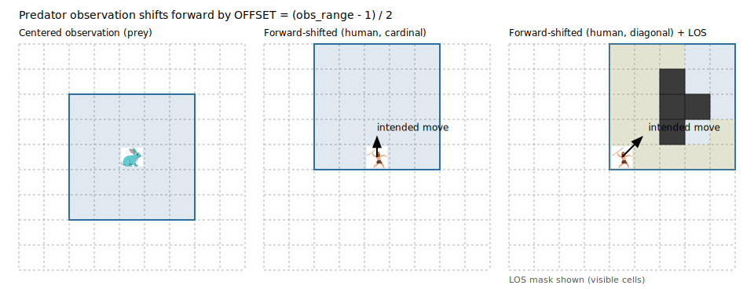
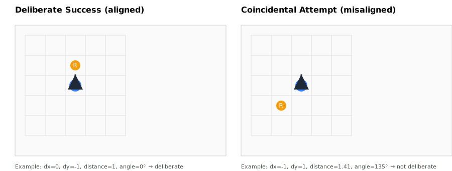
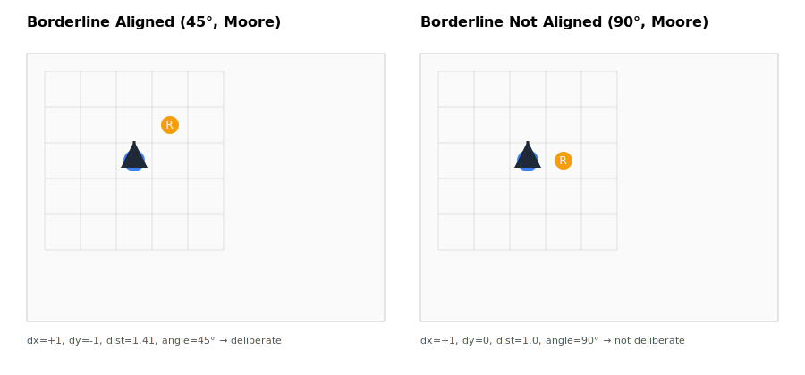
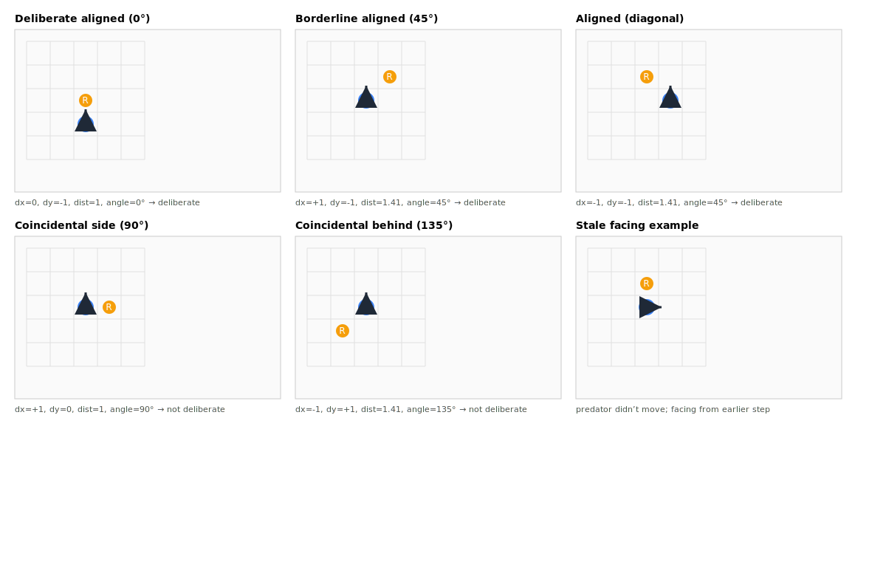
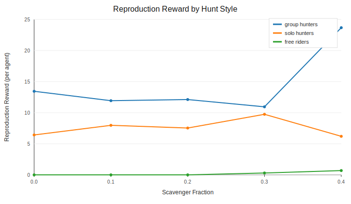

# Stag Hunt Nature + Nurture (Forward View)

<p align="center">
    <b>Emerging human cooperation, defection and free-riding</b></p>
<p align="center">
    
</p>

This module is a full copy of `stag_hunt_forward_view` with a new
nature+nurture cooperation mechanism:
- `join_hunt` remains the nurture/action signal (voluntary participation).
- Predators now also carry a heritable cooperation trait in `[0, 1]` (nature).
- Team-capture success depends on both the action choice and the trait-weighted
  contribution effort.

## Quick summary

- **What this is:** a stag-hunt ecology with forward-view observations and combined nature+nurture cooperation dynamics. See **What changed** and **Forward-view observations**.
- **How defection works:** joiners pay costs; non-joiners can free-ride. See **Join-or-Free-Ride capture logic**.
- **Results snapshot:** cooperation remains reproductively advantageous. See **Eval comparison summary (join_cost_0.02)**.
- **Caveats:** comparisons are not always matched across prey/cost settings. See **Comparison summary (defection vs forward-view)** and **Matched comparison (next step)**.

**Key conclusion (from current evals):** **cooperative group hunters have higher reproductive success than solo hunters, and both outperform free‑riders.** (See **Eval comparison summary (join_cost_0.02)** and `eval_comparison_report.md`.)

## Contents

- [What changed (high level)](#what-changed-high-level)
- [Differences vs `stag_hunt_defection`](#differences-vs-stag_hunt_defection)
- [Comparison summary (defection vs forward-view)](#comparison-summary-defection-vs-forward-view)
- [Matched comparison (next step)](#matched-comparison-next-step)
- [Files and structure](#files-and-structure)
- [Forward-view observations (predators only)](#forward-view-observations-predators-only)
- [New action semantics](#new-action-semantics)
- [Join-or-Free-Ride capture logic](#join-or-free-ride-capture-logic)
- [Measuring defection/cooperation/solo](#measuring-defectioncooperationsolo)
- [Facing/Alignment Explainer](#facingalignment-explainer)
- [Sample results (from last evaluation output)](#sample-results-from-last-evaluation-output)
- [Eval comparison summary (join_cost_0.02)](#eval-comparison-summary-join_cost_002)
- [Opportunity-conditioned preference (mammoth vs rabbit)](#opportunity-conditioned-preference-mammoth-vs-rabbit)
- [Training and evaluation](#training-and-evaluation)

## What changed (high level)

- Predators have a second action component `join_hunt` that controls whether they
  contribute to a team capture.
- Capture uses only joiners, not all nearby predators.
- Joiners pay a fixed `team_capture_join_cost` whenever they choose `join_hunt = 1`
  (on success or failure; solo or cooperative attempts).
- Defectors (non-joiners) can divide a scavenger spillover
  `team_capture_scavenger_fraction`, a fraction of the prey energy.
- Predator observations are shifted forward based on the last intended move.
- Everything else stays the same: movement, energy decay, reproduction, LOS,
  grass growth, walls, and the original team-capture margin/split logic.

## Differences vs `stag_hunt_defection`

This module is identical to `stag_hunt_defection` except for predator observations and
viewer overlays:

- Predator observations are forward-shifted (edge/corner placement in the obs window).
- Predator facing is updated from intended moves (even if blocked), with random facing at reset.
- The LOS visibility mask for predators is computed per-facing (prey stays centered).
- The PyGame FOV overlay uses predator facing to shift the drawn window and automatically
  reassigns the overlay to the lowest-index living predator/prey if the originally tracked
  agent dies.

## Comparison summary (defection vs forward-view)

Short qualitative read of the **current** 1000-step plots (see `COMPARISON_STAG_HUNT.md`
for the full note):

- Defection-only plots: rabbits (`type_2_prey`) crash early; mammoths persist with
  oscillations; predators remain high and oscillatory.
- Forward-view plots (join_cost_0.02 evals with rabbits removed): strong early predator
  overshoot, prey recovery, and sustained oscillations without extinction.
- **Caveat:** these are *not* matched settings. The forward-view plots use join costs and
  removed rabbits, so differences may be driven by prey mix and costs, not only
  forward-view observations.

## Matched comparison (next step)

To make the comparison causal, regenerate forward-view evals under the same prey mix
and cost settings as `stag_hunt_defection`:

- Use the same `max_steps`, seeds, and eval script (e.g., `evaluate_ppo_from_checkpoint_multi_runs.py`)
  for both envs.
- Match prey mix by setting `n_initial_active_type_2_prey` and `n_possible_type_2_prey` in
  `config/config_env_stag_hunt_forward_view.py` to the values in
  `stag_hunt_defection/config/config_env_stag_hunt_defection.py`.
- Match cost parameters (`team_capture_join_cost`,
  `team_capture_scavenger_fraction`, `team_capture_margin`) to the defection
  config before running evals.
- Compare the resulting `summary_plots/iters=1000` side-by-side and update
  `COMPARISON_STAG_HUNT.md`.

## Files and structure

This directory `stag_hunt_forward_view_nature_nurture` mirrors `stag_hunt_forward_view_nature_nurture`
with trait-based cooperation added. Key files:

- `predpreygrass_rllib_env.py`: defection-enabled environment.
- `config/config_env_stag_hunt_forward_view.py`: default env config with defection knobs.
- `random_policy.py`: quick rollout viewer (predators now random sample MultiDiscrete).
- `utils/*`: copied helpers (renderer, callbacks, scenario inspector, etc).

All imports inside this module point to
`predpreygrass.rllib.stag_hunt_forward_view_nature_nurture.*`
so you can run it without touching the original module. Default `ray_results`
paths also point at `.../stag_hunt_forward_view_nature_nurture/ray_results/`.

## Forward-view observations (predators only)

- Predator observations are shifted forward based on the last intended move.
- The predator sits at the edge (cardinal moves) or corner (diagonal moves) of its observation window.
- If the predator stays put, the last facing direction is kept; facing is randomized at reset.
- Intended actions update facing even if the move is blocked.
- Prey observations remain centered (full around-the-agent view).

Rationale: predators/humans tend to have forward-facing eyes, which increases binocular
overlap and depth perception for judging distance to prey. Prey species more often have
laterally placed eyes that maximize field of view for threat detection, at the cost of
reduced depth perception. This ecological trade-off motivates forward-shifted predator
observations but centered prey observations. [1][2]

Visualization (grid-world style; centered vs forward-shifted):

<p align="center">
  
</p>

Diagonal moves push the window into a corner, and the human LOS mask is computed
from that shifted position (right panel shows an example LOS mask with a wall).

In code: `view_center = position + facing * offset`, with `offset = (predator_obs_range - 1) // 2`.

References:
[1] University of Nebraska State Museum — *Animal Detective* teacher guide (eyes of prey on sides for wider field of view; predators front for depth/stereoscopy). https://museum.unl.edu/file_download/inline/UNSMAnimalDetGuide.pdf
[2] Royal Saskatchewan Museum — *Predator & Prey: Adaptations* (prey eyes on sides for wide field of view; predators front for binocular vision/depth). https://royalsaskmuseum.ca/pub/Educate/Student%20Resources/Life%20Sciences/predator-and-prey-adaptations.pdf

## New action semantics

Only predators get the new join action. Prey actions are unchanged.

- Predator action space: `MultiDiscrete([move, join_hunt])`
  - `move`: same index as before (based on `type_*_action_range`).
  - `join_hunt`: `0` = refuse, `1` = join.
- Prey action space: `Discrete(move)` as before.

The env is backward compatible with old int actions for predators:

- If a predator action is a single int, it is treated as `join_hunt = 1`.
- If a predator action is a tuple/list/np array, it is interpreted as
  `[move, join_hunt]`.
- If a predator action is a dict, it looks for `move` and `join_hunt` keys.

Example action dict (manual stepping):

```
actions = {
    "type_1_predator_0": [4, 1],  # move index 4, join
    "type_1_predator_1": [4, 0],  # move index 4, free-ride
    "type_1_prey_0": 7,
}
```

## Join-or-Free-Ride capture logic

Let:
- `J` = predators in Moore neighborhood (Chebyshev <= 1) with `join_hunt = 1`
- `F` = nearby predators with `join_hunt = 0`
- `E` = prey energy
- `margin` = `team_capture_margin`
- `c_join` = `team_capture_join_cost`
- `s` = `team_capture_scavenger_fraction`
- `w` = `team_capture_nature_weight`

### Eligibility
Only predators in Moore neighborhood are eligible. If no joiners are present,
no capture attempt happens.

### Capture condition
For each joiner `i`, effort is:

```
effort_i = energy_i * ((1 - w) + w * trait_i)
```

If traits are disabled (`coop_trait_enabled = False`), effort is just predator
energy.

Then:

```
prey_difficulty = E + margin
total_effort = sum(effort_i for i in J)
effort_ratio = total_effort / prey_difficulty
```

Defectors (non-joiners) do not count toward effort.

### Success model

- `deterministic`: success iff `effort_ratio > 1.0`
- `probabilistic`: draw Bernoulli with
  `p = clip(1 - (1 - p0)^effort_ratio, min_success_prob, 1.0)`
- `hybrid`: guaranteed success if
  `effort_ratio >= team_capture_force_success_ratio`, otherwise use the
  probabilistic draw above.

### Success payouts
- If `F` is non-empty, a scavenger pool is reserved: `E * s`.
- If `F` is empty, the scavenger pool is zero.
- Joiners split the remaining energy (`E - scavenger_pool`) either equally or
  proportionally (based on `team_capture_equal_split`).
- Each joiner pays `c_join` on success.
- Each free rider gets `scavenger_pool / |F|`.

### Failure handling
- On failed attempts, joiners pay `c_join`.
- Free riders never pay failure costs.

### Solo vs cooperative cost rule (explicit)
**Current implementation applies `team_capture_join_cost` to every joiner on
every attempt**, including solo and cooperative captures, on both success and
failure.

### Why defectors cannot solo-capture
`join_hunt = 0` means “refuse to contribute.” If defectors could still capture
alone, defection would become a safe default (no cost, still gets prey), which
weakens the social dilemma. Requiring `join_hunt = 1` for any capture keeps the
choice meaningful: cooperation enables success, defection can only free-ride.
This preserves the minimal-change goal and avoids a degenerate policy like
“defect unless others are present.”

### Death from join cost
If a joiner drops to `<= 0` energy after join-cost deduction:
- after a **successful** capture, death cause is `exhausted_hunt`;
- after a **failed** attempt, the regular starvation path is used.

## Detailed change table

| Change area | Original stag_hunt | Defection version | Configure/observe |
| --- | --- | --- | --- |
| Predator action space | `Discrete(move)` | `MultiDiscrete([move, join_hunt])` with `join_hunt` in `{0,1}` | `predpreygrass_rllib_env.py`, per-step `join_hunt` |
| Capture eligibility | All nearby predators can contribute | Only joiners contribute; free riders do not count | `join_hunt` per step |
| Capture condition | Sum(nearby energies) > `E + margin` | Trait-weighted joiner effort vs prey difficulty, with `deterministic`/`probabilistic`/`hybrid` success model | `team_capture_margin`, `team_capture_nature_weight`, `team_capture_success_model` |
| Reward split | All helpers split full prey energy | Joiners split `E - scavenger_pool`; free riders equally share `scavenger_pool` | `team_capture_scavenger_fraction`, `team_capture_equal_split` |
| Cooperation cost | None on success | Joiners pay fixed `team_capture_join_cost` on every join attempt (solo/cooperative, success/failure) | `team_capture_join_cost`, event `join_cost` |
| Attempt cost | None | Not implemented in the current env code | n/a |
| Failure penalties | Apply to all helpers | Joiners pay `team_capture_join_cost`; free riders pay nothing | `team_capture_join_cost` |
| Defection metrics | Not defined | Join/defect decision rates and free-rider exposure tracked | `utils/defection_metrics.py`, `EpisodeReturn` |

Explanation notes:
- "Nearby" means Moore neighborhood (Chebyshev distance <= 1), same as the base env.
- "Joiners" are predators with `join_hunt = 1` on that step; "free riders" are `join_hunt = 0`.
- A scavenger pool exists only if at least one free rider is present; otherwise joiners split full prey energy.
- "Solo capture" means exactly one joiner; "coop capture" means two or more joiners.
- Join/defect decision rates are per predator-step; capture metrics use successful capture events only.

## New config keys

Defined in `config/config_env_stag_hunt_forward_view.py`:

- `team_capture_join_cost` (float): energy cost paid by joiners on every attempt.
- `team_capture_scavenger_fraction` (float in [0, 1]): fraction of prey energy
  reserved for nearby non-joiners (only when non-joiners are present).
- `coop_trait_enabled` (bool): toggles heritable cooperation trait usage.
- `coop_trait_init_mean` / `coop_trait_init_std`: founder trait distribution.
- `coop_trait_mutation_std` / `coop_trait_mutation_rate`: mutation dynamics at predator reproduction.
- `team_capture_nature_weight` (float in [0, 1]): weight of trait in effort scaling.
- `team_capture_success_model` (`deterministic` | `probabilistic` | `hybrid`): capture success mode.
- `team_capture_base_success_p0` (float): base probabilistic success parameter.
- `team_capture_force_success_ratio` (float): hybrid-mode guaranteed-success ratio threshold.
- `team_capture_min_success_prob` (float): lower bound for probabilistic success.

These are in addition to existing team-capture controls:

- `team_capture_margin`
- `team_capture_equal_split`

## Info fields and event logs

Per-agent info additions (predators):

- `team_capture_helpers`: number of joiners in the last local capture attempt.
- `team_capture_free_riders`: number of non-joiners near the capture.
- `team_capture_energy_gain`: direct prey-share energy gain (joiners).
- `team_capture_scavenger_gain`: energy gained via scavenging (free riders only).
- `team_capture_join_cost`: join cost paid (joiners) or `0` (free riders).
- `team_capture_joined`: `True` if agent joined, else `False`.
- `team_capture_success_prob`: probability used by probabilistic/hybrid success.
- `team_capture_effort_ratio`: `total_effort / prey_difficulty`.
- `team_capture_total_effort`: total joiner effort for the attempt.
- `team_capture_mean_helper_trait`: mean trait among joiners.
- `join_hunt`: per-step join choice for all predators (logged every step).
- `coop_trait`: predator's cooperation trait value.

Global info additions:

- `team_capture_last_free_riders` in `infos["__all__"]`.
- `team_capture_last_success_prob` and `team_capture_last_effort_ratio`.
- `team_capture_attempts` and `team_capture_avg_success_prob`.
- `predator_mean_coop_trait` and `predator_trait_variance`.

Event log additions (predator eating/failed events):

- `free_riders`: list of free-riding predators nearby.
- `join_hunt`: boolean per event.
- `join_cost`: join cost applied (`0` for free riders).
- `success_prob`, `effort_ratio`, `total_effort`: attempt diagnostics.
- `coop_trait`: predator trait at event time.

Per-step agent data additions:

- `per_step_agent_data[step][predator_id]["join_hunt"]` records the join choice
  for every predator each step, independent of capture outcomes.

## Measuring defection/cooperation/solo

Use the helper script in `utils/defection_metrics.py` to summarize metrics from a
short rollout (defaults come from `config_env_stag_hunt_forward_view.py`):

```bash
PYTHONPATH=src python -m predpreygrass.rllib.stag_hunt_forward_view_nature_nurture.utils.defection_metrics
```

It reports:

- Join vs defect decision rates per predator-step.
- Solo vs cooperative capture rates (successful captures only).
- Free-rider exposure on successful captures.

RLlib training runs (e.g., `tune_ppo.py`) already use the `EpisodeReturn`
callback, which now logs these defection/cooperation metrics to `custom_metrics`
so they appear in TensorBoard.

## Dominant hunt-style classification (reporting only)

Some analysis (e.g., `eval_hunt_style_report.md`) uses a **dominant hunt-style** label per agent **per run**.
This is **not a fixed trait** and **not a per-step rule**. It is a summary label used only for reporting.

How it is assigned:
- For each predator and each run, we count event types from the event logs:
  - **solo join events** (`join_hunt=True` and `team_capture=False`)
  - **cooperative join events** (`join_hunt=True` and `team_capture=True`)
  - **free‑ride events** (`join_hunt=False`)
- The agent is labeled by whichever join style dominates **within that run**:
  - `group_hunter` if coop events > solo events
  - `solo_hunter` if solo events > coop events
  - `free_rider` if the agent has **no join events at all** but does have free‑ride events
  - `mixed_joiner` if solo == coop (ties)

Important implications:
- An agent can **free‑ride early and cooperate later** in the same run.
- The label is **recomputed for every run** (not persistent across runs).
- This is a **reporting abstraction**, not a behavioral constraint in the environment.

Examples (real log, run 1):
Log source: `src/predpreygrass/rllib/stag_hunt_forward_view_nature_nurture/ray_results/join_cost_0.02/STAG_HUNT_FORWARD_VIEW_JOIN_COST_0_02_SCAVENGER_0_3_2026-01-29_15-52-24/PPO_PredPreyGrass_1fe3e_00000_0_2026-01-29_15-52-25/checkpoint_000099/eval_10_runs_STAG_HUNT_FORWARD_VIEW_2026-02-04_23-06-13/summary_data/agent_event_log_1.json`

1. `type_1_predator_0`: solo=5, coop=6, free‑ride=0 → `group_hunter` (coop > solo).
2. `type_1_predator_2`: solo=8, coop=3, free‑ride=0 → `solo_hunter` (solo > coop).
3. `type_1_predator_110`: solo=0, coop=0, free‑ride=1 → `free_rider` (no join events, but free‑ride exists).

## Facing/Alignment Explainer

This note explains how the “deliberate vs coincidental” label is computed for predator attack attempts in
`extract_predator_trajectory.py`.

**Facing**
- `facing_x` / `facing_y` are the predator’s last non-zero movement direction (normalized to -1, 0, 1).
- If the predator does not move on a step, facing stays at its previous non-zero direction.

**Alignment computation (per event step)**
- For each step that has `eat` or `failed` events, we look up predator and prey positions from
  `per_step_agent_data_{run}.json`.
- We compute the vector from predator to prey and compare it to facing:

```text
dx = prey_x - predator_x
dy = prey_y - predator_y
distance = sqrt(dx^2 + dy^2)
dot = dx * facing_x + dy * facing_y
angle = acos(dot / (distance * |facing|))   # in degrees
```

**Labels**
- `alignment_prey_in_front` is true when `dot > 0` (prey in front half-plane).
- `alignment_deliberate` is true when `distance <= 3.0` and `angle <= 45°`.
- If multiple prey are involved in the same step, we use the closest one for the alignment fields.

**Visuals**
Legend: P = predator, R = prey, arrow = facing.





**Caveat**
Facing reflects the last non-zero movement, not necessarily movement in the current step. If the predator is
stationary, the arrow may be stale.

### Metric naming (2026-01-31)

To make denominators explicit, several metrics were renamed. New runs use the
new names in TensorBoard and JSON outputs; older runs keep the old names.

Old name → New name:
- `join_rate` → `join_decision_rate` (per predator decision step)
- `defect_rate` → `defect_decision_rate`
- `solo_rate` → `solo_capture_rate` (successful captures only)
- `coop_rate` → `coop_capture_rate`
- `free_rider_rate` → `free_rider_share`
- `coop_defection_rate` → `coop_free_rider_rate`

## Sample results (from last evaluation output)

These tables capture the exact metrics you shared from the latest
`evaluate_ppo_from_checkpoint_multi_runs.py` run (seeds 1-10). The aggregate
uses a `min_steps` filter of 500 (kept 4 of 10 runs).

## Eval comparison summary (join_cost_0.02)

Condensed findings from `eval_comparison_report.md` (5 trainings, 30 eval runs each,
1000 steps):

- Join decisions stay high at scavenger 0.0–0.2 but drop sharply at 0.3–0.4, while
  free‑rider share rises (more defection pressure).
- Cooperative attempts are far more successful than solo attempts, even though
  overall failure rates remain high.
- `net_joiner_advantage` is consistently positive, meaning **joiners reproduce more**
  on average even after paying hunt costs (in current env code: join costs).
- By dominant hunt style, **group hunters > solo hunters > free‑riders** in
  reproduction reward.

Full tables, plots, and derivations: `eval_comparison_report.md`.



## Opportunity-conditioned preference (mammoth vs rabbit)

To avoid comparing this spatial ecology to a one-shot stag-hunt game, we use an
opportunity-conditioned preference test: only predator-steps where a prey is
adjacent (Moore neighborhood) are counted. The key question is whether
predators choose to `join_hunt` more often when mammoths are available than when
only rabbits are available.

From the latest eval folder:
`eval_checkpoint_000049_2026-01-06_23-24-46`

- Any prey available: join decision rate 0.844 (4446 / 5269)
- Mammoth available: join decision rate 0.848 (4305 / 5079)
- Rabbit available: join decision rate 0.749 (170 / 227)
- Mammoth only: join decision rate 0.848 (4276 / 5042)
- Rabbit only: join decision rate 0.742 (141 / 190)
- Both available: join decision rate 0.784 (29 / 37)

Interpretation:
- Joining is consistently higher when mammoths are present (0.848) than when
  only rabbits are present (0.742).
- This indicates a revealed preference to cooperate for the higher-risk,
  higher-return prey, even though rabbit captures are easier.
- The “both available” bucket is small but still shows a high join decision rate,
  suggesting predators do not simply default to solo rabbit hunting when a
  mammoth is in reach.

This is a more “pure” stag-hunt indicator because it conditions on local
opportunity rather than global capture counts, and it reflects the actual
join/defect choice made at the moment of potential cooperation.

### Attempt-based preference (unique attempts)

From the same eval folder (unique attempts grouped by `(t, prey_id)`):

- Mammoth attempts: 3509 (87.1% of all attempts)
- Rabbit attempts: 521 (12.9% of all attempts)
- Mammoth share of cooperative attempts: 96.9%
- Rabbit share of cooperative attempts: 3.1%

Risk/return profile:

- Mammoth success rate: 8.0% overall (coop 22.1%, solo 0.48%)
- Rabbit success rate: 78.7% overall (coop 97.4%, solo 77.2%)
- Energy per success: mammoth 13.07 vs rabbit 1.57
- Joiner net gain per success: mammoth 12.27 vs rabbit 1.35

Interpretation:
- Predators attempt mammoths far more often, and almost all cooperative attempts
  target mammoths.
- Mammoths are high risk but high return; rabbits are low risk and low return.
- Combined with the opportunity-conditioned join decision rates above, this supports a
  preference for the high-risk/high-return cooperative option when it is
  available.

### Aggregate (kept runs only; steps >= 500)

| Steps | Join steps | Defect steps | Total predator steps | Join decision rate | Defect decision rate | Captures | Solo | Coop | Solo capture rate | Coop capture rate | Joiners total | Free riders total | Free rider share |
| --- | --- | --- | --- | --- | --- | --- | --- | --- | --- | --- | --- | --- | --- |
| 4000 | 150878 | 32016 | 182894 | 82% | 18% | 1809 | 471 | 1338 | 26% | 74% | 4929 | 190 | 4% |

### Per-run detailed table (all runs; kept if steps >= 500)

| Run | Steps | Kept | Join steps | Defect steps | Total predator steps | Join decision rate | Defect decision rate | Captures | Solo | Coop | Solo capture rate | Coop capture rate | Joiners total | Free riders total | Free rider share |
| --- | --- | --- | --- | --- | --- | --- | --- | --- | --- | --- | --- | --- | --- | --- | --- |
| 1 | 1000 | yes | 37296 | 7716 | 45012 | 83% | 17% | 383 | 56 | 327 | 15% | 85% | 1128 | 54 | 5% |
| 2 | 206 | no | 7711 | 1937 | 9648 | 80% | 20% | 270 | 204 | 66 | 76% | 24% | 380 | 12 | 3% |
| 3 | 1000 | yes | 37491 | 7782 | 45273 | 83% | 17% | 401 | 73 | 328 | 18% | 82% | 1230 | 45 | 4% |
| 4 | 286 | no | 8745 | 2271 | 11016 | 79% | 21% | 286 | 228 | 58 | 80% | 20% | 387 | 9 | 2% |
| 5 | 324 | no | 9873 | 2949 | 12822 | 77% | 23% | 336 | 268 | 68 | 80% | 20% | 443 | 9 | 2% |
| 6 | 1000 | yes | 39368 | 7806 | 47174 | 83% | 17% | 526 | 180 | 346 | 34% | 66% | 1352 | 43 | 3% |
| 7 | 1000 | yes | 36723 | 8712 | 45435 | 81% | 19% | 499 | 162 | 337 | 32% | 68% | 1219 | 48 | 4% |
| 8 | 299 | no | 11846 | 2576 | 14422 | 82% | 18% | 329 | 216 | 113 | 66% | 34% | 551 | 7 | 1% |
| 9 | 134 | no | 4171 | 1016 | 5187 | 80% | 20% | 231 | 189 | 42 | 82% | 18% | 299 | 4 | 1% |
| 10 | 229 | no | 6740 | 1971 | 8711 | 77% | 23% | 260 | 210 | 50 | 81% | 19% | 335 | 10 | 3% |

Notes:
- Join/defect decision rates are per predator-step.
- Solo/coop capture rates are over successful captures only.
- Free rider share is `free_riders_total / (joiners_total + free_riders_total)`.
- Rates shown as whole percentages (rounded).

### Results summary and conclusion

Across these runs, predators join most of the time (~80% join vs ~20% defect),
showing that cooperation is common but defection is non-trivial. Successful
captures split between solo and cooperative outcomes depending on run length:
shorter runs skew heavily toward solo captures, while the longer (kept) runs
show a strong cooperative majority (~74% coop). Free-rider exposure on successful
captures is consistently low (about 1% to 5%), which indicates that free riding
occurs but does not dominate capture outcomes in this configuration. Overall,
the mechanism achieves its goal: it introduces measurable defection behavior
without collapsing cooperation, yielding a stable mix of join and defect choices
that can be probed by norms or punishment in later experiments.

## Training and evaluation

Typical entry points:

- Train: `python src/predpreygrass/rllib/stag_hunt_forward_view_nature_nurture/tune_ppo.py`
- Random rollouts: `python src/predpreygrass/rllib/stag_hunt_forward_view_nature_nurture/random_policy.py`
- Debug/eval: `evaluate_ppo_from_checkpoint_debug.py`
- Multi-run eval: `evaluate_ppo_from_checkpoint_multi_runs.py`

All scripts in this module are already wired to the defection env and config.
Evaluation scripts decode MultiDiscrete actions, so checkpoints trained with
join/defect behavior are evaluated correctly.

## Quick Start

From the repo root:

```bash
# Train
PYTHONPATH=src python src/predpreygrass/rllib/stag_hunt_forward_view_nature_nurture/tune_ppo.py

# Random rollout viewer
PYTHONPATH=src python src/predpreygrass/rllib/stag_hunt_forward_view_nature_nurture/random_policy.py

# Evaluate a checkpoint (debug viewer)
PYTHONPATH=src python src/predpreygrass/rllib/stag_hunt_forward_view_nature_nurture/evaluate_ppo_from_checkpoint_debug.py

# Evaluate multiple runs (batch)
PYTHONPATH=src python src/predpreygrass/rllib/stag_hunt_forward_view_nature_nurture/evaluate_ppo_from_checkpoint_multi_runs.py
```

## Compatibility notes

- Predators now emit MultiDiscrete actions. Custom policies must output
  `[move, join_hunt]` for predator agents.
- Existing policies that output a single int will still work but always join.
- Prey behavior and action spaces are unchanged.
- Network helpers in `utils/networks.py` use `act_space.n` when present; for
  MultiDiscrete predators, `act_space.n` is not set, so it falls back to the
  standard FC head size. This does not block training.

## Nature/Nurture ablation

Sweep nature weight (`team_capture_nature_weight`) and compare against a
`nurture_only` baseline:

```bash
PYTHONPATH=src python -m predpreygrass.rllib.stag_hunt_forward_view_nature_nurture.utils.sweep_nature_weight_ablation \
  --runs 10 \
  --steps 1000 \
  --weights 0.0,0.25,0.5,0.75,1.0 \
  --include-forced-join-baseline
```

Outputs:

- `ablation_results/nature_weight_sweep/nature_weight_runs.csv`
- `ablation_results/nature_weight_sweep/nature_weight_summary.csv`

## Design summary

This change adds a minimal social dilemma without adding communication,
reputation, or centralized logic. Predators can now choose whether to contribute
at the moment of capture, making free-riding a real, learnable strategy while
preserving the original ecological dynamics.
