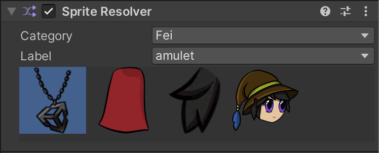

# Sprite Resolver component in Unity

The Sprite Resolver component pulls information from the [Sprite Library Asset](SL-Asset.md) assigned to the [Sprite Library component](SL-component.md) at the root of the actor Prefab, and displays the Sprites available for selection. This component is part of the [Sprite Swap setup and workflow](SpriteSwapSetup.md), where attaching the Sprite Resolver component to a GameObject that's part of an actor Prefab allows you to change the Sprite rendered by that GameObject's [Sprite Renderer component](https://docs.unity3d.com/Manual/class-SpriteRenderer.html).

## Property settings

The component contains two properties - [Category](SL-Editor.md#categories) and [Label](SL-Editor.md#labels) - and the **Visual variant selector** interface which displays thumbnails of the Sprites within the Sprite Library Asset.

 _Inspector window properties of Sprite Resolver component._

| Property     | Function                                                     |
| ------------ | ------------------------------------------------------------ |
| **Category** | Select the **Category** that contains the Sprite you want to use for this GameObject. |
| **Label**    | Select the **Label** name of the Sprite you want to use for this GameObject. |
|**Visual variant selector**   | Select the thumbnail of the Sprite you want to use. This selector displays all Sprites contained in the selected Category above.   |

## Additional resources
* [Setting up for Sprite Swap](SpriteSwapSetup.md)
* [Sprite Library Asset in Unity](SL-Asset.md)
* [Sprite Library component in Unity](SL-component.md)