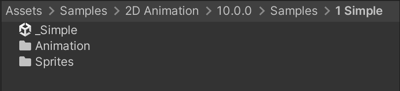
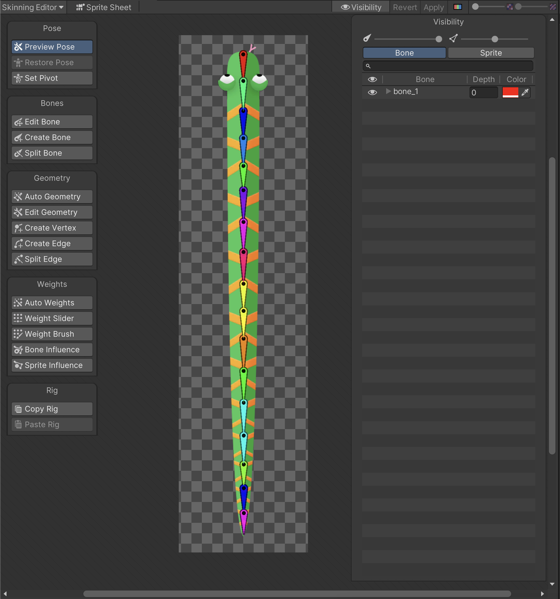
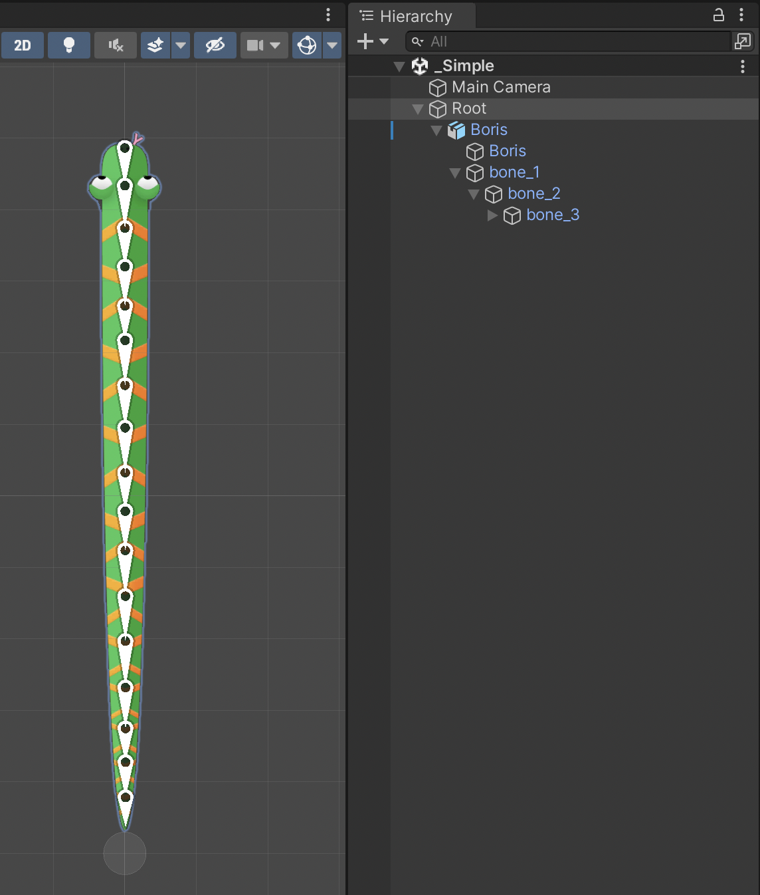

# Simple single Sprite actor and rig

This sample shows a simple single Sprite rigged actor, which was imported with the [PSD Importer](https://docs.unity3d.com/Packages/com.unity.2d.psdimporter@latest) package. The Project and Assets can be found in the following location (the version number folder may differ):

 Sample project location in the Project window (for 2D Animation 9.0).

Open the Asset `Assets/Samples/2D Animation/[X.Y.Z]/Samples/1 Simple/Sprites/Boris.psd` in the [Skinning Editor](SkinningEditor.md) module to examine how the Sprite is rigged.

The `_Simple` Scene shows how the Asset is used in a Scene when it is animated with animation that [deforms](SpriteSkin.md) its Sprite mesh.

Follow the steps below to reconstruct this `_Simple` sample Scene:

1. Create a new Scene, and create one empty GameObject and name it 'Root'.

2. Drag the 'Boris' psd file into the scene and attach it to the Root GameObject as its child.

3. Add an [Animator component](https://docs.unity3d.com/Manual/class-Animator.html) to the 'Root' GameObject.

4. Locate the Root [Animator Controller Asset](https://docs.unity3d.com/Manual/Animator.html) in `Assets/Samples/2D Animation/[X.Y.Z]/Samples/1 Simple/Animation/Animator/Root.controller`. Assign this Asset to the Animator component's **Controller** property.

5. Add an Animator component to the 'Boris' GameObject. Locate the Boris [Animator Controller Asset](https://docs.unity3d.com/Manual/Animator.html) in `Assets/Samples/2D Animation/[X.Y.Z]/Samples/1 Simple/Animation/Animator/Boris.controller` and assign this Asset to the Animator’s **Controller** property.
