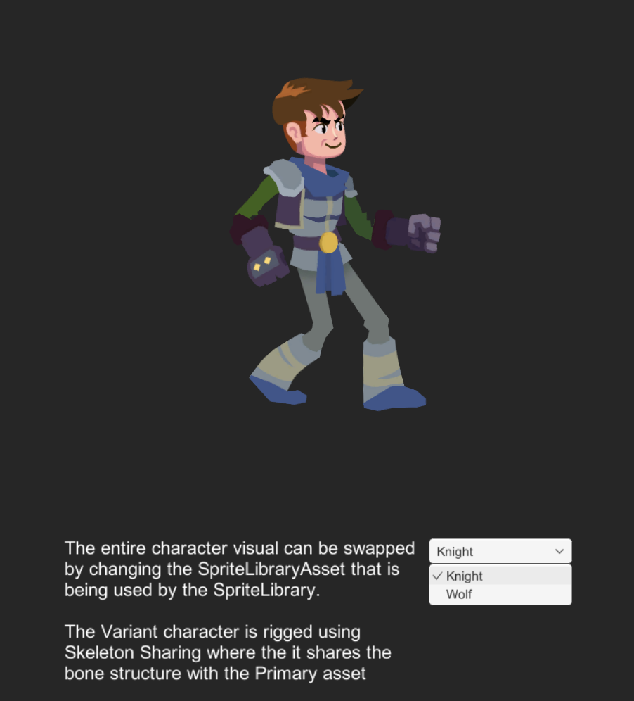
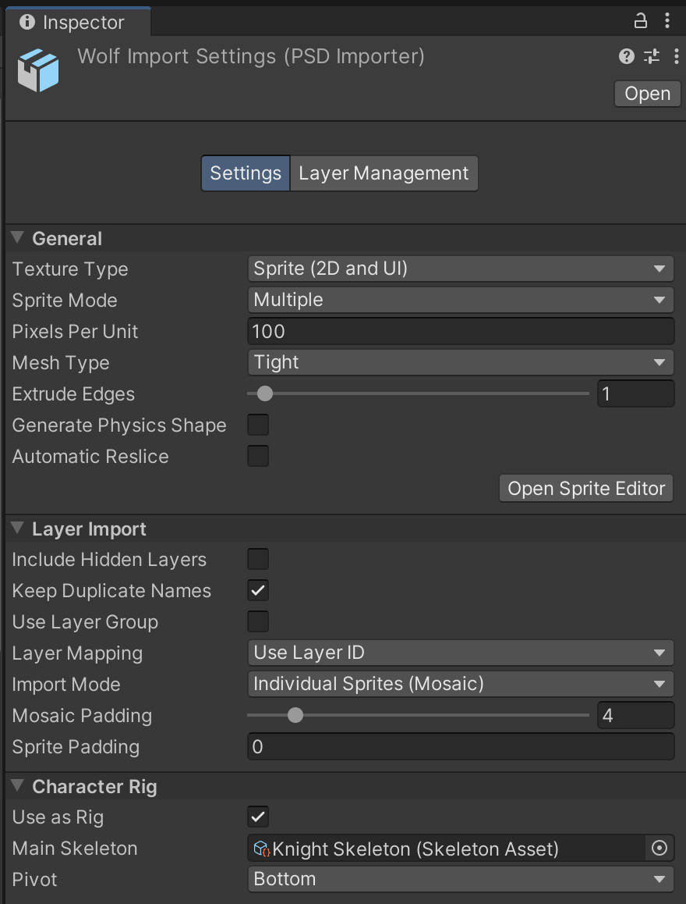
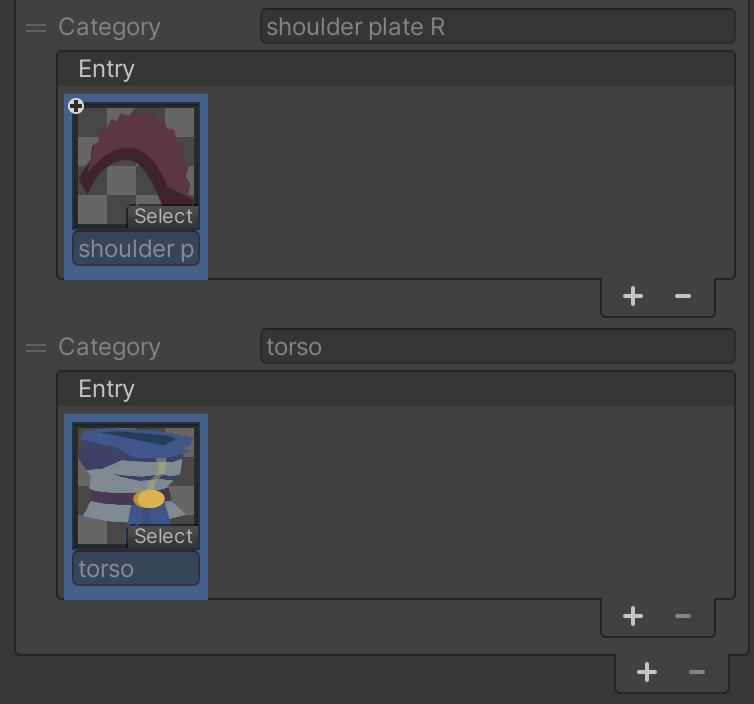
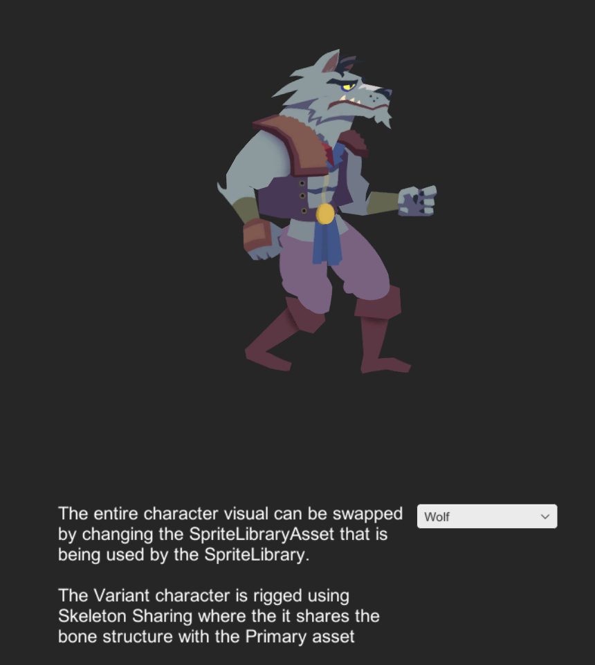

# Skeleton Sharing
This sample demonstrates how Skeleton sharing can be set up and leverages on the [other samples](Examples.md) before this. Note that the following requires the [PSD Importer](https://docs.unity3d.com/Packages/com.unity.2d.psdimporter@latest) installed. Open the `5 Skeleton Sharing.unity` Scene to see this sample in action.

This sample's setup is similar to the one in the [Full Skin Swap](ex-sprite-swap.md#full-skin-swap) sample. The visual Assets are located in `Assets/Samples/2D Animation/[X.Y.Z]/Samples/5 SpriteSwap/Sprites`:

- `Knight.psb`
- `Wolf.psb`

The `Wolf.psb` uses the [.skeleton Asset](https://docs.unity3d.com/Packages/com.unity.2d.psdimporter@latest/index.html?subfolder=/manual/PSD-importer-properties.html%23main-skeleton) from the `Knight.psb`, which means that the `Wolf.psb` is prepared using the same skeleton structure as the `Knight.psb`.

The `Wolf` actor also uses the following Sprite Library Assets located in `Assets/Samples/2D Animation/[X.Y.Z]/Samples/5 SpriteSwap/Sprites`:

- `Knight.spriteLib`
- `Wolf.spriteLib`

The `Knight.spriteLib` is assigned to the **Main Library** property for the `Wolf.spriteLib` is. The `Wolf.spriteLib` has been setup so that the **torso** Category is not overridden, which allows it to use the Sprite from `Knight.spriteLib`.

 The Wolf actor uses the same torso Sprite as the Knight actor.
