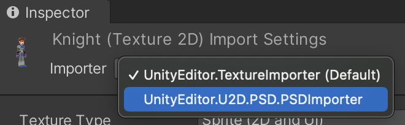

# PSD File Importer Override

By default .psd files are imported with the Texture Importer. If you wish to instead import a .psd file with the PSD Importer, simply select the .psd file, click on the Importer dropdown and select **UnityEditor.U2D.PSD.PSDImporter**.

<br/>Importer drop down.

You can also create a script to automate this process. Below is an example of how this can be done using the `AssetDatabase.SetImporterOverride` method.

## Example SetImporterOverride script
### ChangePsdImporterUtility.cs
```
using UnityEditor;
using UnityEditor.U2D.PSD;
using UnityEngine;

public static class ChangePsdImporterUtility
{
    /// <summary>
    /// Change importer of the currently selected .psd files.
    /// </summary>
    [MenuItem("Assets/2D Importer/Change PSD File Importer", false, 30)]
    static void ChangeImporter()
    {
        foreach (var obj in Selection.objects)
        {
            var path = AssetDatabase.GetAssetPath(obj);
            var ext = System.IO.Path.GetExtension(path);
            if (ext == ".psd")
            {
                var importer = AssetImporter.GetAtPath(path);
                if (importer is PSDImporter)
                {
                    Debug.Log($"{path} is now imported with TextureImporter");
                    AssetDatabase.ClearImporterOverride(path);
                }
                else
                {
                    Debug.Log($"{path} is now imported with PSDImporter");
                    AssetDatabase.SetImporterOverride<PSDImporter>(path);
                }
            }
        }
    }
}
```