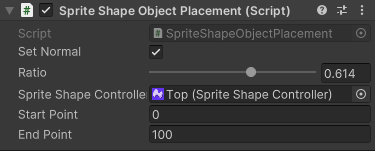

# SpriteShape Object Placement
Attach a SpriteShapeObjectPlacement component to your GameObject to position an Object along the Spline of a __Sprite Shape Controller__. 

1. Start Point must be smaller than the End Point and must be a valid index in the Spline's control points. 
2. Enabling Set Normal rotates the Object at normal direction to where the Object is placed along the Spline.
3. Ratio dictates the distance ratio between the Start and End points where the Object should be placed.