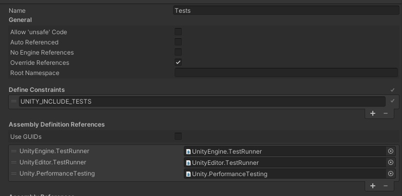

# Performance Testing Package for Unity Test Framework

The Unity Performance Testing Package extends Unity Test Framework with performance testing capabilities. It provides an API and test case decorators for taking measurements/samples of Unity profiler markers, and other custom metrics, in the Unity Editor and built players. It also collects configuration metadata that is useful for comparing data across different hardware and configurations, such as build and player settings.

The Performance Testing Package is intended for use with the Unity Test Framework. You should be familiar with how to create and run tests as described in the [Unity Test Framework documentation](https://docs.unity3d.com/Packages/com.unity.test-framework@latest).


> **Note:** When tests are run with Unity Test Framework, a development player is always built to support communication between the editor and player, effectively overriding the development build setting from the build settings UI or scripting API.

## Installing the Performance Testing Package

Install the Performance Testing Package package using one of the following methods:
* Add the package by [installing from a Git URL](https://docs.unity3d.com/Manual/upm-ui-giturl.html).
* Add the package as a dependency to the [project manifest](https://docs.unity3d.com/Manual/upm-manifestPrj.html).

Example:
1. Open the `manifest.json` file for your Unity project (located in the YourProject/Packages directory) in a text editor.
2. Add `"com.unity.test-framework.performance": "3.0.3",` to the dependencies.
3. Save the manifest.json file.
4. Verify the Performance Testing Package is now installed by opening the Unity Package Manager window.

When the package is installed, add a reference to `Unity.PerformanceTesting` in your assembly definition to access the performance testing APIs.




## Unity version compatibility

Unity releases can often include changes that break compatibility with the Performance Testing Package, so we cannot currently guarantee latest package version compatability with every Unity version. The table below shows which version of the package is compatible with which Unity release streams. 

| Unity stream             | Package version |
| ------------------------- |-----------------|
| 2023.2                    | 3.0.3           |
| 2023.1                    | 3.0.3           |
| 2022.2                    | 3.0.3           |
| 2022.1                    | 3.0.3           |
| 2021.3                    | 3.0.3           |
| 2020.3                    | 3.0.3           |
| 2019.4                    | 2.8.1-preview   |

## Tips

### Project settings

- Remove all but one of the [Quality level settings](https://docs.unity3d.com/Manual/class-QualitySettings.html) in **Project Settings > Quality**. Otherwise, you may have different configurations when running on different platforms. If you require different settings per platform then make sure they are being set as expected.
- Disable VSync under **Project Settings > Quality**. Some platforms like Android have a forced VSync and this will not be possible.
- Disable HW Reporting **PlayerSettings -> Other -> Disable HW Reporting**.
- Remove camera and run in batchmode if you are not measuring rendering.

### Generating assets

Use [IPrebuildSetup](https://docs.unity3d.com/Packages/com.unity.test-framework@1.1/api/UnityEngine.TestTools.IPrebuildSetup.html) attribute when you need to generate assets.
Place assets in Resources or [StreamingAssets](https://docs.unity3d.com/Manual/SpecialFolders.html) folders, scenes can be placed anywhere in the project, but should be added to build settings.

#### Example 1: IPrebuildSetup implementation

``` csharp
public class TestsWithPrebuildStep : IPrebuildSetup
{
    public void Setup()
    {
        // this code is executed before entering playmode or the player is executed
    }
}

public class MyAmazingPerformanceTest
{
    [Test, Performance]
    [PrebuildSetup(typeof(TestsWithPrebuildStep))]
    public void Test()
    {
        ...
    }
}
```

When loading scenes in IPrebuildSetup you have to use `LoadSceneMode.Additive`.

#### Example 2: Using EditorSceneManager to create new scenes additively, save and add them to build settings.

``` csharp
private static string m_ArtifactsPath = "Assets/Artifacts/";

public static Scene NewScene(NewSceneSetup setup)
{
    Scene scene = EditorSceneManager.NewScene(setup, NewSceneMode.Additive);
    EditorSceneManager.SetActiveScene(scene);
    return scene;
}

public static void SaveScene(Scene scene, string name, bool closeScene = true)
{
    EditorSceneManager.SaveScene(scene, GetScenePath(name));

    if (closeScene)
    {
        foreach (var sceneSetting in EditorBuildSettings.scenes)
            if (sceneSetting.path == GetScenePath((name)))
                return;

        EditorSceneManager.CloseScene(scene, true);
        EditorSceneManager.SetActiveScene(EditorSceneManager.GetSceneAt(0));

        var newListOfScenes = new List<EditorBuildSettingsScene>();
        newListOfScenes.Add(new EditorBuildSettingsScene(GetScenePath(name), true));
        newListOfScenes.AddRange(EditorBuildSettings.scenes);
        EditorBuildSettings.scenes = newListOfScenes.ToArray();
    }
}

public static string GetScenePath(string name)
{
    return m_ArtifactsPath + name + ".unity";
}
```
