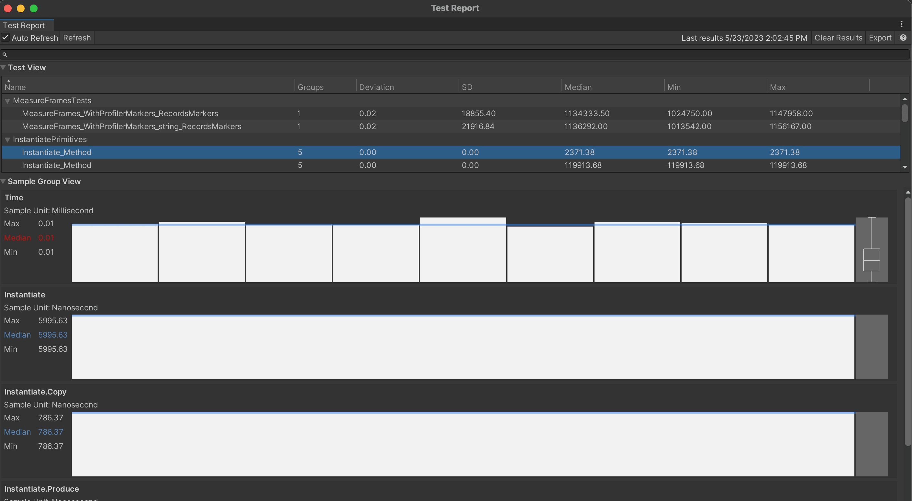

## Output

When a test is selected in the **Test Runner** window in the Unity Editor, each performance test will have a performance test summary. This summary includes every sample group's aggregated samples such as median, min, max, average, standard deviation, sample count and sum of all samples.

#### Example: Performance Test Summary from Test Runner window

```
Time Microsecond Median:2018.60 Min:1903.00 Max:2819.80 Avg:2186.35 Std:368.42 SampleCount: 4 Sum: 8745.40
```


## The Performance Test Report

The Performance Test Report (**Window > General > Performance Test Report**) shows a detailed breakdown of individual test runs. This can be used to assess the stability of each test. It provides a visualization of each individual sample recorded within a sample group along with summary statistics for the selected test.

The Performance Test Report is split into two views: the *test view* and the *sample group view*.

**Test View:** Provides a list of all tests. Tests are separated by class names. Each of the columns can be clicked to sort the view. Column values show the sample group with highest deviation.

* *Name* - Name of the test.
* *Deviation* - The deviation is calculated by dividing the standard deviation by the median for a sample group. It shows the sample group with the highest 'deviation' value. Useful for defining stability of the test.
* *Standard Deviation* - Standard deviation of the samples in a sample group. It shows the sample group with the highest standard deviation.

**Sample Group View:** Visualizes sample groups for the test selected in the Test View. Provides:
*   Sample group summary  displaying the min, max, and median values for a given sample group.
*   Samples displayed in a bar chart, ordered by time, with a blue line indicating the median.
*   Box plot showing upper (75%) and lower (25%) quartiles, min, max and median of the samples for a given sample group.


